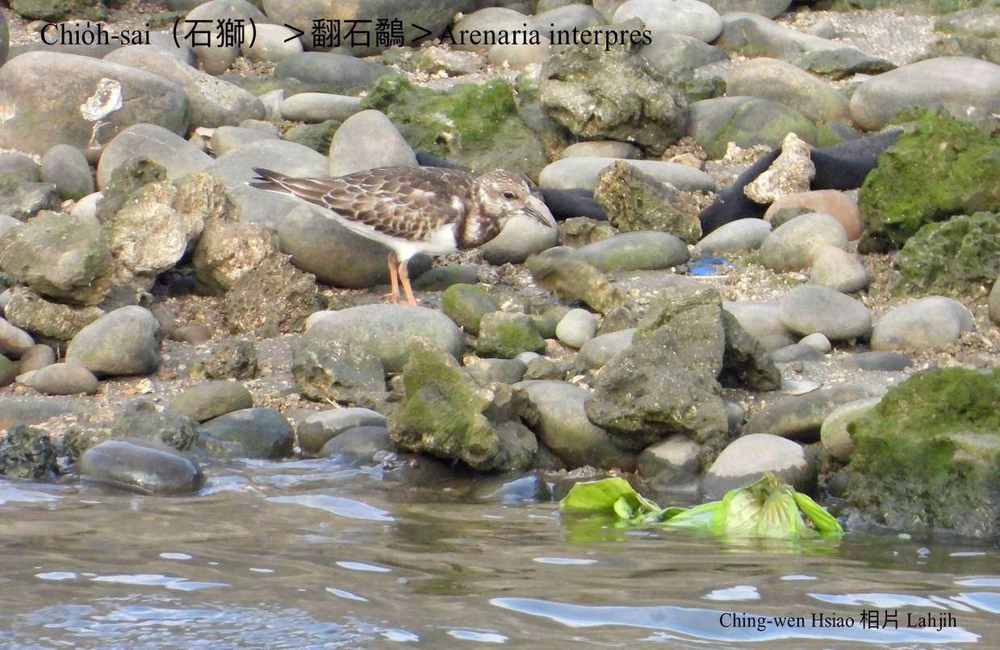
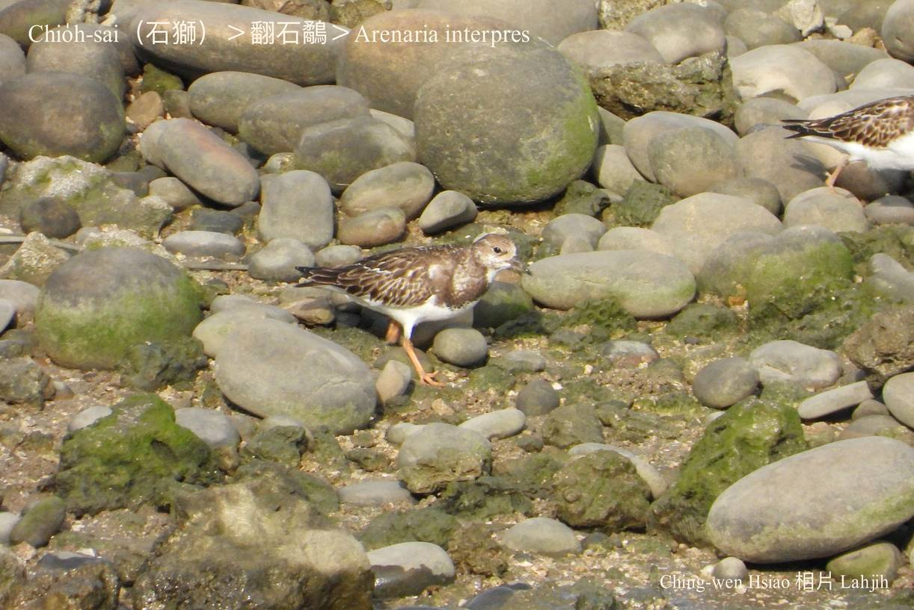
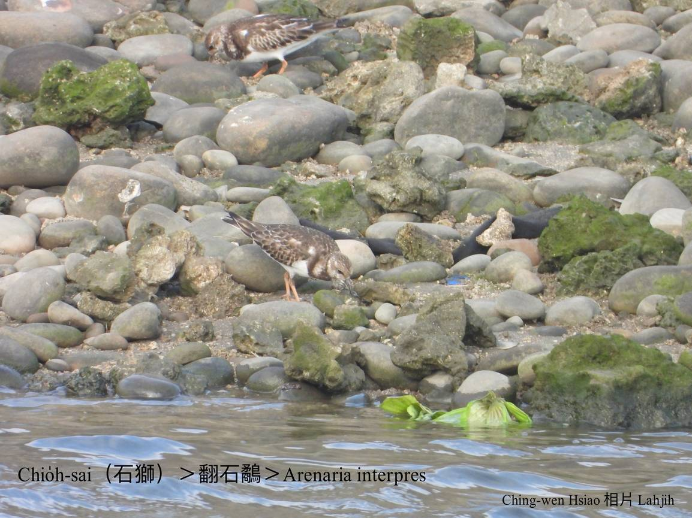
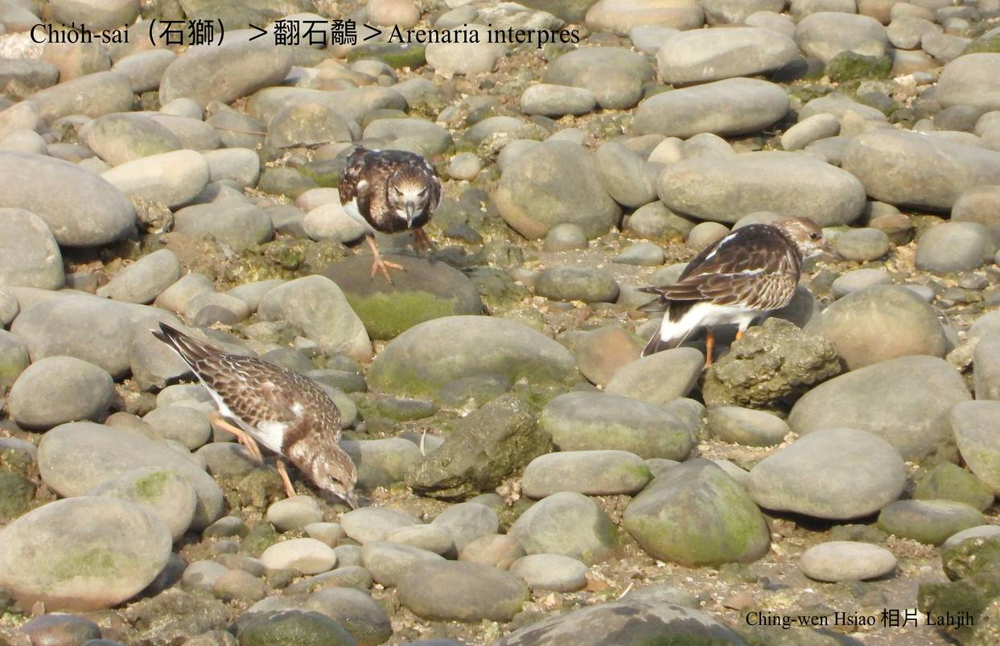
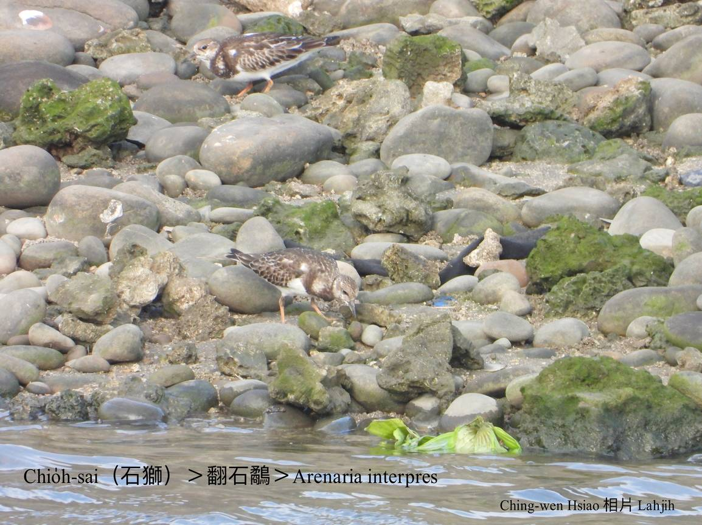
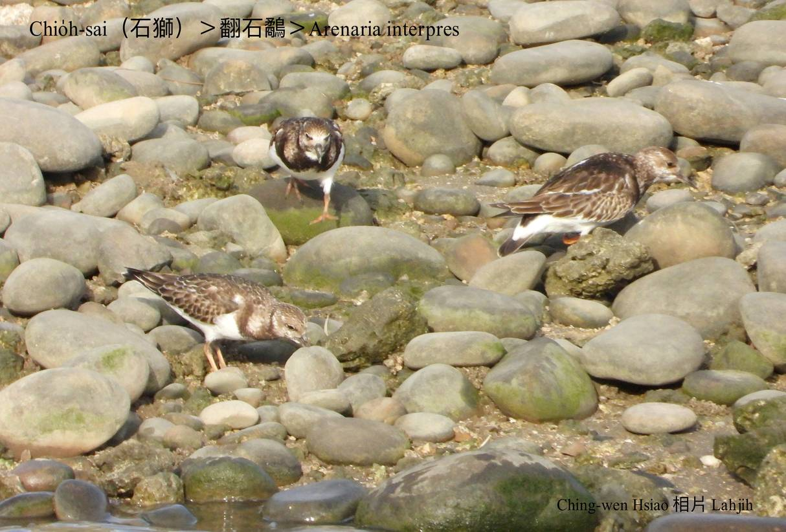
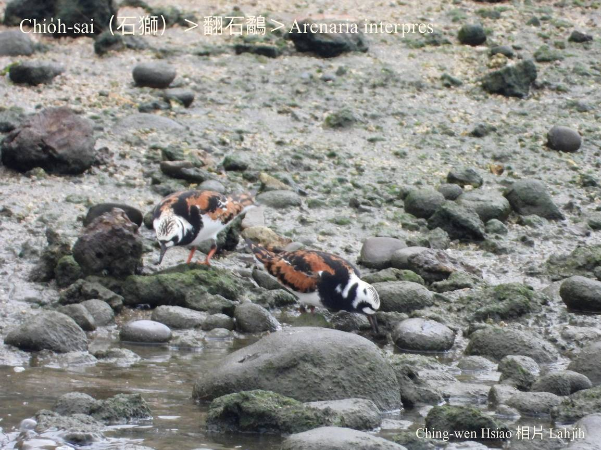
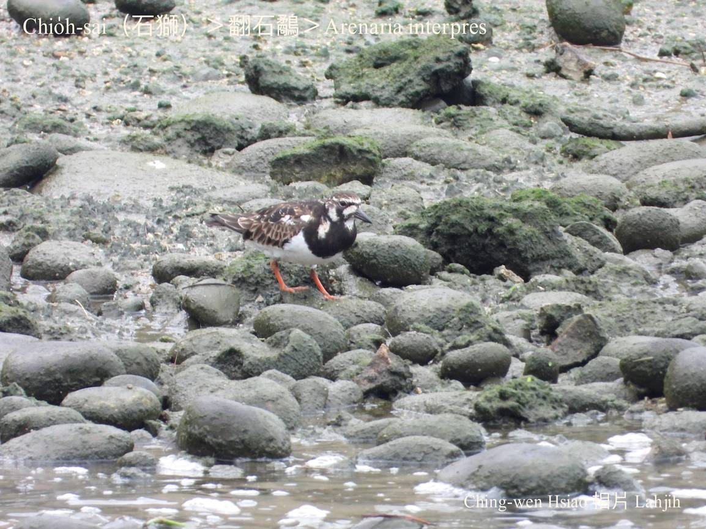
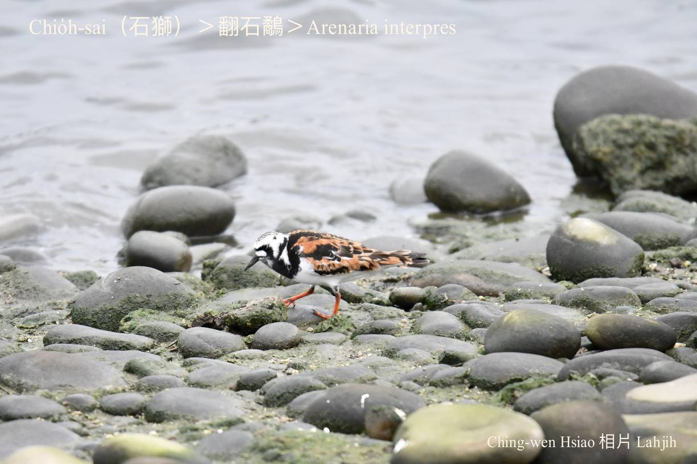
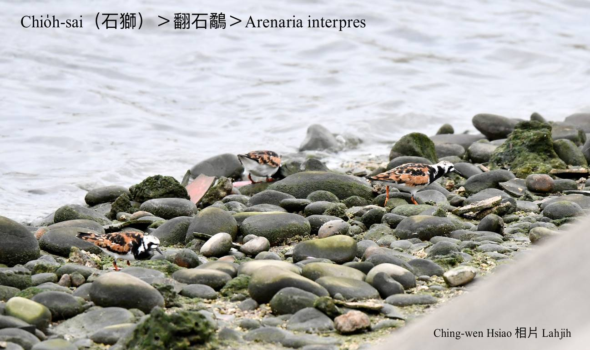

#### 15. U̍t Kho『鷸科』

|台灣名|中譯名|學名|
|Chio̍h-sai（石獅）|翻石鷸|Arenaria interpres|

# 15-2. Chio̍h-sai（石獅）

Chio̍h-sai ê嘴pe tēng、ngē-chiāⁿ koh有力，chhōe食時，用伊ê嘴pe péng大水柴a̍h是石頭縫，專門chhōe bih tiàm內面ê thâng-thōa ham-á，所以澎湖人ka號做石獅。

Chio̍h-sai生湠tī北極圈海域，冬季避寒到各所在海域。Tī台灣西部ê大肚溪口附近，春秋天過境ê數量真chē，少數留leh過冬。所以是過境鳥mā是過冬鳥。

### 【註解】

|詞|解說|
|ham-á|Clam，蚶á。|
