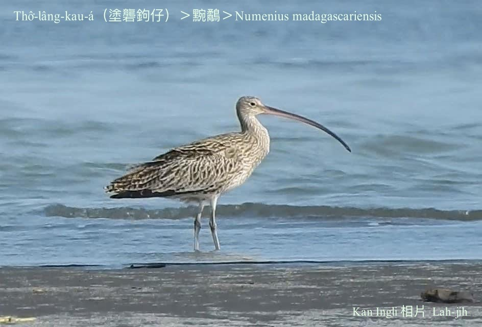
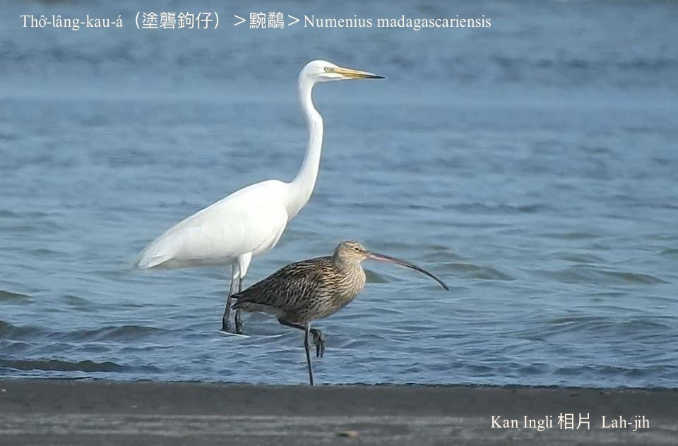
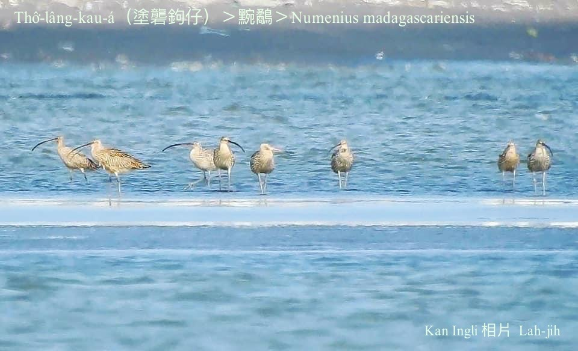
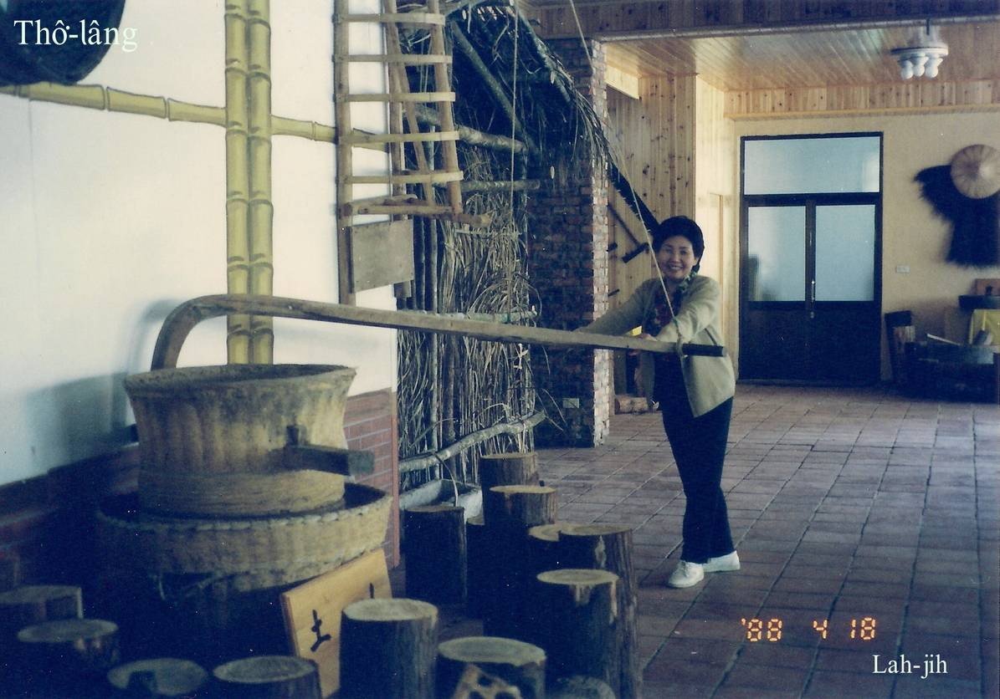
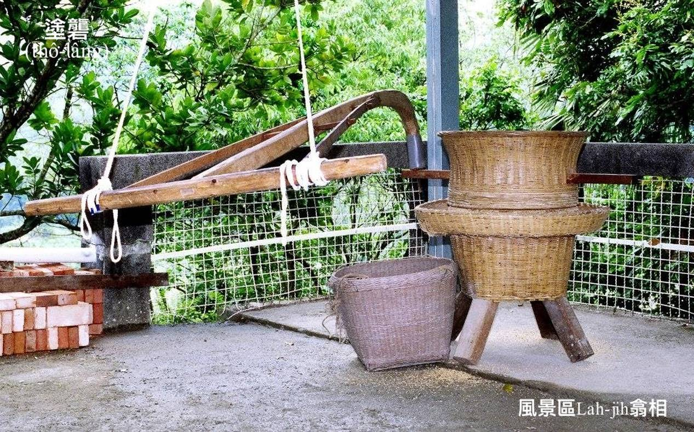

#### 15. U̍t Kho『鷸科』

|台灣名|中譯名|學名|
|Thô͘-lâng-kau-á（土礱鉤á）|黦鷸|Numenius madagascariensis|

# 15-4. Thô͘-lâng-kau-á（土礱鉤á）

Thô͘-lâng-kau-á和（Numenius arquata）『大杓鷸』生做真相像，mā號土礱鉤á，是過境鳥，和『大杓鷸』kāng-khoán有鷸科鳥類siāng長ê嘴pe。分別『大杓鷸』與『黦鷸』bô-kāng siāng可靠ê方法是看in飛行ê翼股下色水，『大杓鷸』翼股下白色，『黦鷸』翼股下全是斑點。Nā看bē-tio̍h飛行，ē-tàng看尾liu下面ê羽毛，『大杓鷸』是白色--ê，『黦鷸』是咖啡色斑點。

