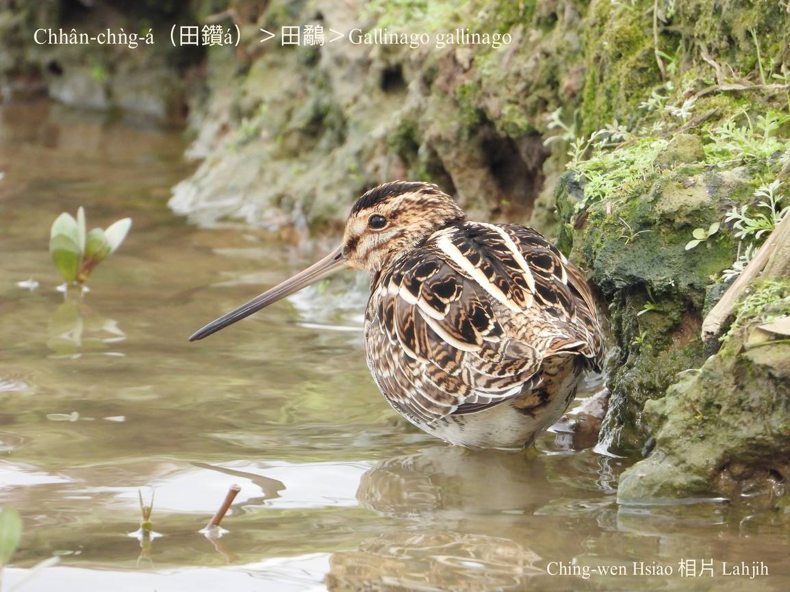

#### 15. U̍t Kho『鷸科』

|台灣名|中譯名|學名|
| Chhân-chǹg-á（田鑽á）|田鷸|Gallinago gallinago|

# 15-5. Chhân-chǹg-á（田鑽á）

Chhân-chǹg-á tī lòm地chhōe食時，用伊ê長嘴pe鑽入去土內挾tō͘-kín-á hit種軟軟蟲thōa kài出名。

Chhân-chǹg-á生湠tī亞洲大陸東北部，tī台灣，冬天ē-sái-tit tī各所在ê海邊、lòm窟地、湖埤邊，有廬竹、蓮花ê所在看tio̍h伊ê腳跡，是過冬鳥，伊ê長嘴pe尾溜有真敏感ê神經，ē-tàng探測食物。

台灣人常常用田鑽á來keng-thé chi̍t-ê人勞碌命，phah-piàⁿ kui世人無歇睏，to̍h親像田鑽á án-ne piàⁿ命鑽土chhōe食。

# 【Tâi-oân Chiáu-á Liām Koa-si】

### **Chhân-chǹg-á Chǹg Thô͘-khang**

Chhân-chǹg-á chhùi-pe tn̂g koh chiam

Chǹg ji̍p thô͘-khang lia̍h thâng-thōa

Piān-nā hō͘ i chǹg--tio̍h

Tiāⁿ-tio̍h thun lo̍h-âu

### 【註解】

|詞|解說|
|tō͘-kín-á|Tō͘-ún，tō͘-kún，『蚯蚓』。|
|腳跡|Kha-jiah。|

