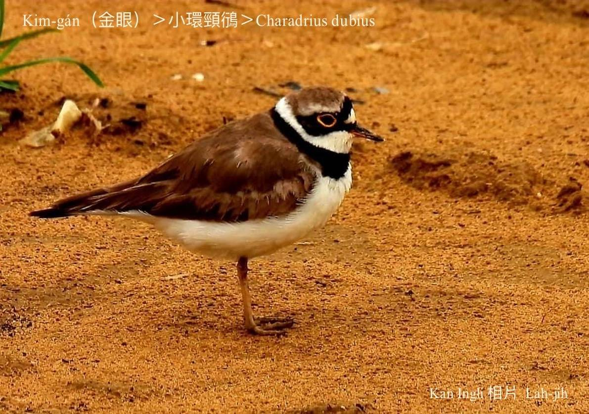
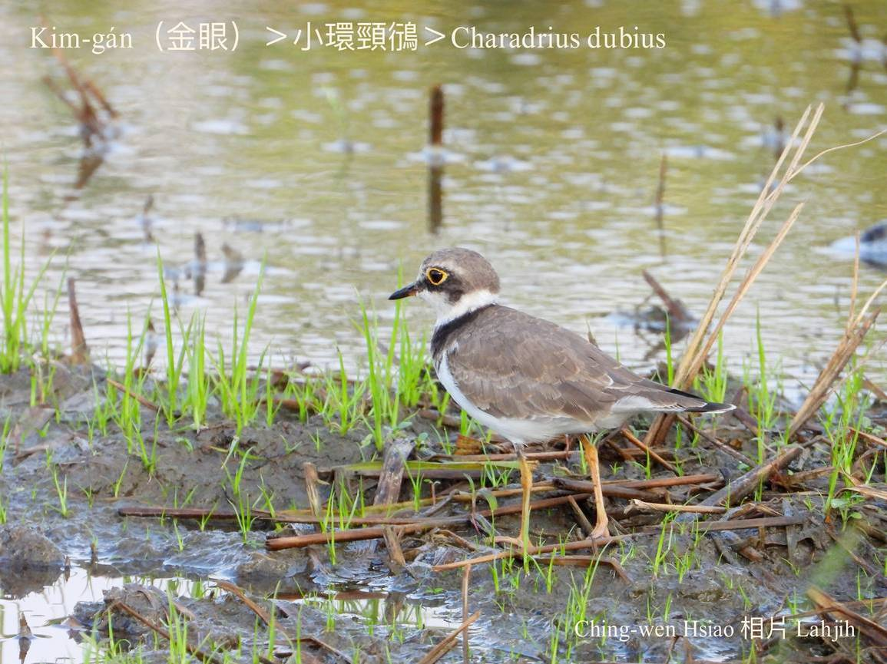
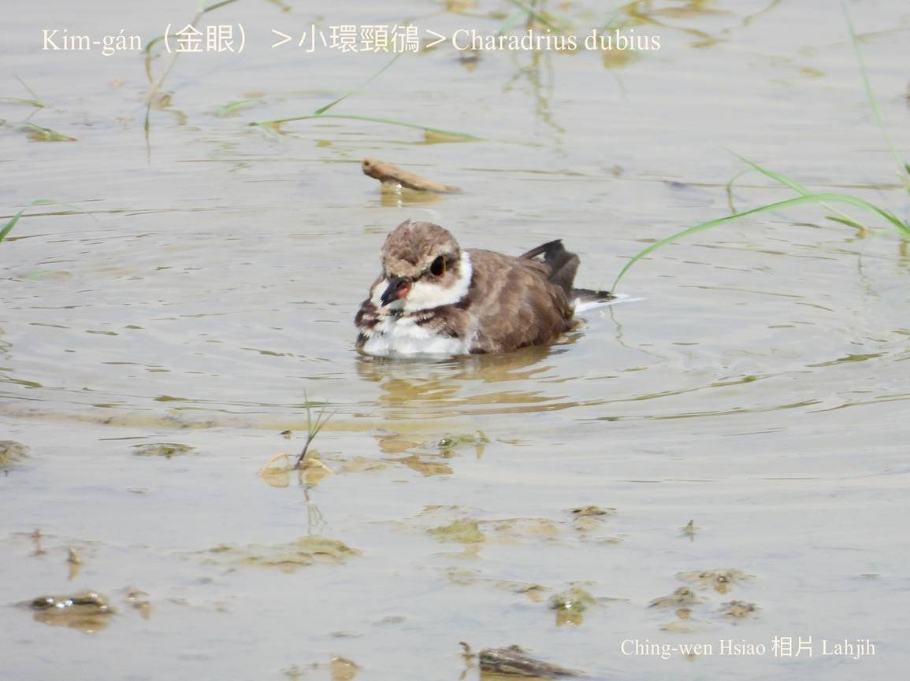
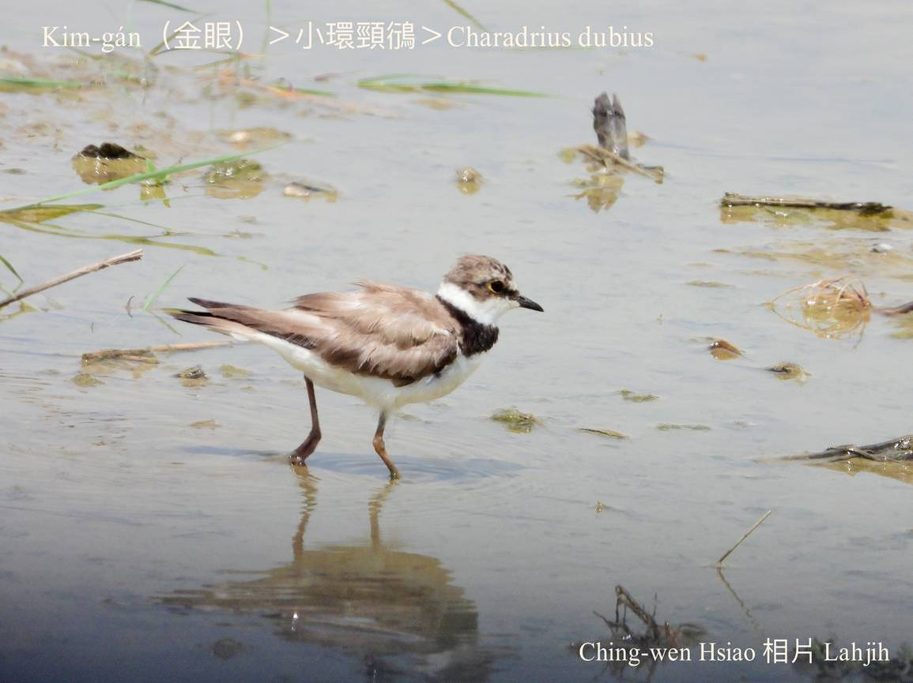
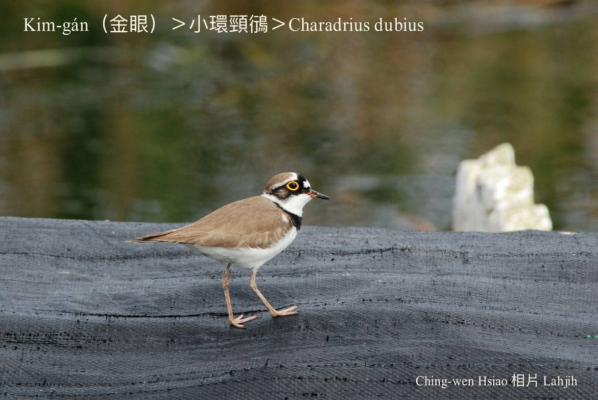
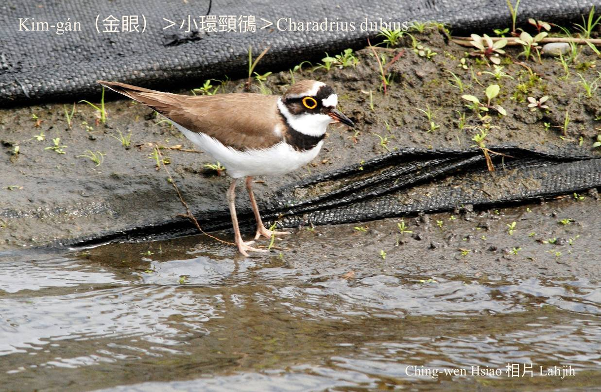
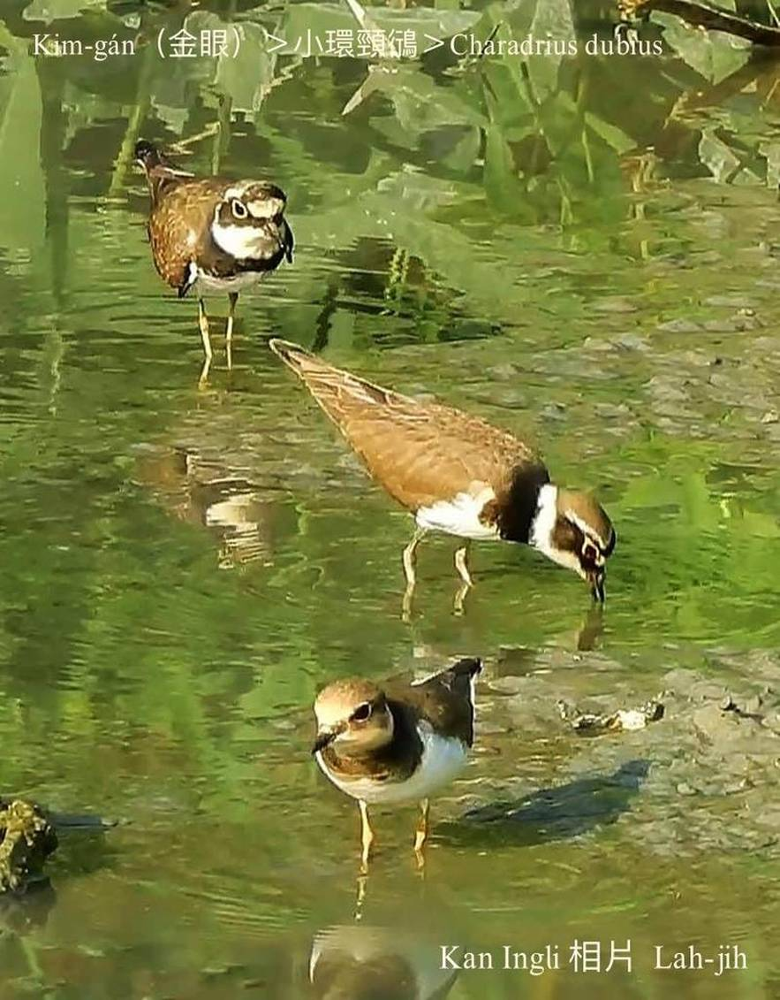
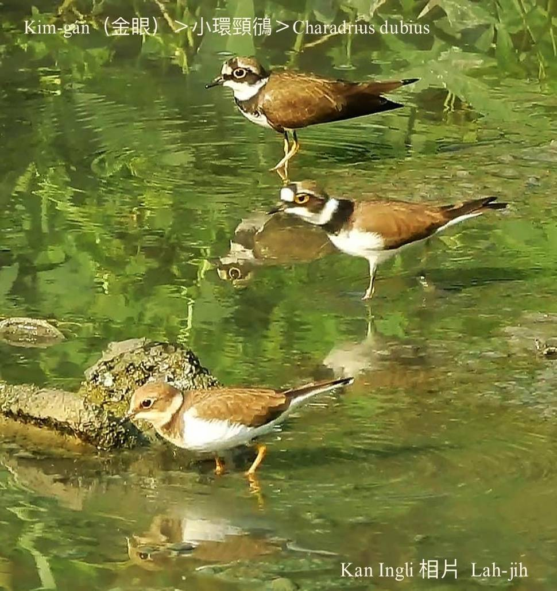

#### 16. Hêng Kho『鴴科』

|台灣名|中譯名|學名|
|Kim-gán（金眼）|小環頸鴴|Charadrius dubius|

# 16-2. Kim-gán（金眼）

Kim-gán目chiu大大蕊，深烏色，khong金黃色目khang，真súi真影目。

Kim-gán是普遍ê留鳥仔-sī過冬鳥，時常20~30隻，a̍h是三、五隻tàu-tīn出現tī海邊沙埔a̍h是溪埔á地、魚池á邊chhōe食；飛行時直飛速度chiâⁿ緊，se̍h îⁿ-kho͘-á、oat方向lóng真liú-lia̍h choa̍t-téng。

Kim-gán毛草白chhap淺咖啡色，目khang嘴pe所在是烏色，ām下胸前是烏色ná領巾，put-chí-á kó͘-chui。

親鳥tī孵卵a̍h是chhōe鳥仔-kiáⁿ thit-thô活動時，nā tn̄g-tio̍h有天敵出現，伊ē假影跛腳落翼假做tio̍h傷，去siâⁿ天敵ê注意，hō͘鳥仔-kiáⁿ有時間thang閃避逃命。水生小動物、小型無ki骨動物a̍h是細隻蟲á lóng是伊ê主食。

# 【Tâi-oân Chiáu-á Liām Koa-si】

### **Kim-gán Kòa Ba̍k-kiàⁿ**

Kòa kim-kheng ba̍k-kiàⁿ ba̍k-chiu-jîn o͘ koh kim

Kat o͘-sek niá-kin chin hó-khòaⁿ

Kim-gán, chhiáⁿ lí khiā chi̍t-ê hó-chu-sè

Góa boeh kā lí hip chi̍t-tiuⁿ siòng

The̍h lâi-khì chham-ka pí-sài

Khó-sioh lí ū khah é

Khióng-kiaⁿ bē-tàng tit-tio̍h thâu-siúⁿ

Kim-gán, lí kám ē sit-bōng bô-nāi

### 【註解】

|詞|解說|
|鴴|日本人ê造字。|
|影目|Iáⁿ-ba̍k。|

