#### 16. Hêng Kho『鴴科』

|台灣名|中譯名|學名|
|Lò-kha-á（Lò腳á）|高蹺鴴|Himantopus himantopus |

# 16-3. Lò-kha-á（Lò腳á）

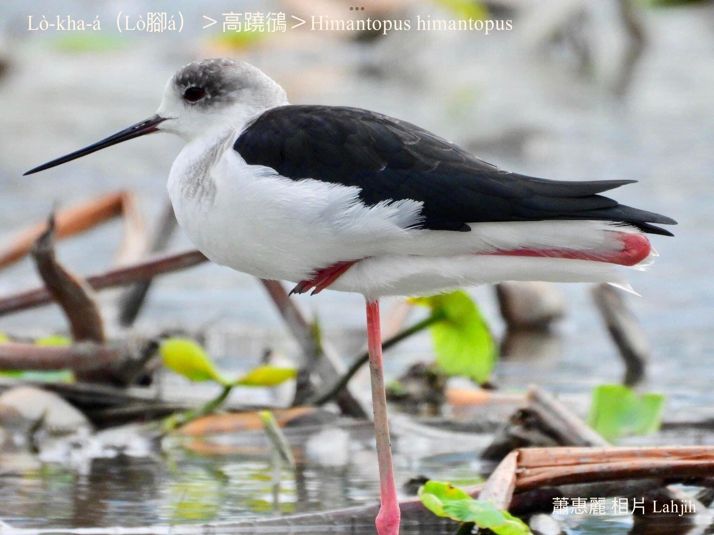

Lò-kha-á腳lò-lò，腳骨特別長，嘴pe烏烏尖尖，鳥公kha-phiaⁿ翼股暗khóng色，鳥母phú-phú咖啡色，頭殼、ām-kún、腹肚白色，chhap lò-lò ê兩支腳骨是真súi ê桃紅色，khiā--leh lò-sia̍k-sia̍k，ûn-ûn-á飛行姿勢非常súi。

Lò-kha-á kah意海phiâⁿ、chiáⁿ水lòm地、水窟、魚池、水田liâu水chhōe食物。

鳥類腳khiau chiâⁿ特別，為tio̍h àⁿ身thóng食物，腳後khiau是khiau頭前，m̄是khiau後壁，看lò-kha-á àⁿ落去食物件特別明顯。

# 【Tâi-oân Chiáu-á Liām Koa-si】

### **Lò-kha-á Ta̍h-kha-khiau**

Lò-kha-á, lò-kha-á, ta̍h-kha-khiau 

Tiàm chúi-tî-á it-ti̍t liâu, chhōe mi̍h-kiāⁿ chia̍h

Lò-kha-á, lò-kha-á, lò-sia̍k-sia̍k, lí kám bē hoân-ló

Boeh án-choáⁿ àⁿ-lo̍h-khì khioh mi̍h-kiāⁿ 

Lò-kha-á, lò-kha-á, chin cháu-thiàu

Phah-piàⁿ bián kiaⁿ pak-tó͘ iau

Lò-kha-á, sió-sim--ò͘

Kiâⁿ ho͘ hó, m̄-thang poa̍h-tó

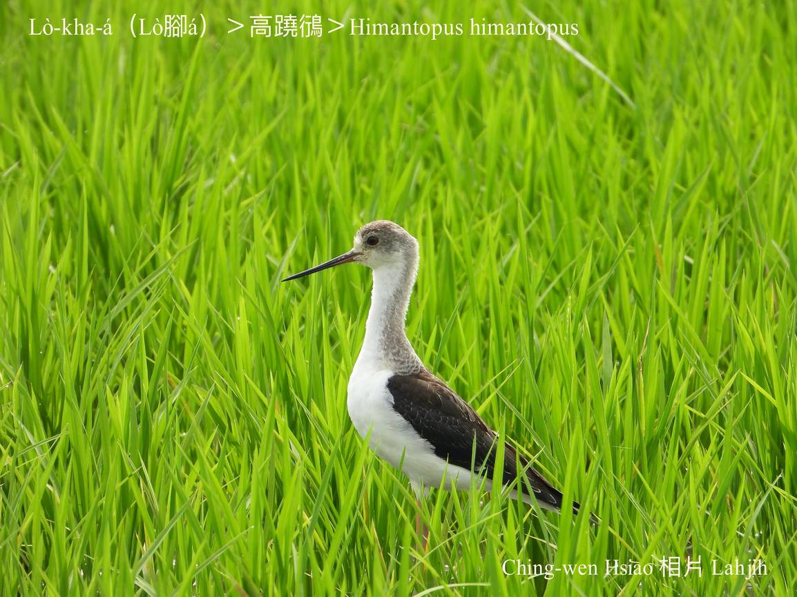
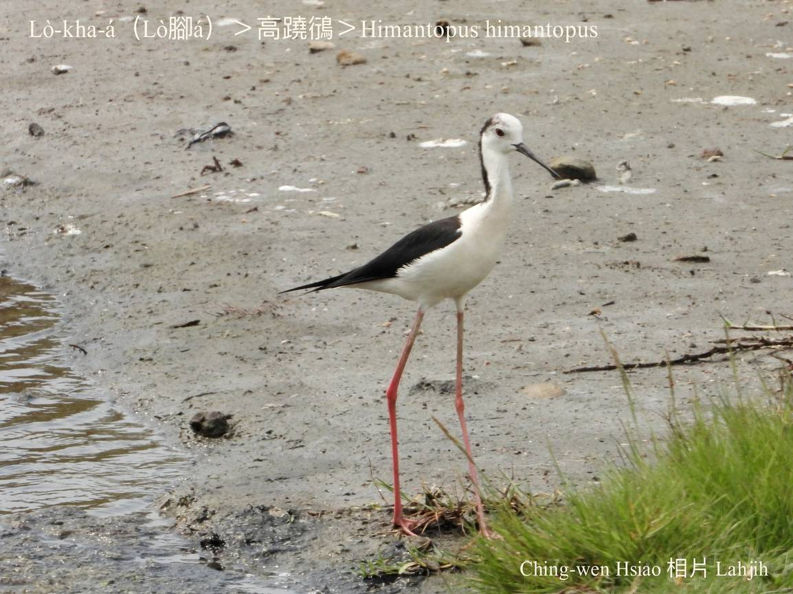
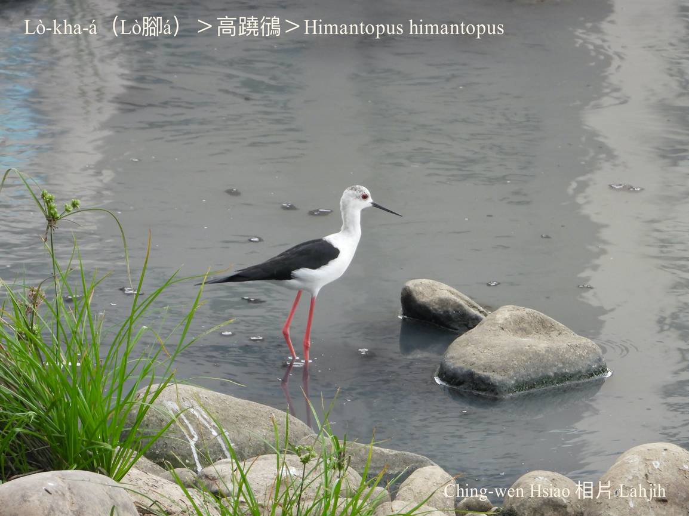
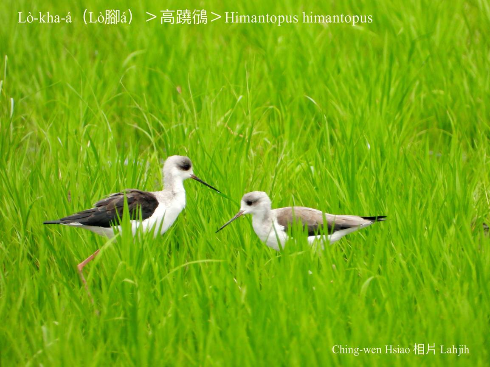
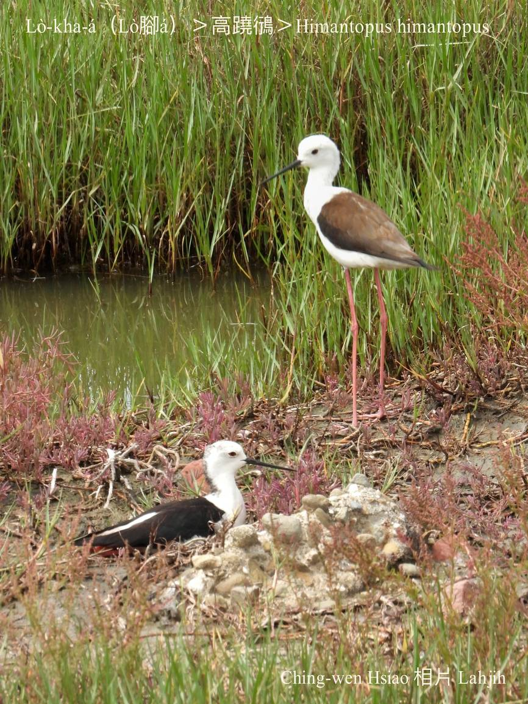
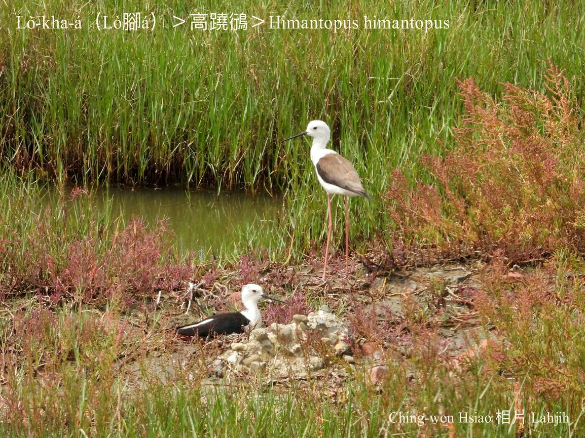
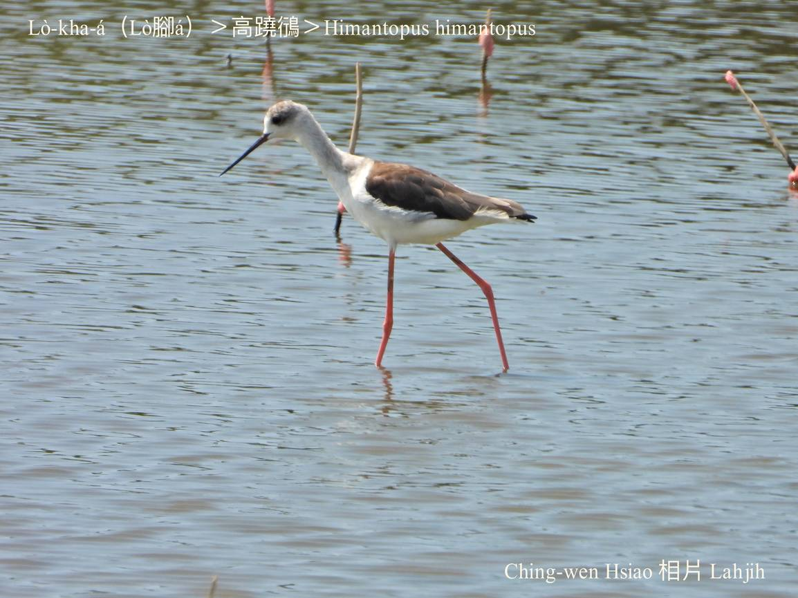
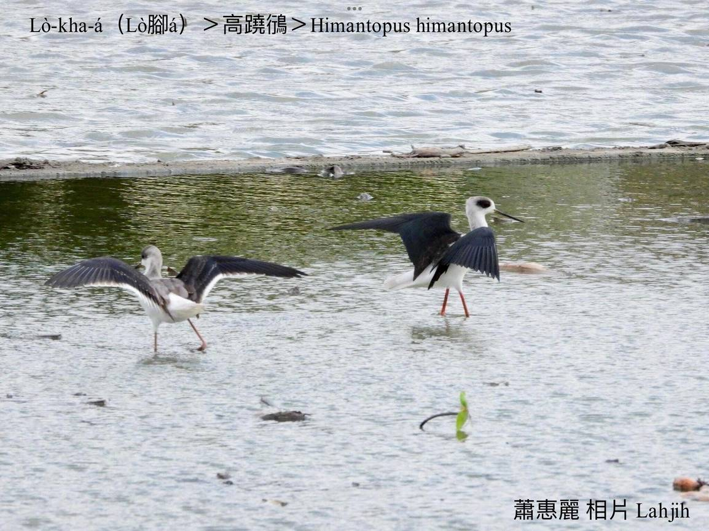
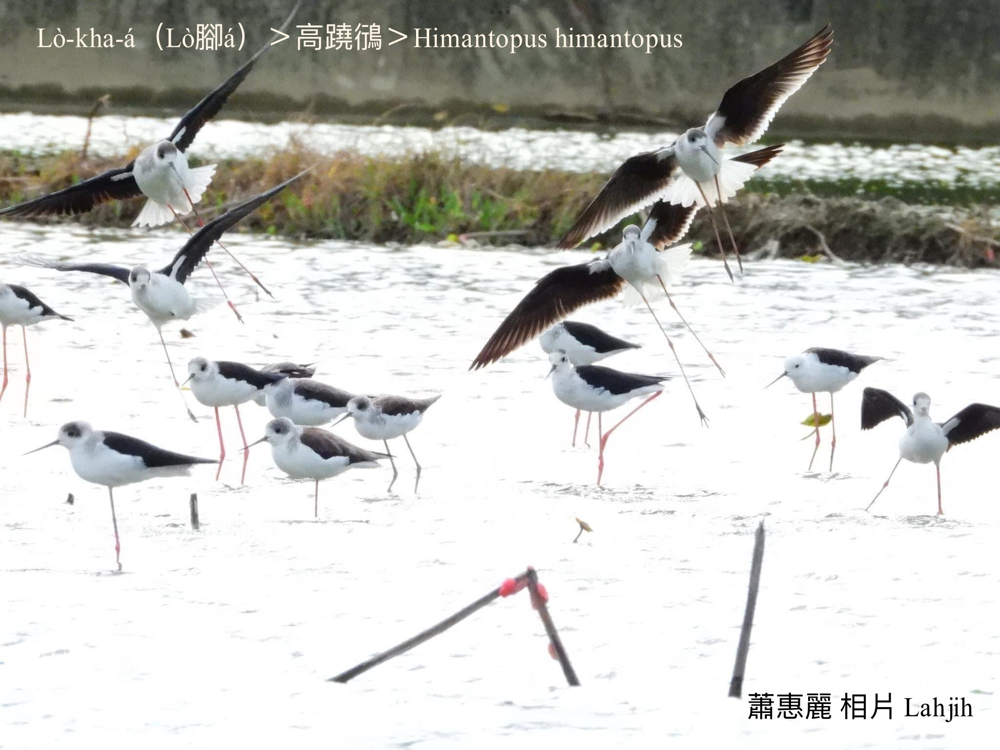
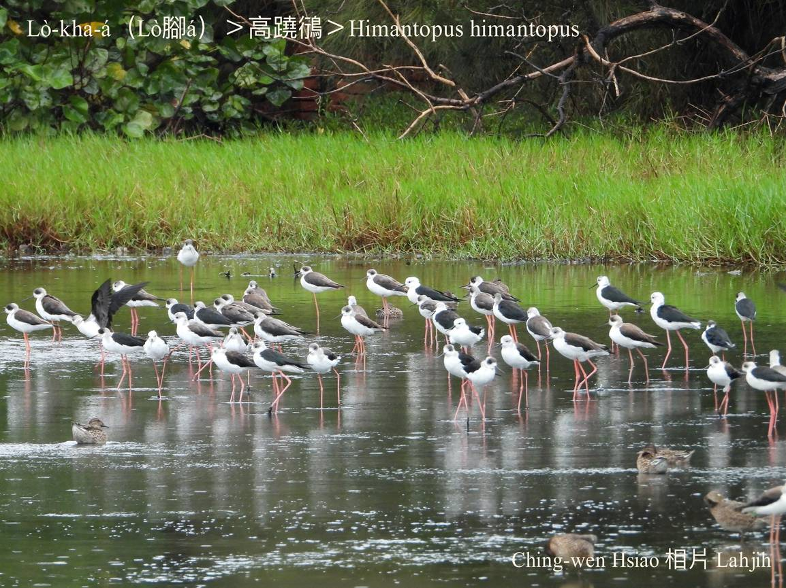
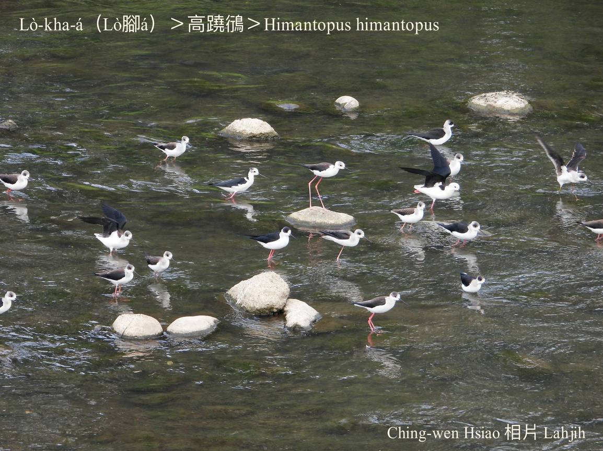
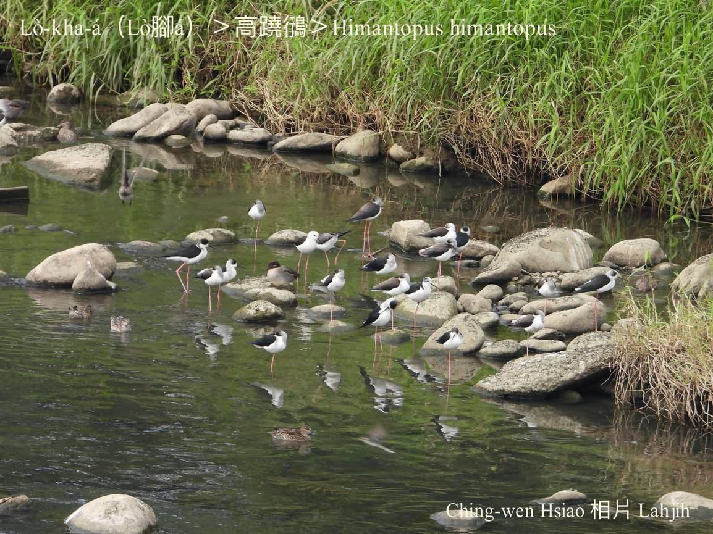
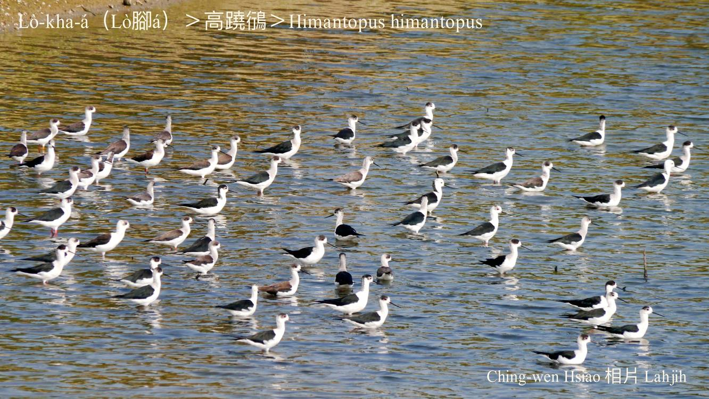

### 【註解】

|詞|解說|
|鴴|日本人ê造字。|
|ta̍h-kha-khiau|『踩高蹺』。|

