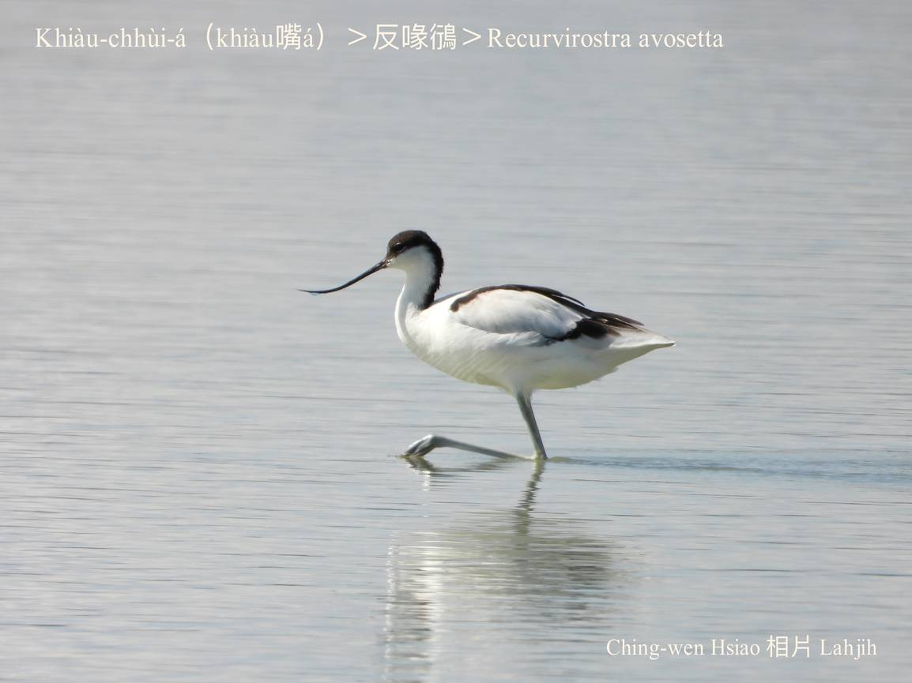
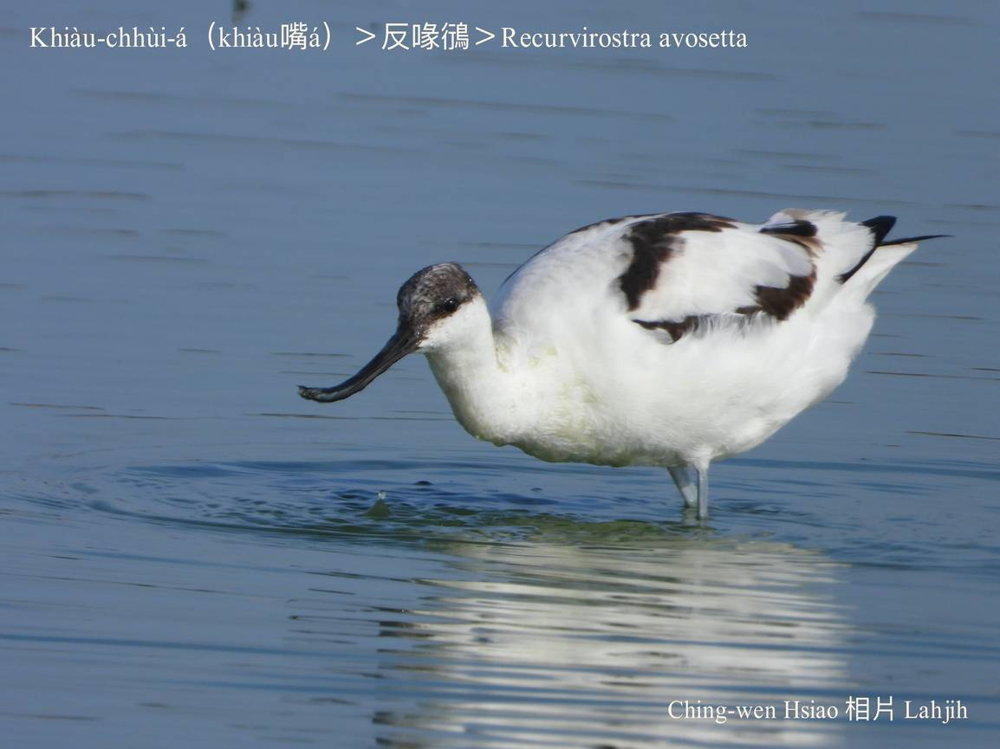
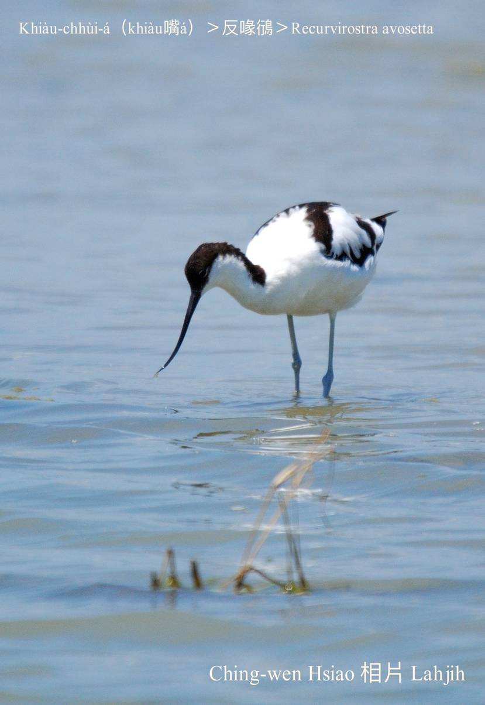
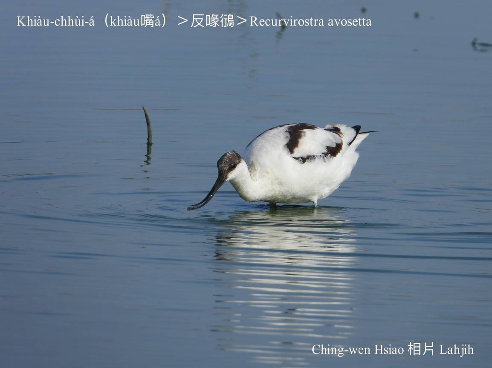
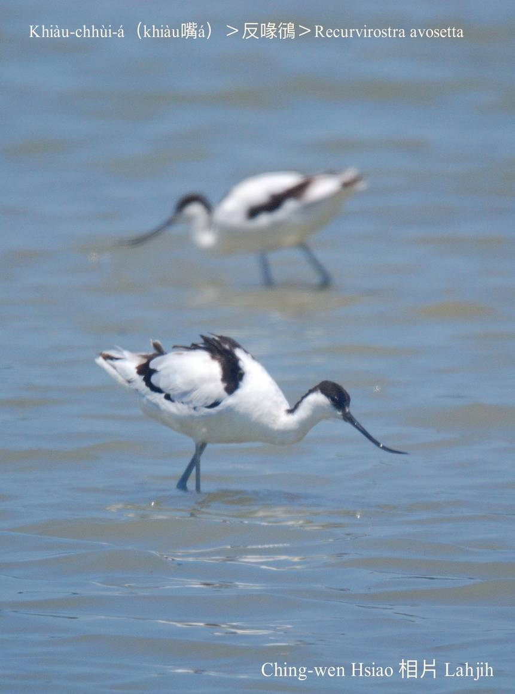
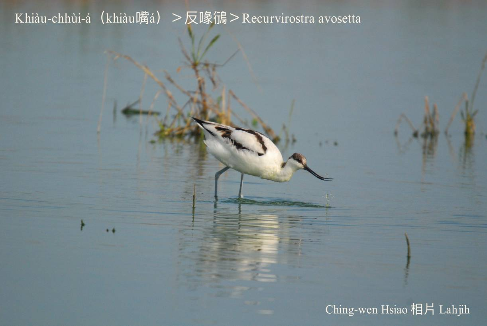
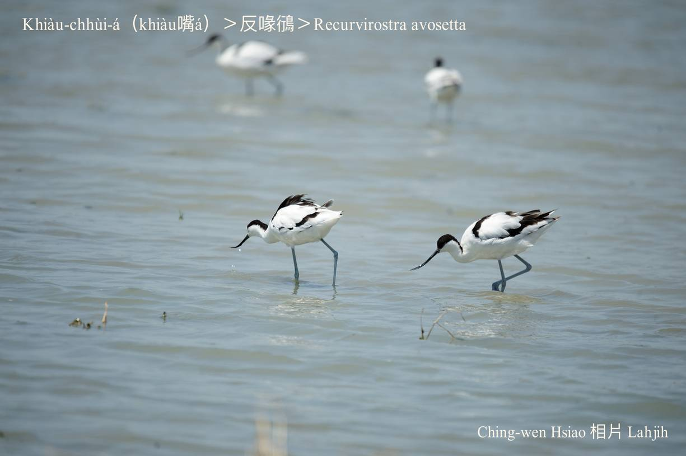
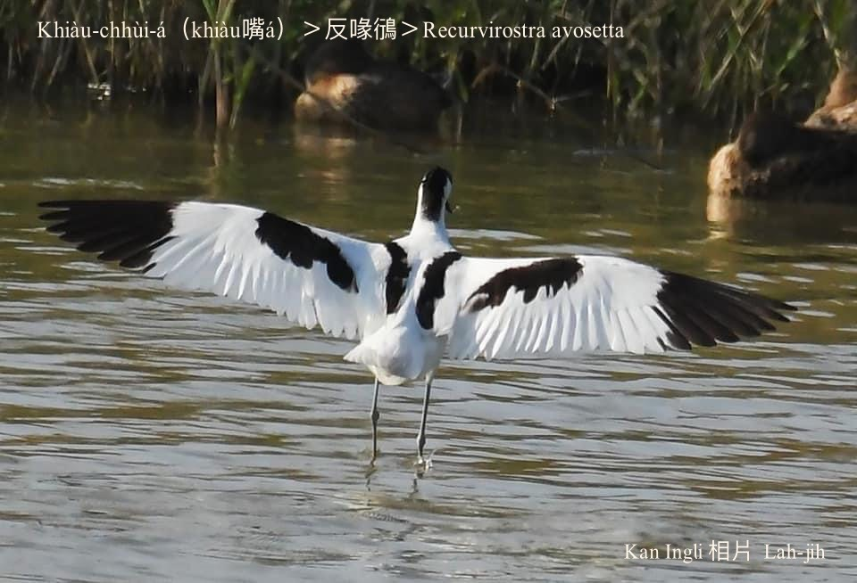
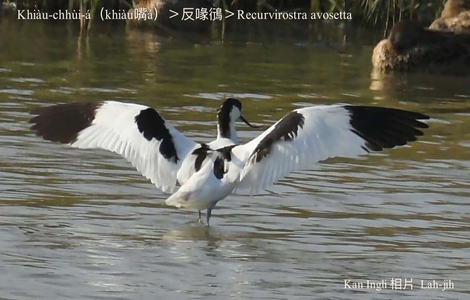
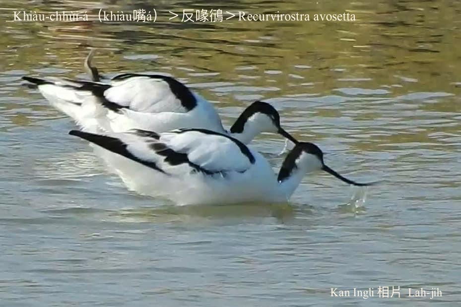

#### 16. Hêng Kho『鴴科』

|台灣名|中譯名|學名|
|Khiàu-chhùi-á（Khiàu嘴á）|反喙鴴|Recurvirostra avosetta|

# 16-4. Khiàu-chhùi-á（Khiàu嘴á）

Khiàu-chhùi-á是因為伊ê嘴pe特別長有8.8公分koh khiàu-khiàu，反嘴鴴是日本名，反字ê日本語ê意思是khiàu-khiàu。

Khiàu-chhùi-á毛色烏chhap白，嘴pe、頭殼頂、腳骨kap翼股chhap一寡烏以外，chhun--ê大部份白色，siāng特別to̍h是嘴pe khiàu-khiàu，m̄-chiah hō͘人號做khiàu-chhùi-á。kah意kui-tīn做夥tī淺水所在散步chhōe食物，真súi真好認。

Khiàu-chhùi-á tī台灣是過冬鳥，台南、嘉義沿海魚塭、鹽田濕地族群siāng chē。

# 【Tâi-oân Chiáu-á Liām Koa-si】

### **Khiàu-chhùi-á Chhùi Khiàu-khiàu**

Khiàu-chhùi-á, lâng sī khiàm lí gōa-chē chîⁿ

Lí ê chhùi, ná-ē khiàu kah án-ni-siⁿ 

Bô--lah bô--lah!

Ah to̍h pē-bó seⁿ-chiâⁿ

M̄-sī goán ài chhùi khiàu-khiàu

Pē-bó kà goán lō͘-kô͘-moâi-tē chhōe-chia̍h

Chiàⁿ-pêng lā--chi̍t-ē, tò-pêng lā--chi̍t-ē

Lŏa--ni̍h hong-piān, lí kám-chai

### 【註解】

|詞|解說|
|鴴|日本人ê造字。|
|反嘴鴴|日本名，「反」日本語ê意思是khiàu-khiàu。|

