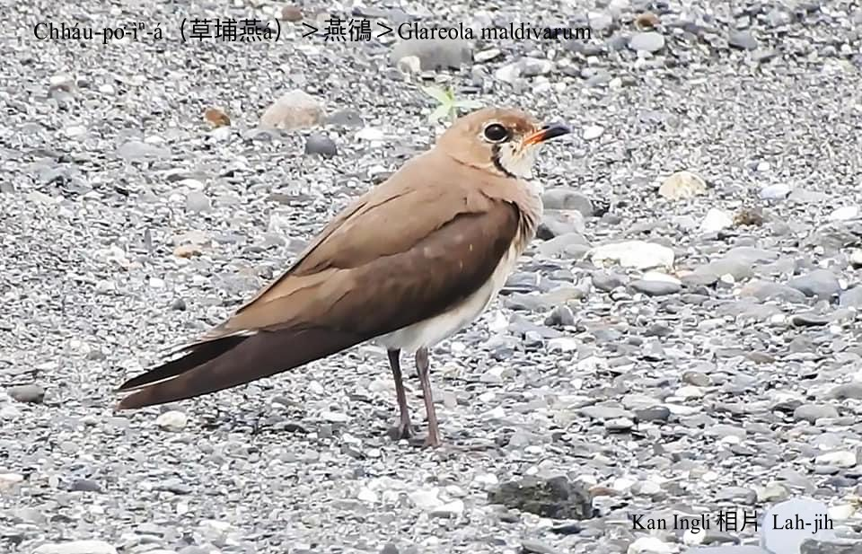

#### 17. Iàn-hêng Kho『燕鴴科』

|台灣名|中譯名|學名|
|Chháu-po͘-ìⁿ-á（草埔燕á）|燕鴴|Glareola maldivarum|

# 17-1. Chháu-po͘-ìⁿ-á（草埔燕á）

Chháu-po͘-ìⁿ-á做siū tī海邊草埔、溪埔草地；嘴pe短短闊闊，雙翼長長尖尖，尾長pit叉是典型ê燕á尾，空中飛行chhōe食姿勢mā sêng燕á。

Chháu-po͘-ìⁿ-á tī台灣西部平原是普遍ê熱天候鳥a̍h是留鳥；蘭陽平洋是春秋兩季常常看tio̍h ê過境鳥。

Chháu-po͘-ìⁿ-á親鳥有裝傷假落翼，覆tiàm土腳ké-iàⁿ bē飛來siâⁿ天敵ê行為，thang hō͘鳥á-kiáⁿ有時間走去bih。

# 【Tâi-oân Chiáu-á Liām Koa-si】

### **Chháu-po͘-ìⁿ-á Ké-sí Kiù Hâi-jî**

Chháu-po͘-ìⁿ-á, khiā-tiàm thô͘-kha chiah-nī súi

Bóe pit-chhe, ū sêng ìⁿ-á-bóe

Poe tiàm pòaⁿ-khong-tiong, kài-sêng ìⁿ-á poe

Khong-tiong lia̍h báng-thâng, si̍t-chāi hó ki-gē

Siāng hō͘ lâng o-ló, to̍h-sī lí ê bó-ài

Ūi-tio̍h kò͘-kiáⁿ an-choân

Lí ē ké-sí tī thô͘-kha phia̍t--leh phia̍t--leh

Phiàn lí te̍k-jîn, gông-gông-se̍h

Chiah bē hō͘ lí ê gín-á, kiaⁿ kah chò káu-pê

### 【註解】

|詞|解說|
|鴴|日本人ê造字。|
|ké-iàⁿ|『佯裝』。|

