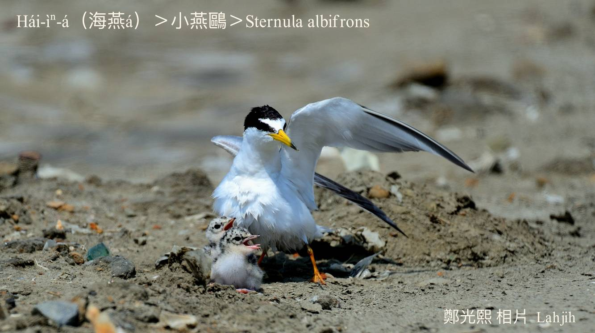

#### 18. Au Kho『鷗科』

|台灣名|中譯名|學名|
|Hái-ìⁿ-á（海燕á）|小燕鷗|Sternula albifrons|

# 18-1. Hái-ìⁿ-á（海燕á）

Hái-ìⁿ-á飛行時所展開ê尾kap燕á尾kāng-khoán pit叉，因為生活tī海邊，chiah hō͘人號做海燕á。

Hái-ìⁿ-á是唯一tī台灣本島生湠ê鷗科鳥，tī大肚溪口附近出現ê族群非常chē，是夏候鳥a̍h是過境鳥。常常tī海邊、溪口附近離土腳三、四公尺koân飛行，chhōe水面頂ê魚蝦，nā有發現，隨時chai落水面lia̍h食，而且隨時離開水面升空。

Hái-ìⁿ-á是保育類海鳥，每年4月中旬到5月初，飛來台灣生湠，ǹg-bāng hip鳥仔ê鳥友m̄-thang ka攪吵。

# 【Tâi-oân Chiáu-á Liām Koa-si】

### **Hái-ìⁿ-á Lia̍h-hî Ū-kàu Khiàng**

Hái-ìⁿ-á lia̍h-hî ū-kàu khiàng

Phi hái-bīn siòng-chiong-chiong

Choan lia̍h phû-tī chúi-bīn ê hî hê

Poe koân koh poe kē

Hui-hêng ki-su̍t lí siāng ē

### 【註解】

|詞|解說|
|展|Thián。|
|phi|展翼óa水邊，kah Phi chúi-phi ê phi kāng意思。|

