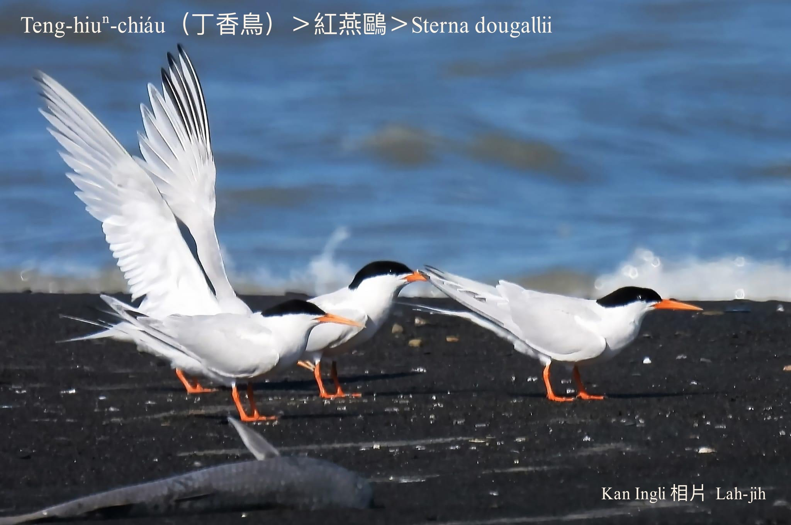
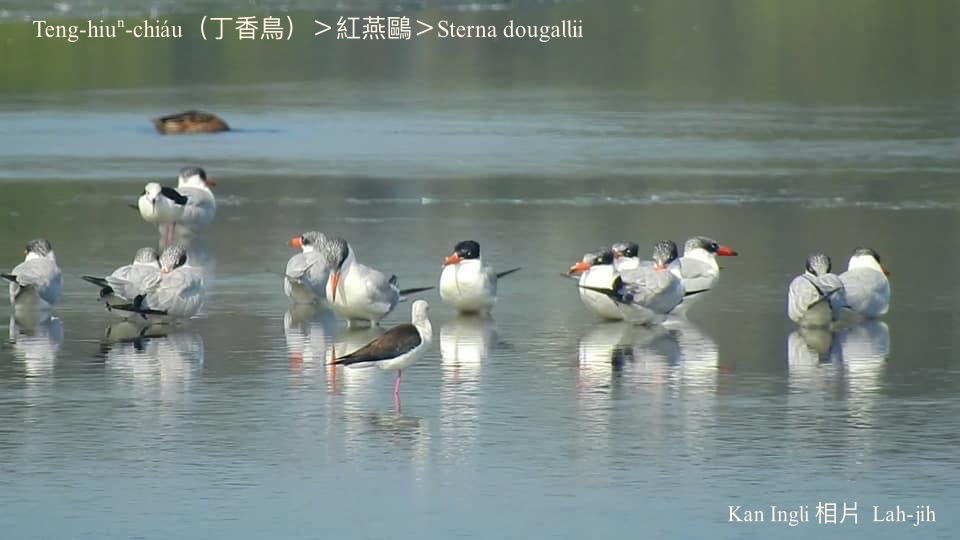

#### 18. Au Kho『鷗科』

|台灣名|中譯名|學名|
|Teng-hiuⁿ-chiáu（丁香鳥）|紅燕鷗|Sterna dougallii|

# 18-2. Teng-hiuⁿ-chiáu（丁香鳥）

Teng-hiuⁿ-chiáu hèng食丁香魚，常常歸陣飛tiàm丁香魚魚群ê空中，lia̍h食丁香魚。漁民to̍h根據in出現ê所在來斷定一定有丁香魚群ê存在，澎湖漁村to̍h kā chit種鳥á號做丁香鳥。

Teng-hiuⁿ-chiáu ê頭殼頂面到後斗殼á有烏色ê羽紋，有烏頭鬃á ê別名，是真súi ê海鳥，tī澎湖地區是罕有ê夏候鳥。

# 【Tâi-oân Chiáu-á Liām Koa-si】

### **Teng-hiuⁿ-chiáu Ài-chia̍h Teng-hiuⁿ**

Teng-hiuⁿ-hî phang koh tiⁿ, góa siāng kah-ì

Bô-gî-gō͘ soah kā lín lia̍h-hî-lâng chhōa-lō͘

Hō͘ lín lia̍h kah móa-chûn-chài

Pài-thok lín kiâⁿ-chûn-lâng, m̄-thang kā gún hāi

