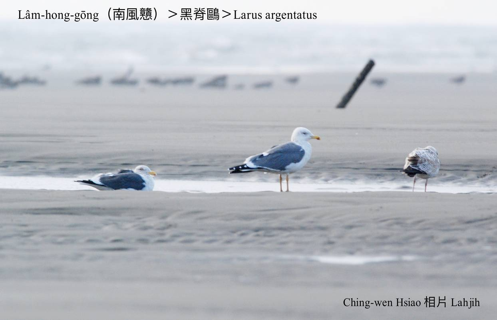
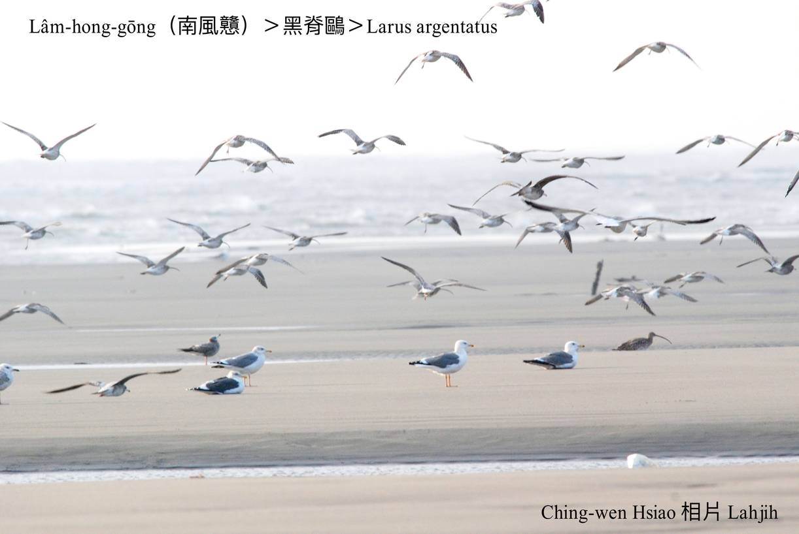
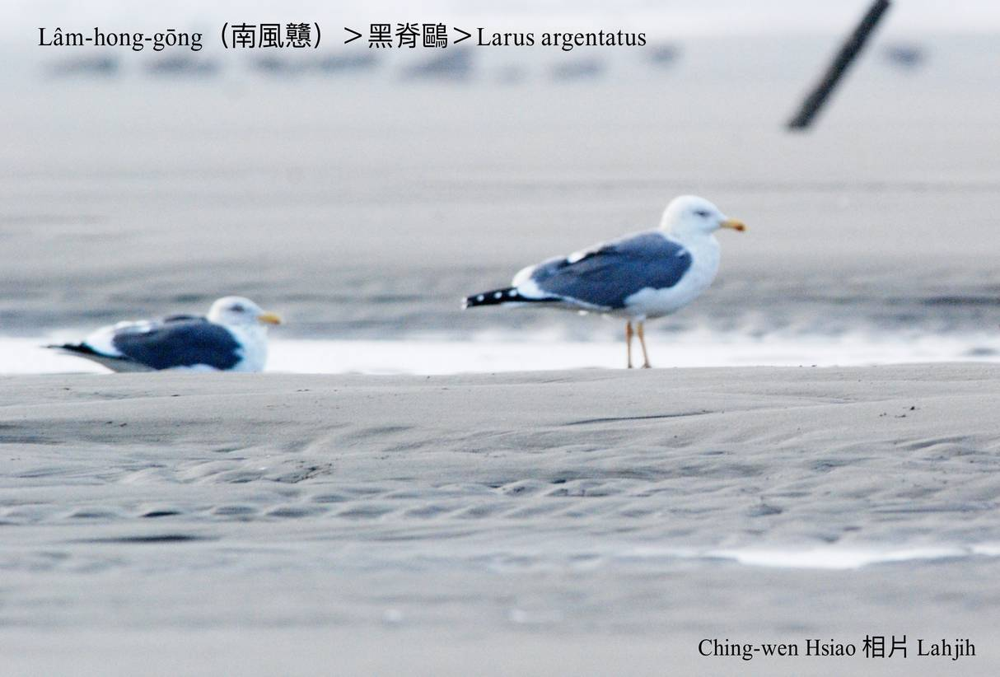

#### 18. Au Kho『鷗科』

|台灣名|中譯名|學名|
|Lâm-hong-gōng（南風戇）|黑脊鷗|Larus argentatus|

# 18-3. Lâm-hong-gōng（南風戇）

Lâm-hong-gōng tī澎湖ê老輩漁民有án-ne傳說，海鵝，俗名南風戇，tī冬天徙來島嶼真chē，漁民常常利用暗夜用手網á lia̍h，tī透南風ê天氣siāng容易lia̍h，認為chit種海鳥戇直，chiah kā號名南風戇。

Chit-mái已經無人leh lia̍h，族群mā chiah chhun 40外隻，tī台灣是chiâⁿ普遍ê冬候鳥，愛食ham-á類kap  tōa-kóng-sian，tī海--ni̍h時常tòe tī輪船後壁飛，chhōe船頂hìⁿ-sak ê食物。

# 【Tâi-oân Chiáu-á Liām Koa-si】

### **Lâm-hong-gōng Chin Liân-hôe**

Lâm-hong nā thàu, lín to̍h sûi-sî kàu

Lâm-hong nā chhoe, lín to̍h chin liân-hôe

Thó-hâi lâng boeh kā lín lia̍h

Lín gōng-gōng m̄-chai sí-oa̍h

Hông lia̍h-khì thâi

Lín iáu chhùi-á khui-khui, m̄-chai-iáⁿ thang ai

Hó-ka-chài, Tâi-oân-lâng sim-lāi ū ài

Nā bô

Khòaⁿ lín gōng-gōng tîⁿ-tòe hî-chûn āu-piah m̄-tio̍h hāi

### 【註解】

|詞|解說|
|tōa-kóng-sian|『招潮蟹』。|
|tîⁿ-tòe|『跟隨』。|

