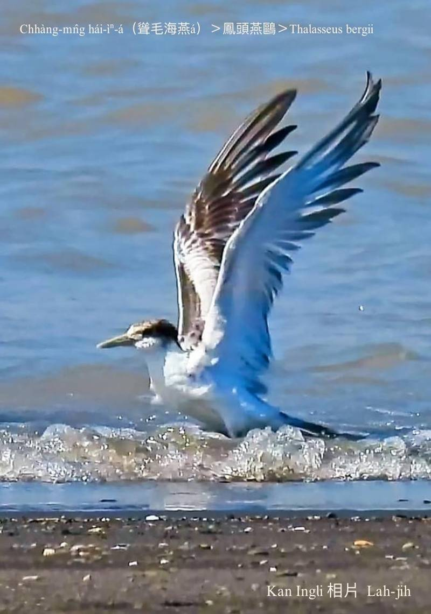

#### 18. Au Kho『鷗科』

|台灣名|中譯名|學名|
|Chhàng-mn̂g Hái-ìⁿ-á（聳毛海燕á）|鳳頭燕鷗|Thalasseus bergii|

## 18-4. Chhàng-mn̂g Hái-ìⁿ-á（聳毛海燕á）

Chhàng-mn̂g hái-ìⁿ-á尾pit叉親像燕á尾，頭殼頂烏色羽毛chhàng-chhàng，身軀是niau鼠á phú色chhap白色，chiâⁿ súi，因為iáu無台語名，所以ka號做聳毛海燕á。

Chhàng-mn̂g hái-ìⁿ-á tī台灣是熱天渡鳥，出現tī溪口、海邊、海礁，ē結群雙雙對對活動，食細尾魚hām無骨動物。

Chhàng-mn̂g hái-ìⁿ-á算是珍貴罕有野生動物，數量穩定。

另外馬祖ê縣鳥「烏嘴尾鳳頭燕鷗Thalasseus bernsteini」是giōng-boeh絕種ê海鳥。

# 【Tâi-oân Chiáu-á Liām Koa-si】

### **Chhàng-mn̂g Hái-ìⁿ-á Mô͘-á Chhàng-chhàng**

Chhàng-mn̂g hái-ìⁿ-á mô͘-á chhàng-chhàng

Chhàng-chhàng thâu-mo͘ chiok bê-lâng

N̂g chhùi-pe

O͘ kha-tê

Phú-sek si̍t-kó͘ pe̍h pak-tó͘

Chin gâu poe

馬祖ê縣鳥，「烏嘴尾鳳頭燕鷗Thalasseus bernsteini」。

