#### 19. Kiu-kap Kho『鳩鴿科』

|台灣名|中譯名|學名|
|Chheⁿ-chui（青鵻）|綠鳩|Treron sieboldii|

# 19-1. Chheⁿ-chui（青鵻）

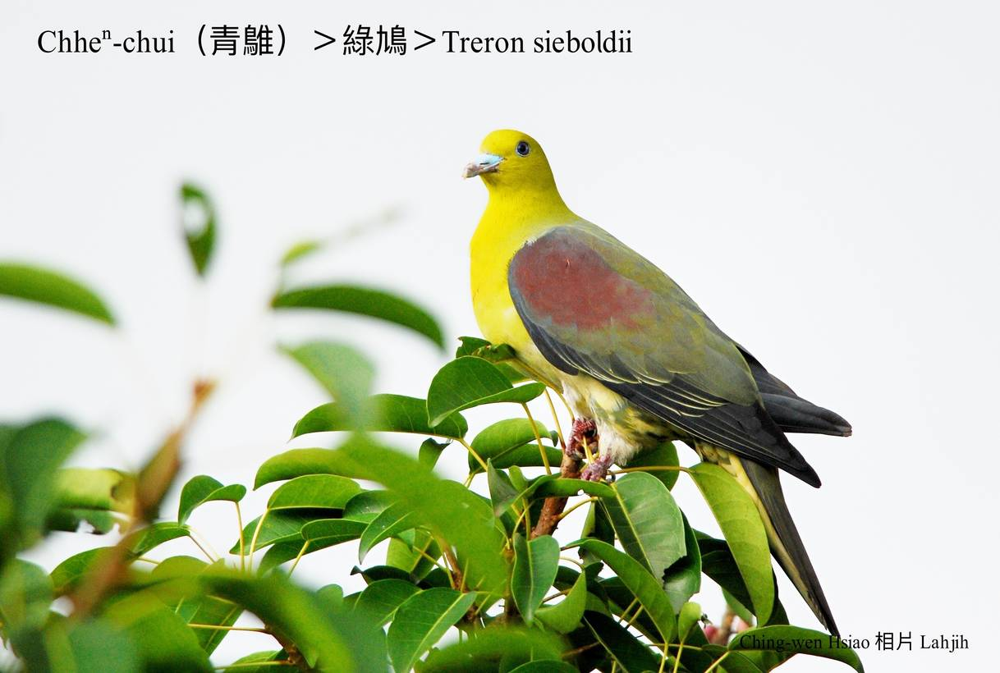

Chheⁿ-chui大部分歇tī原始闊樹林內，kui身軀有樹葉á色ê保護色，真oh hō͘人發現，háu聲「hū hŭ~hu hū」ná洞簫聲，tī台灣東部另外有紅頭青鵻T.formosae formosae，是無kài普遍ê留鳥。Kan-nā出現tī東部、南部kap火燒島、紅頭嶼，食果子hām種子。

# 【Tâi-oân Chiáu-á Liām Koa-si】

### **Chheⁿ-chui Pûn Tōng-siau**

Chheⁿ-chui Chheⁿ-chui lí chin-gâu

Koh-ē pûn tōng-siau

Hū hŭ~hū hŭ~hū hŭ~hū hŭ~

Sui-bóng bô jī khek

Siaⁿ-im chiok hó-thiaⁿ

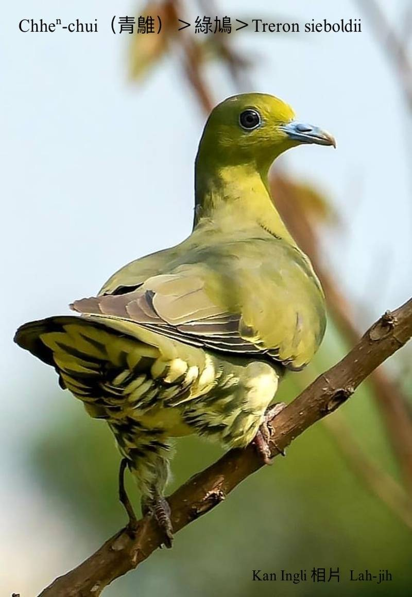
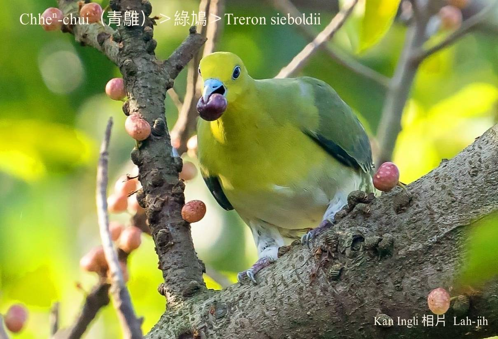
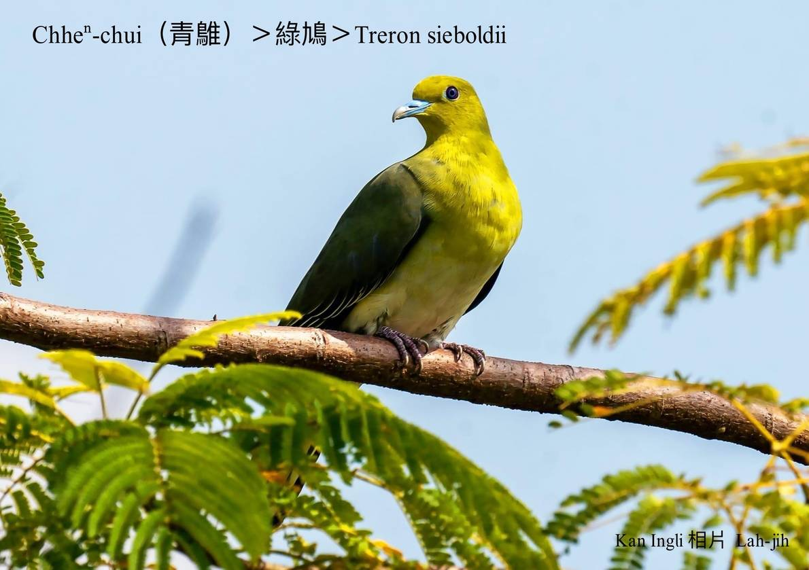
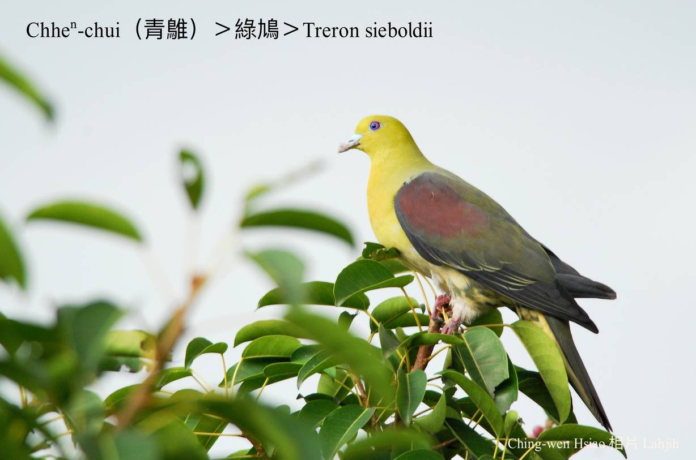
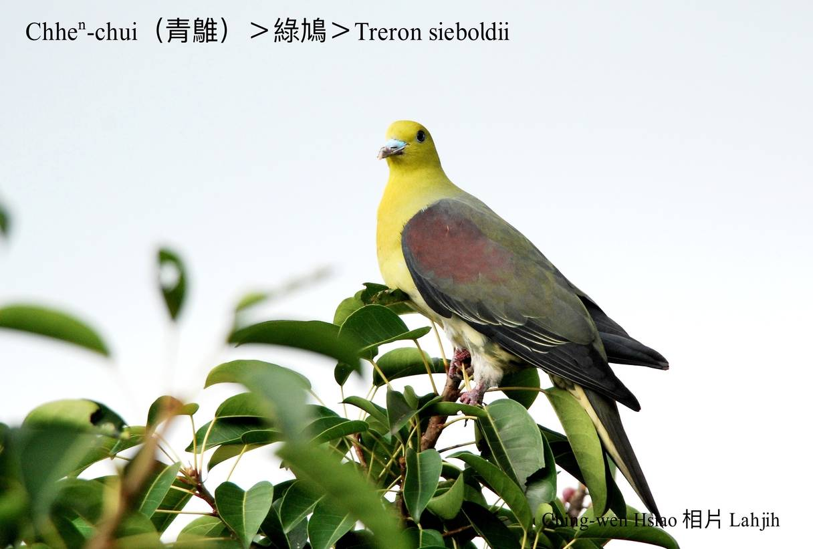
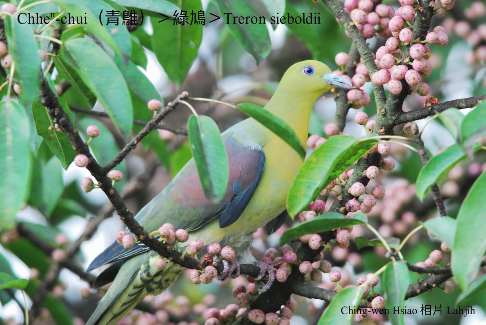
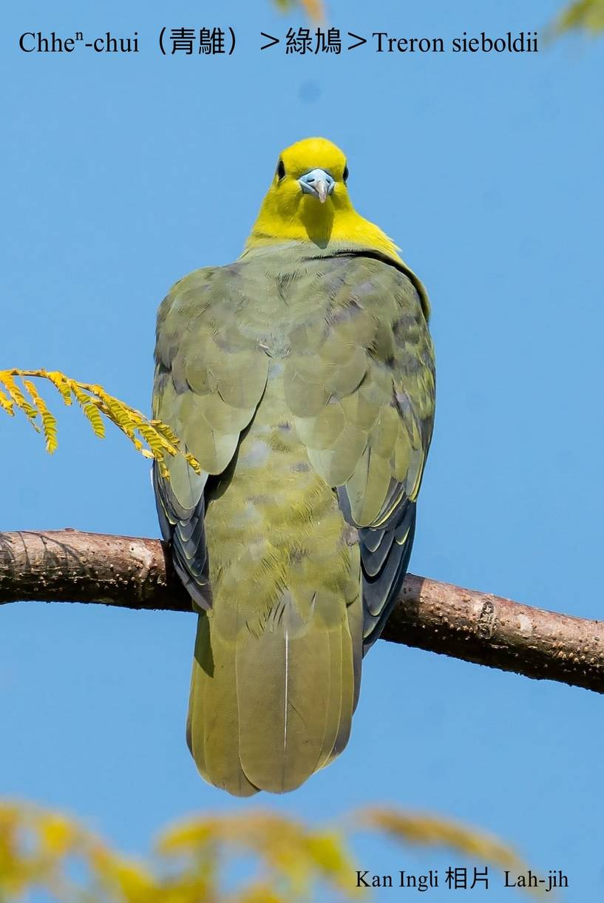
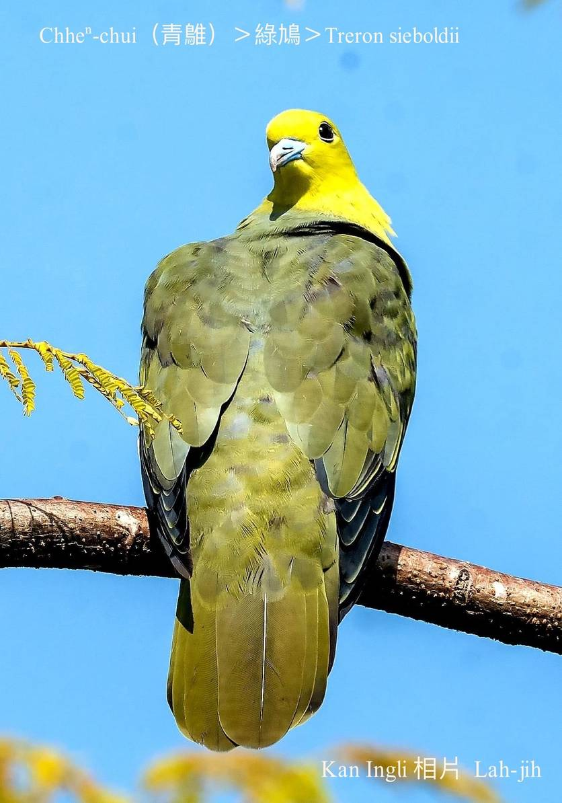
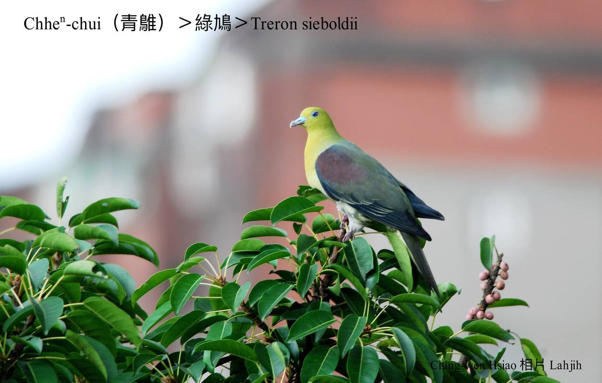
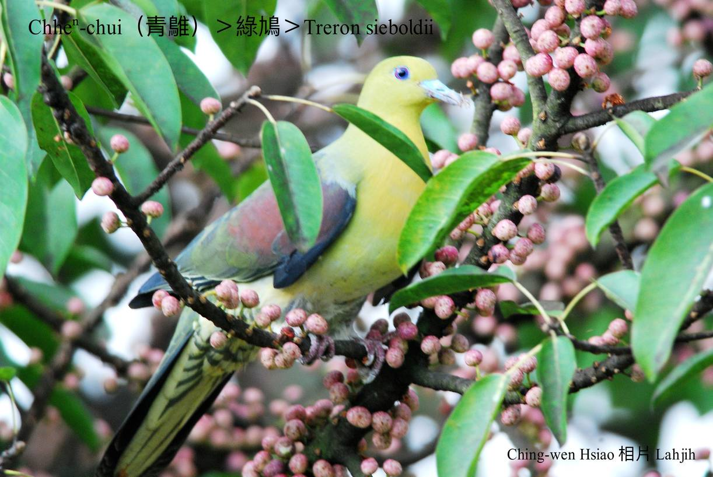
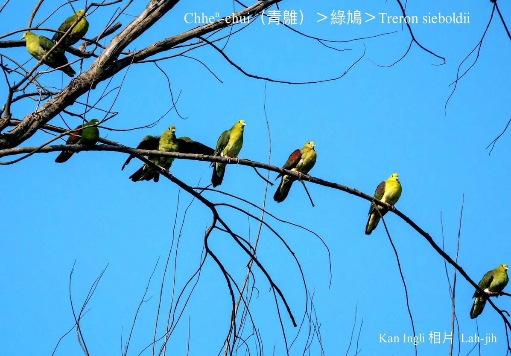
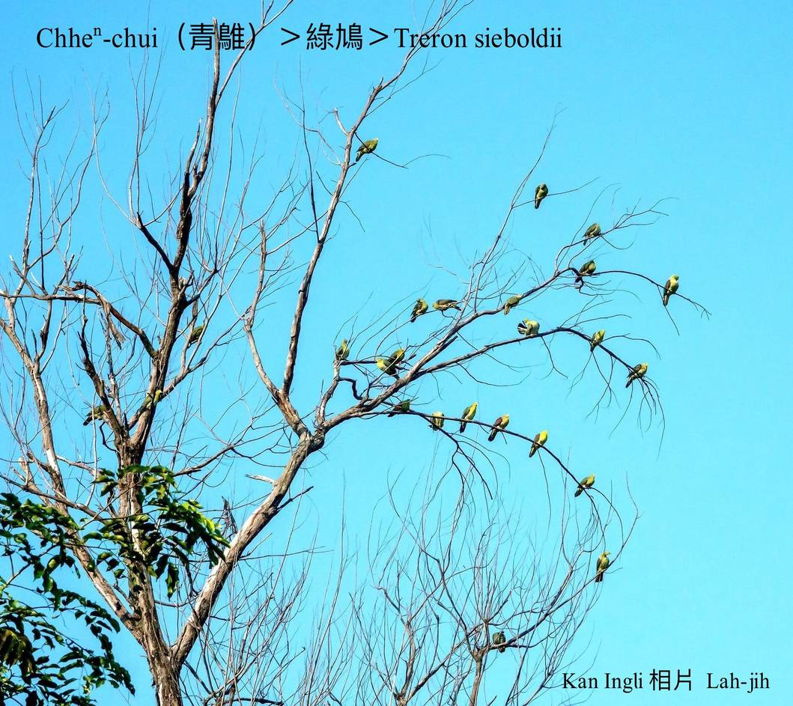

### 【註解】

|詞|解說|
|紅頭嶼|Âng-thâu-sū，『台東縣蘭嶼』。|
|火燒島|Hóe-sio-tó，『台東縣綠島』。|

