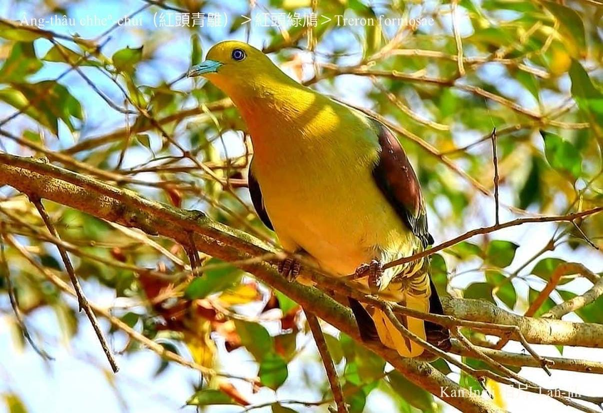
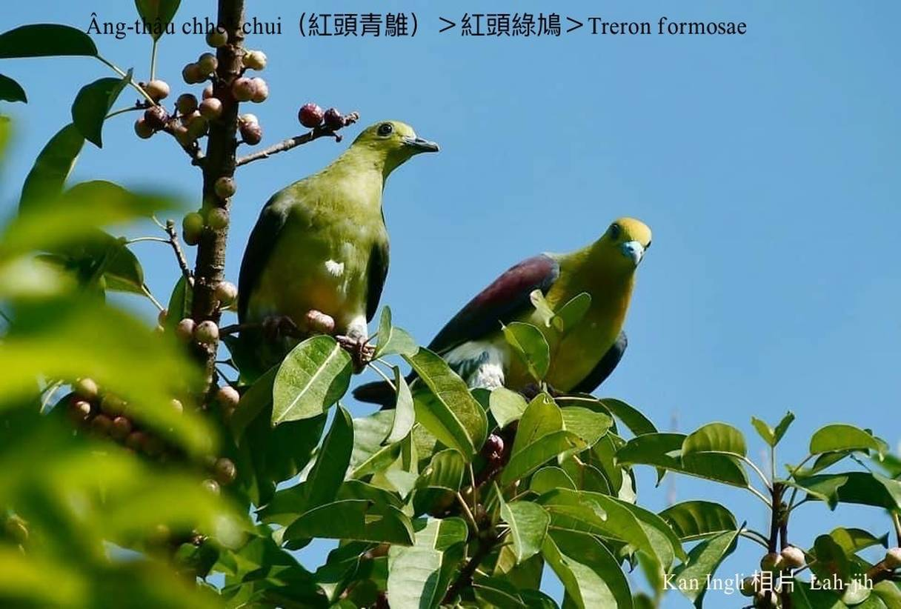
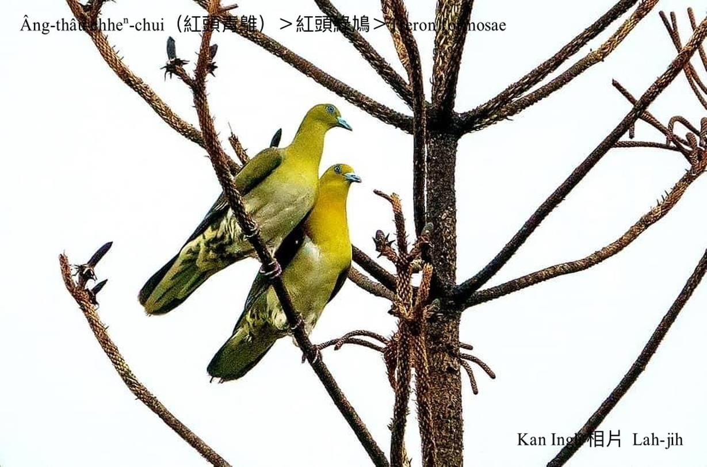
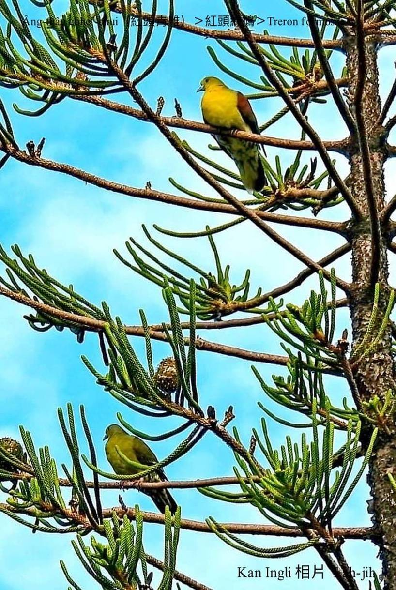
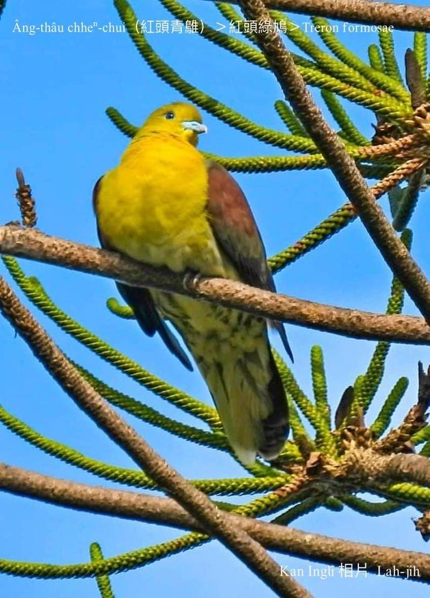
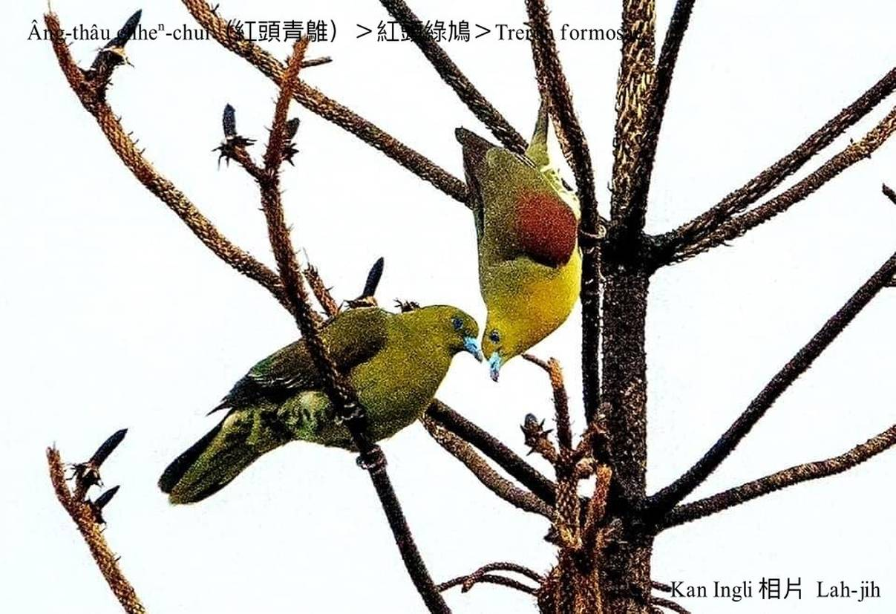
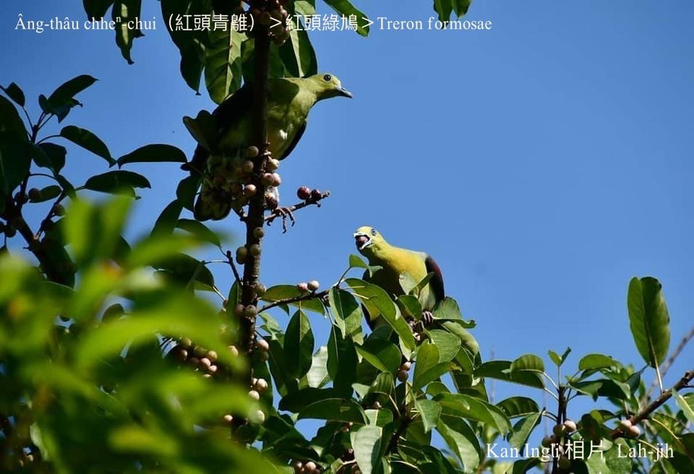

#### 19. Kiu-kap Kho『鳩鴿科』

|台灣名|中譯名|學名|
|Âng-thâu-chheⁿ-chui（紅頭青鵻）|紅頭綠鳩|Treron formosae|

## 19-2. Âng-thâu-chheⁿ-chui（紅頭青鵻）

Âng-thâu-chheⁿ-chui是台灣特有亞種二級保育鳥類，台灣本島東部、南部kap Hóe-sio-tó、Âng-thâu-sū lóng有i ê腳跡，hèng食果子、鳥榕，hioh tī樹林內，oh-tit發現。

Âng-thâu-chheⁿ-chui頭殼頂羽毛âng-hóaⁿ âng-hóaⁿ，háu聲ná像kho͘-si-á聲，chiok sêng thô͘-pi-á聲，好聽koh大聲ê牽聲，其他hām ka-chui無siáⁿ-mih差別。

# 【Tâi-oân Chiáu-á Liām Koa-si】

### **Âng-thâu-chheⁿ-chui Gâu Kho͘-si-á**

Âng-thâu-chheⁿ-chui si̍t-chāi kó͘-chui

M̄-nā seⁿ-chò súi koh-ē kho͘-si-á

Chhin-chhiūⁿ thô͘-pi-á siaⁿ hiah hó-thiaⁿ

Âng-thâu-chheⁿ-chui chhiáⁿ lâi tòa goán chhù-piⁿ

Ta̍k-ji̍t kho͘-si-á hō͘ goán thiaⁿ

### 【註解】

|詞|解說|
|Hóe-sio-tó|『台東縣綠島』。|
|Âng-thâu-sū|『台東縣蘭嶼』。|
|thô͘-pi-á|『陶笛』。|
|ka-chui|『綠鳩』。|
|腳跡|Kha-jiah。|

