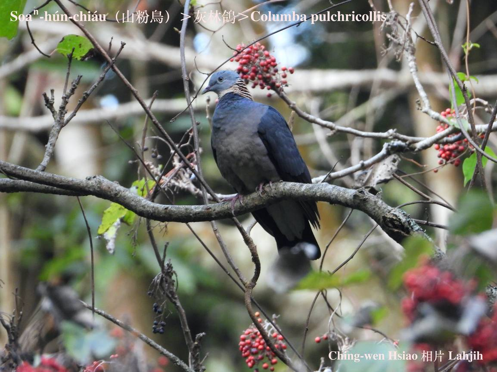
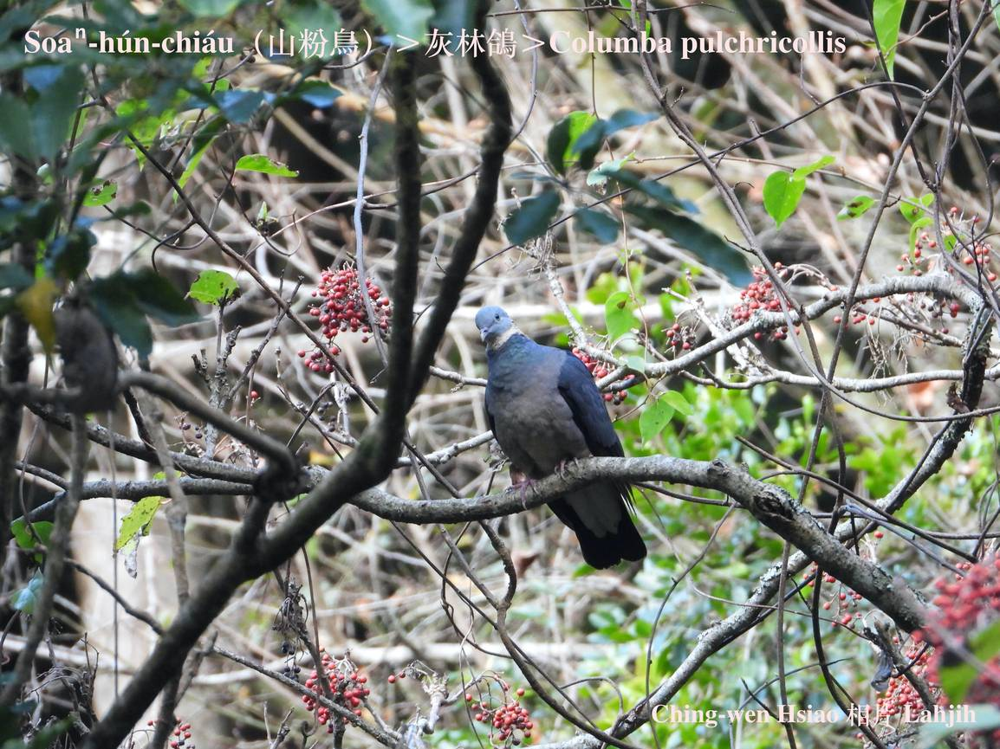
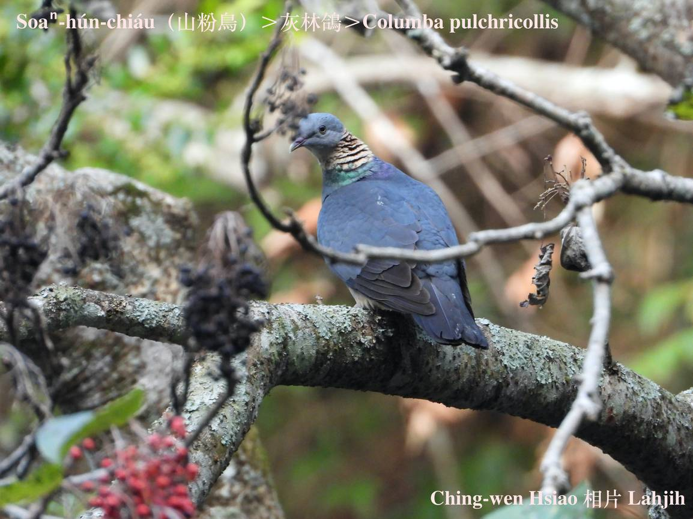

#### 19. Kiu-kap Kho『鳩鴿科』

|台灣名|中譯名|學名|
|Soaⁿ-hún-chiáu（山粉鳥）|灰林鴿|Columba pulchricollis|

# 19-3. Soaⁿ-hún-chiáu（山粉鳥）

Soaⁿ-hún-chiáu體形、大細、羽衣等，tāi-tí kap粉鳥sio-kāng，in原生tī山野，所以有山粉鳥之名，不過tī伊ê ām-kún有斑紋，這是kap粉鳥無kāng ê所在。另外，粉鳥有鼻珠，山粉鳥無。

Soaⁿ-hún-chiáu飛行ê姿勢、速度、習性kap家禽粉鳥無差別，冬天tī南投縣中埔、東埔、觀高，lóng有kui群山粉鳥leh飛來飛去，in歸陣tòa kāng chi̍t-ê所在，在地人ka號做粉鳥洞，a̍h是粉鳥林。身體大約是暗phú色，有一點á sêng一般常見ê粉鳥。

Soaⁿ-hún-chiáu kah意tī大叢樹頂活動，食果子為主，因為bih tī樹林內，無容易發現，受tio̍h嚇驚ē hām粉鳥kāng-khoán tī樹尾中間快速se̍h來se̍h去，一時á-kiáⁿ to̍h消失無khoàiⁿ，是無普遍ê在地鳥。

### 【註解】

|詞|解說|
|khoàiⁿ|Khòaⁿ-kìⁿ ê合音。|

