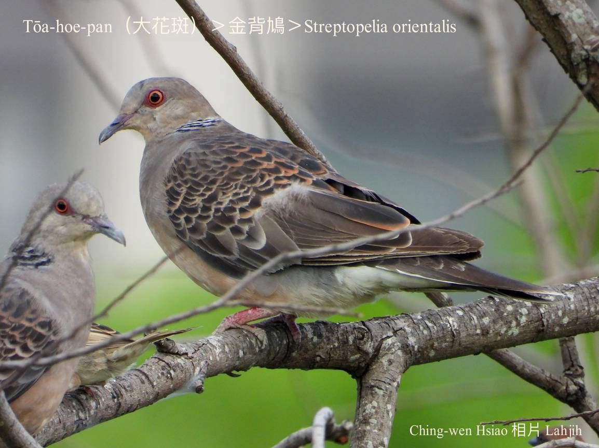
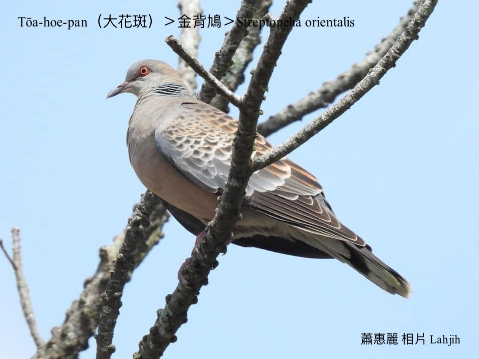
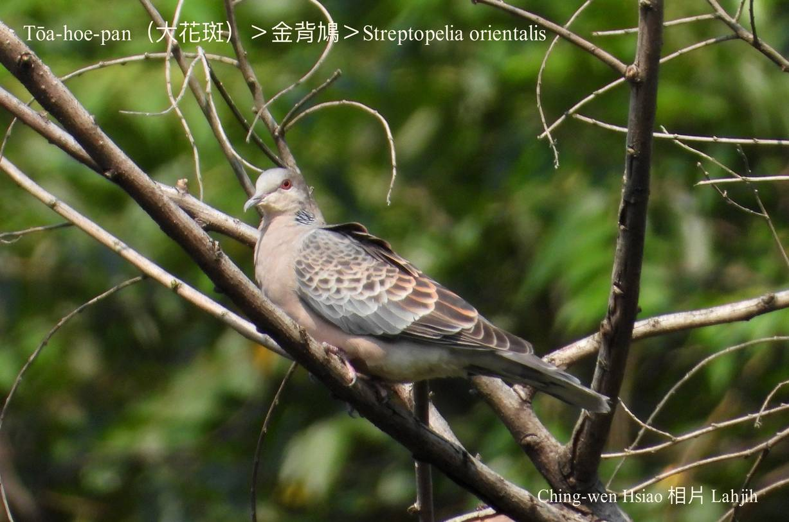
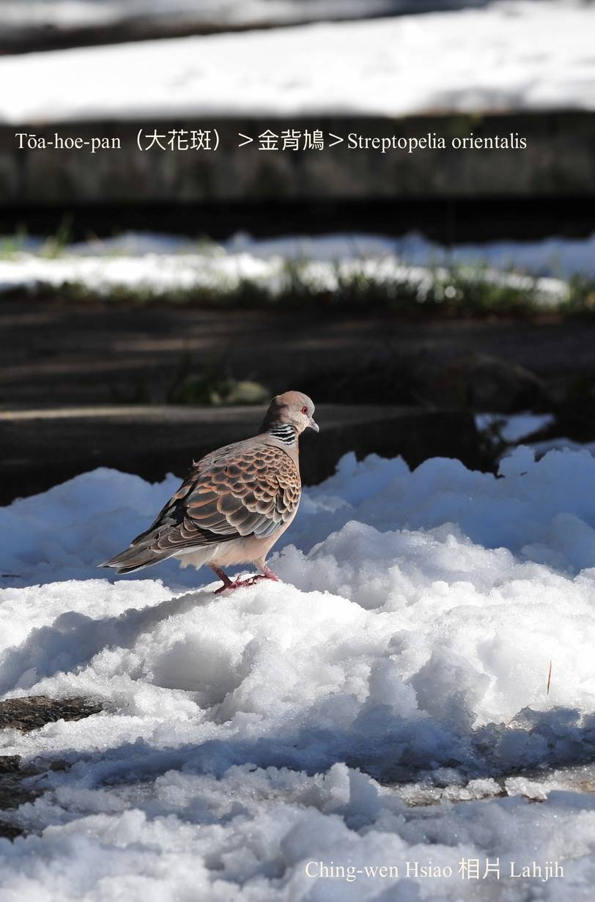
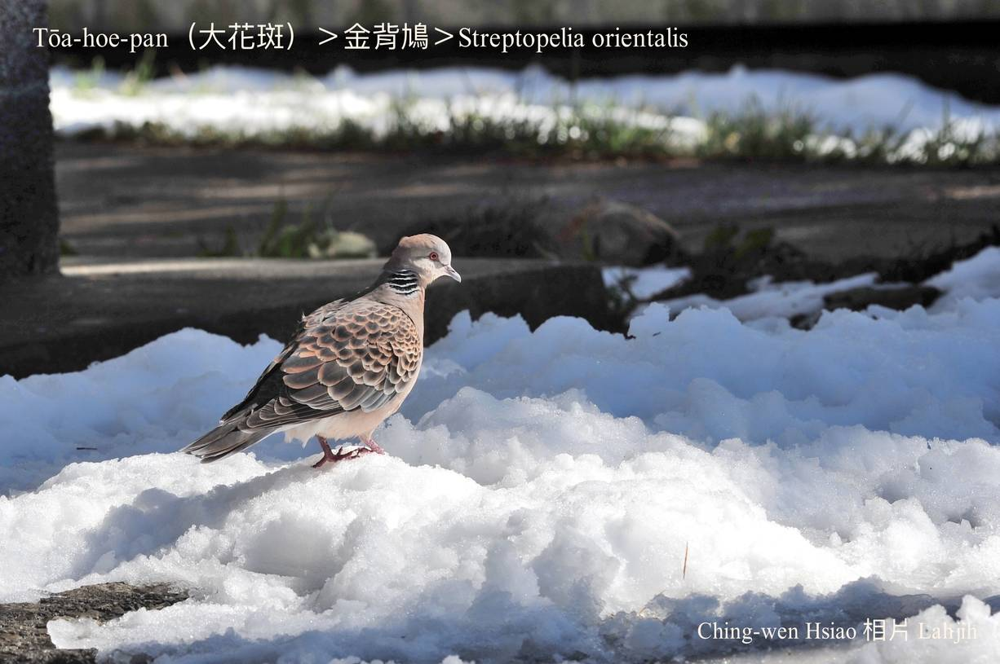
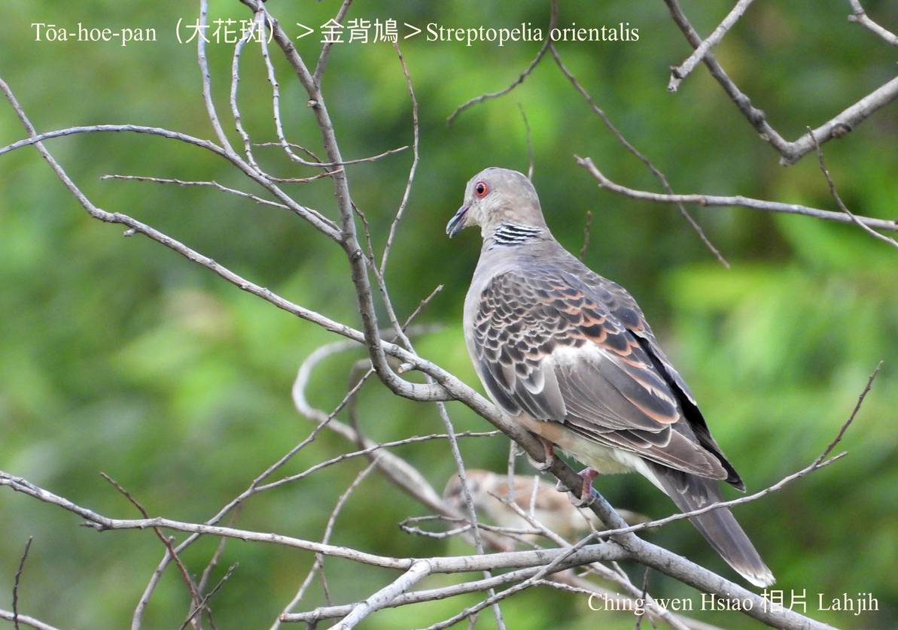
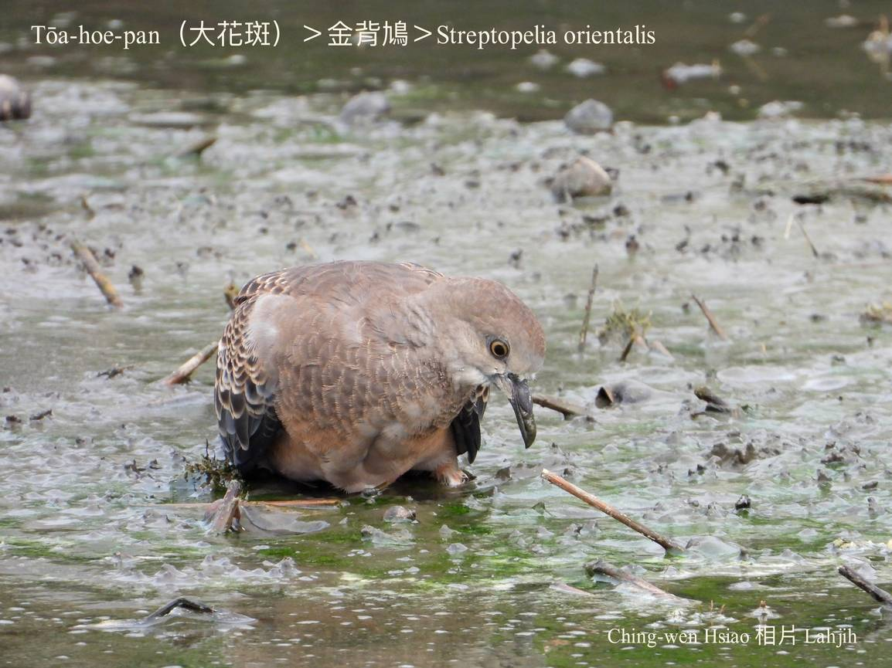
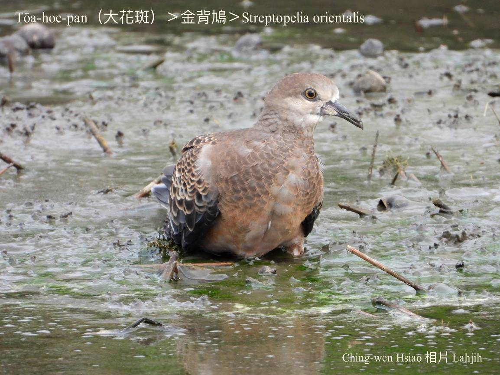
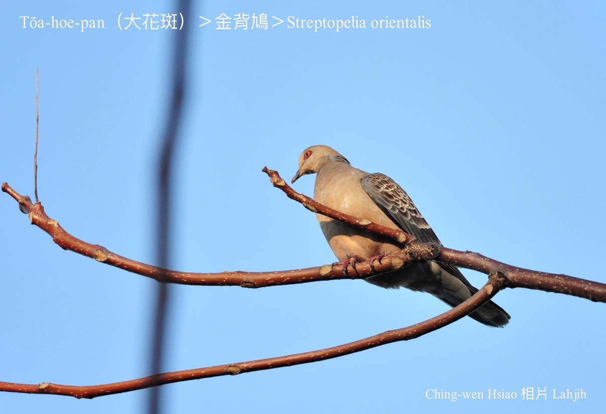

#### 19. Kiu-kap Kho『鳩鴿科』

|台灣名|中譯名|學名|
|Tōa-hoe-pan（大花斑）|金背鳩|Streptopelia orientalis|

# 19-5. Tōa-hoe-pan（大花斑）

Tōa-hoe-pan是大型ê pan-kah，鳥毛有真súi ê花紋，是普遍ê在地鳥。時常出現tī曠闊ê田園，食植物ê幼íⁿ、果子、種子為主，mā hèng食細尾蟲。

Háu聲「ku ku kū ku」、「kù ku kuh」sau聲sau聲低低lô-lô，無sò͘-chu-á hiah大聲好聽。
 
Tōa-hoe-pan khah大隻，受kiaⁿ-hiaⁿh起飛ê時，翼股phia̍t--leh phia̍t--leh ê聲音chiok大聲。

### 【註解】

|詞|解說|
|kiaⁿ-hiaⁿh|『驚嚇』。|
