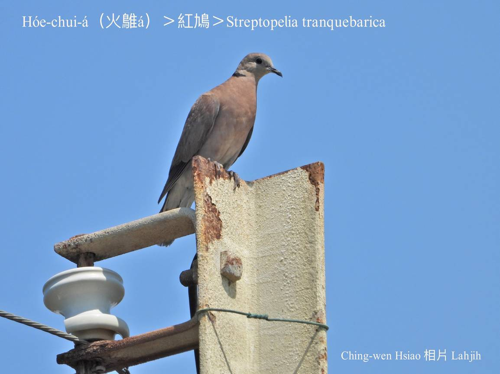
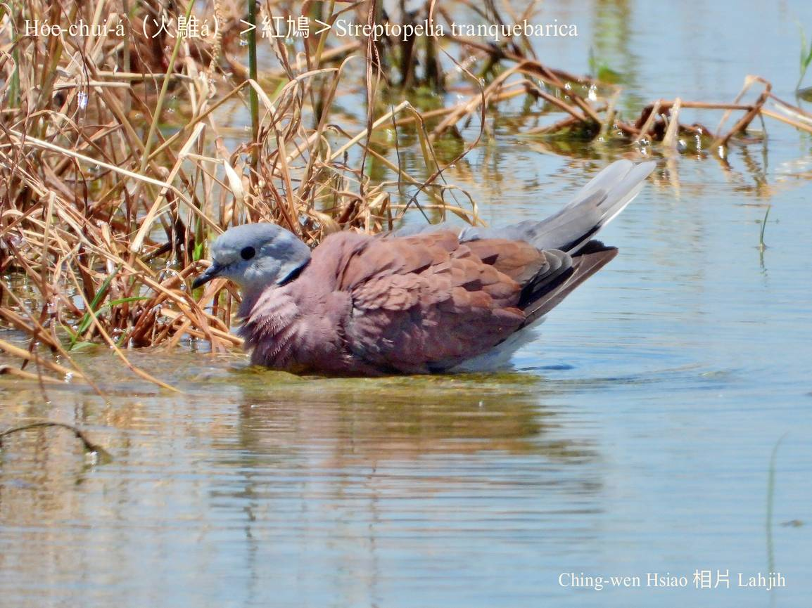
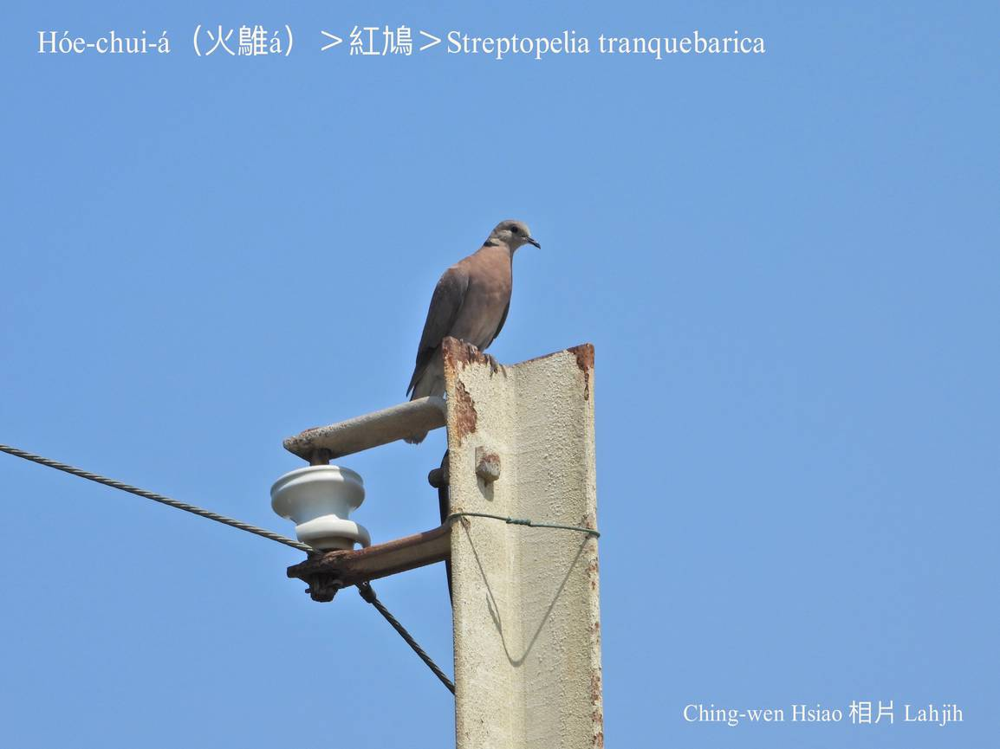
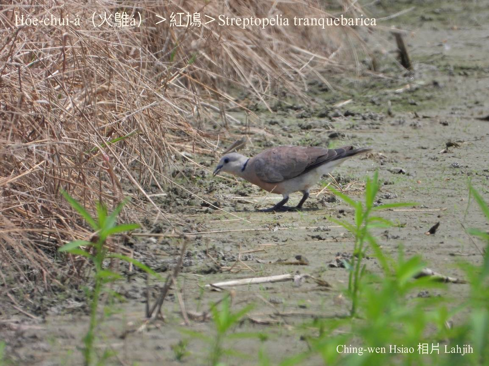
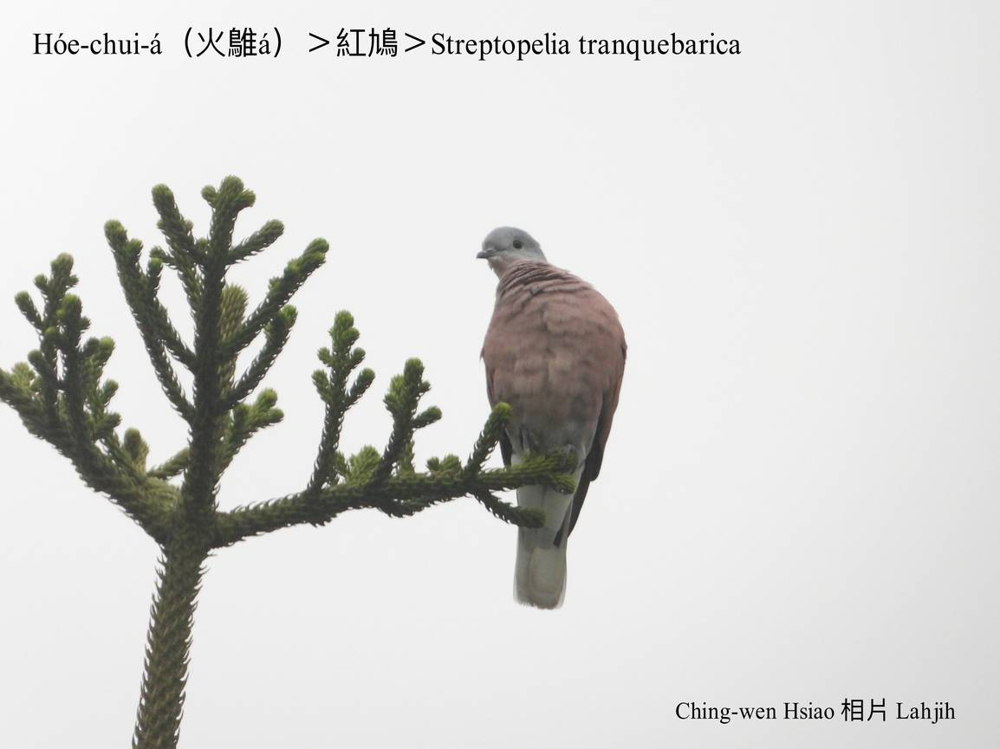

#### 19. Kiu-kap Kho『鳩鴿科』

|台灣名|中譯名|學名|
|Hóe-chui-á（火鵻á）|紅鳩|Streptopelia tranquebarica|

# 19-6. Hóe-chui-á（火鵻á）

Hóe-chui-á mā叫做紅pan-kah，因為伊ê毛紅hóaⁿ紅hóaⁿ，生湠力真強，tī西部近海地區，溪埔á，時常ē-tàng看tio̍h數十隻、數百隻做夥tī草埔a̍h是農耕地活動，in ê葡萄色紅ê鳥毛，tī飛koân落低ê姿態中，ná像火leh燒，所以chiah號做hóe-chui-á。

Hóe-chui-á大部分tī土腳chhōe食，tī城市學校內mā常常看tio̍h三五隻做夥活動，食草籽á a̍h是細尾蟲thōa，庄腳所在iáu-koh khah-chē，真正是滿四界to̍h有。Háu聲是連續ê Kû ku ku Kû ku ku Kû ku ku Kû ku ku，無夠大聲響亮。

Hóe-chui-á tī台灣是真普遍ê在地鳥。

### 【註解】

|詞|解說|
|紅鳩|Âng-kiu。|

