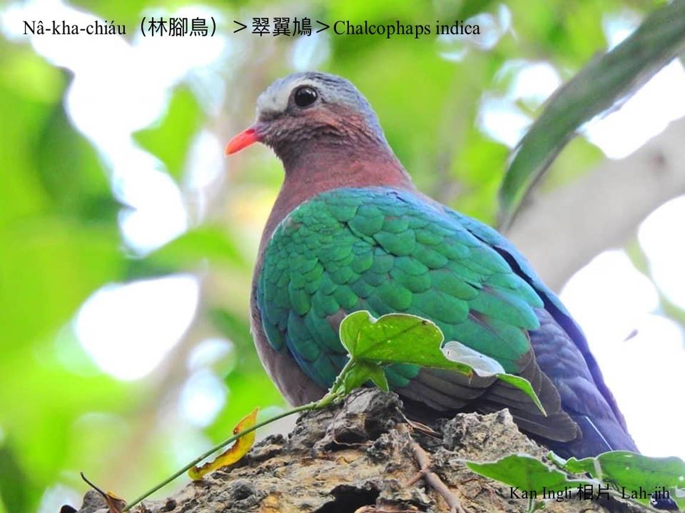
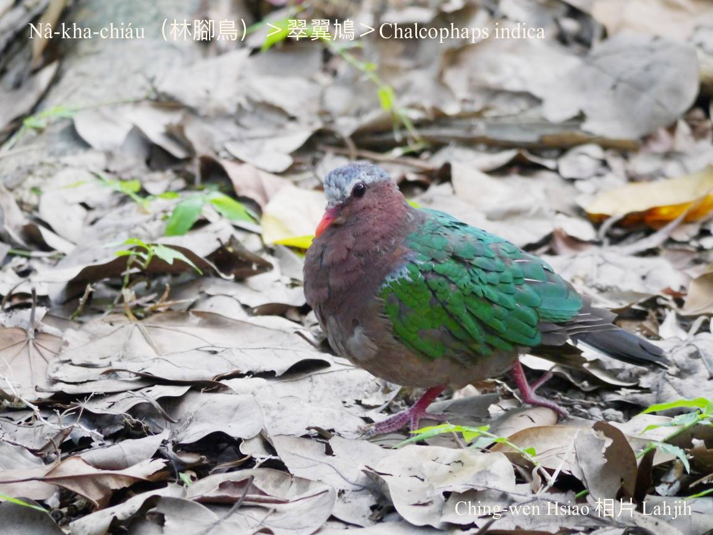
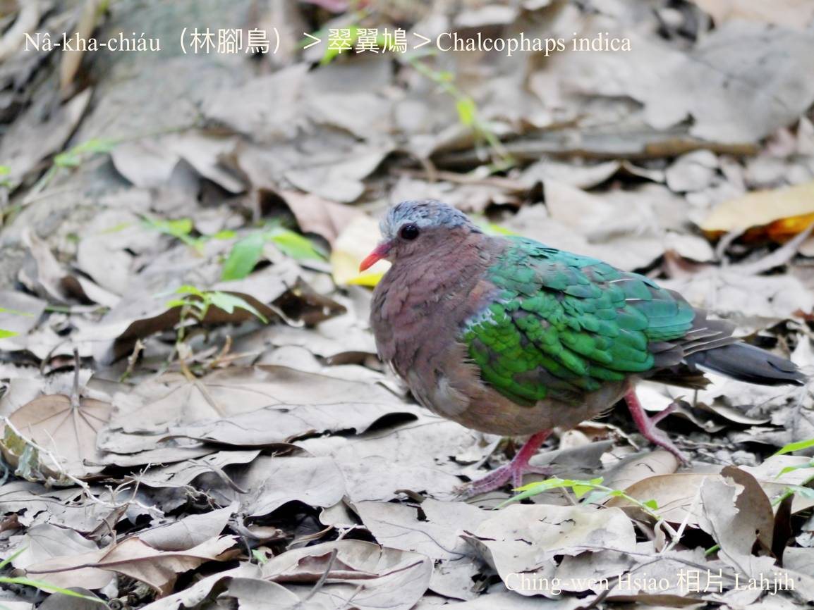
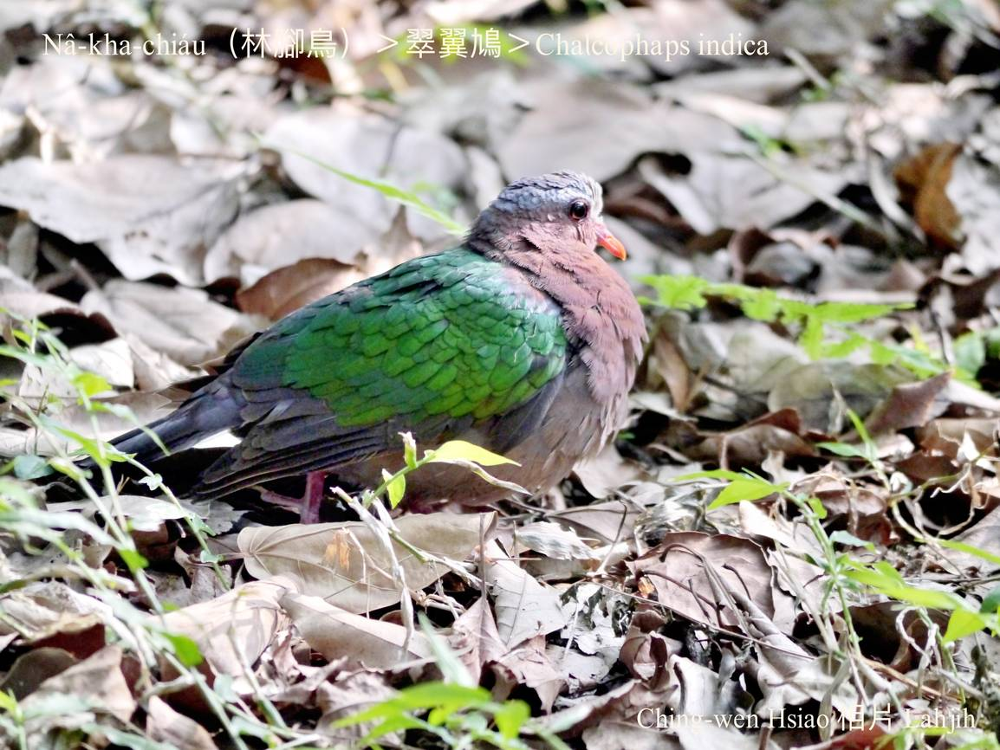
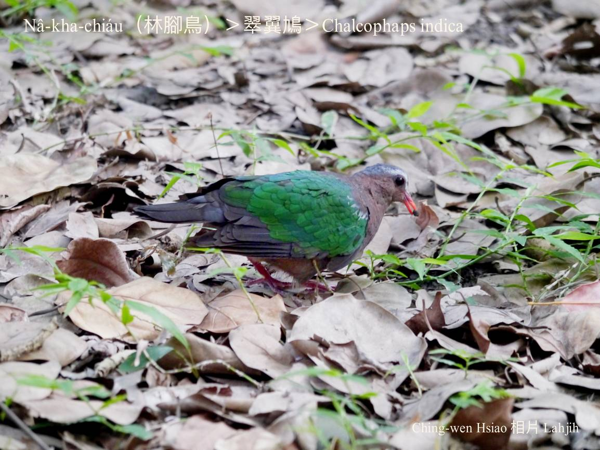
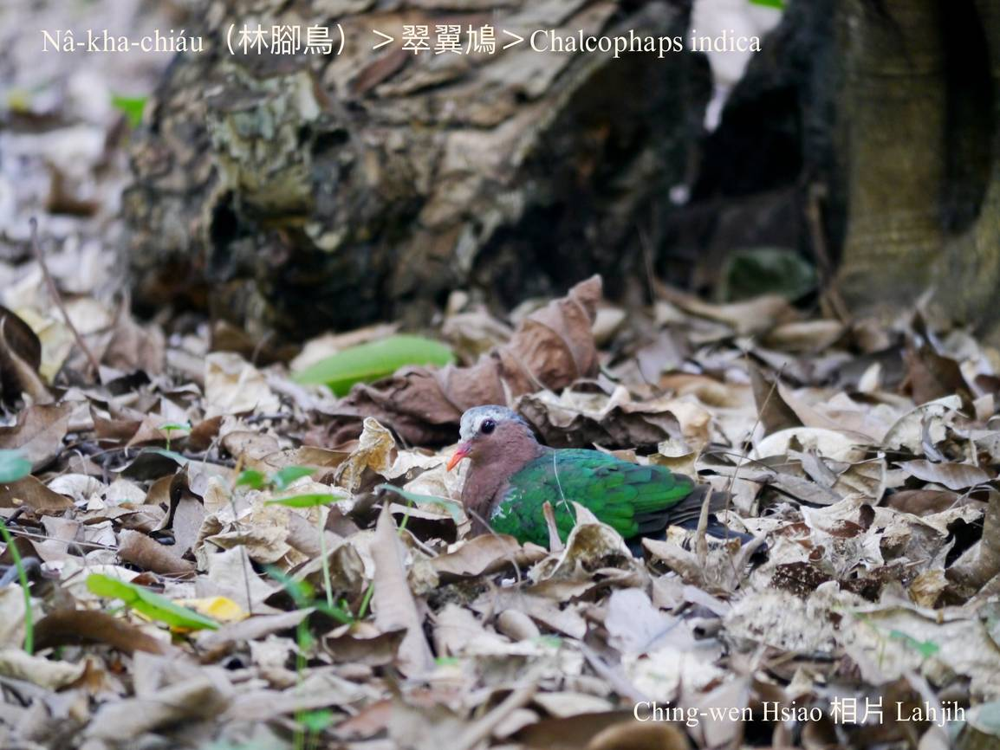
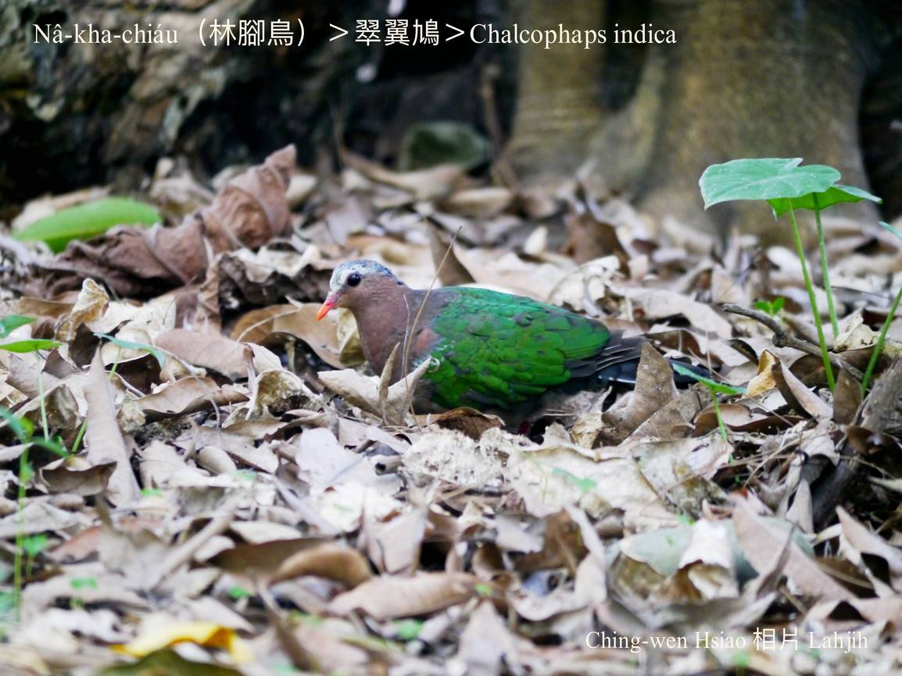
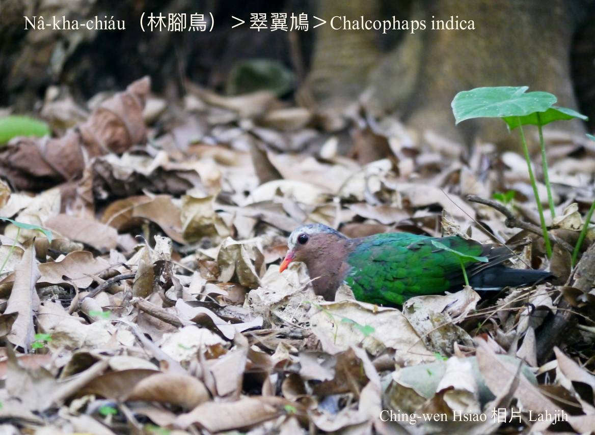
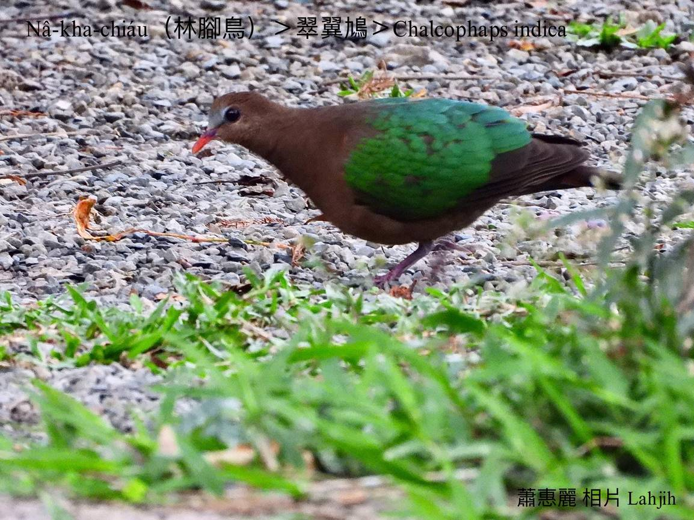
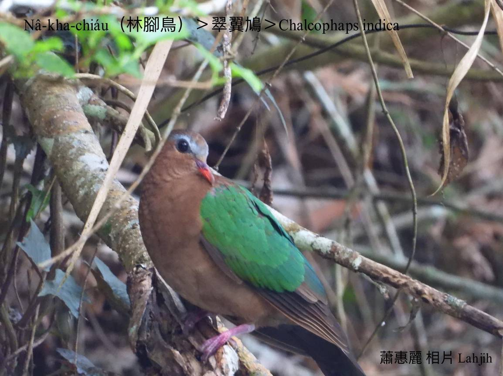

#### 19. Kiu-kap Kho『鳩鴿科』

|台灣名|中譯名|學名|
|Nâ-kha-chiáu（林腳鳥）|翠翼鳩|Chalcophaps indica|

# 19-7. Nâ-kha-chiáu（林腳鳥）

Nâ-kha-chiáu大多數tī樹á腳活動，tī內山林道a̍h是登山山路所看tio̍h ê林腳鳥，差不多lóng tī路面chhōe食，看tio̍h人to̍h隨時飛走，m̄-koh無外久to̍h-koh飛轉來原位。

Nâ-kha-chiáu紅嘴pe、chheⁿ kha-phiaⁿ、chheⁿ翼股、紅腳爪，歇tī低山區ê雜木á林、果子林a̍h是山坡農耕地，時常tī土腳chhōe食，草木ê幼íⁿ、種子、漿果kap蟲thōa是i ê食物。

Nâ-kha-chiáu tī台灣是無普遍在地鳥，大部份tī中、南部ê低海拔山區kap平地，北部khah少看tio̍h。

Nâ-kha-chiáu ê叫聲「kū-kŭ kū-kŭ kū-kŭ kū-kŭ」無kài大聲，有時是像thô͘-pi-á聲「ku ku ku ku」。

Nâ-kha-chiáu kah意單獨活動，是三級保育類。

### 【註解】

|詞|解說|
|chheⁿ kha-phiaⁿ|『綠背』。|
|thô͘-pi-á|『陶笛』。|

