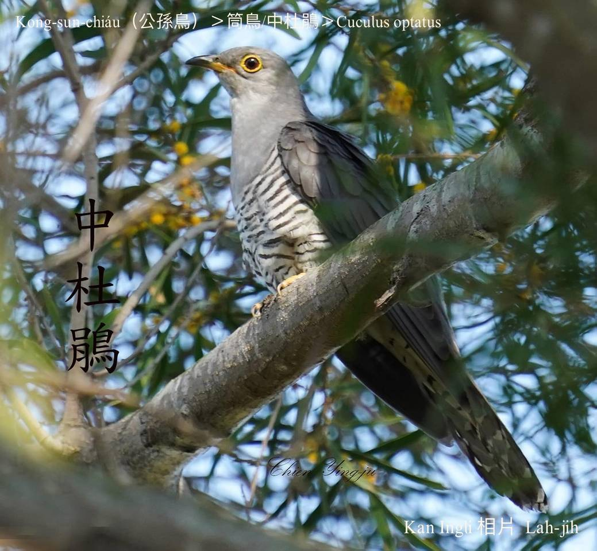
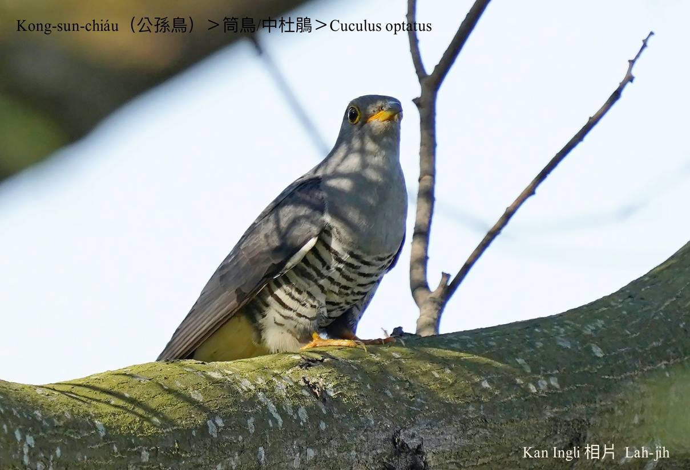
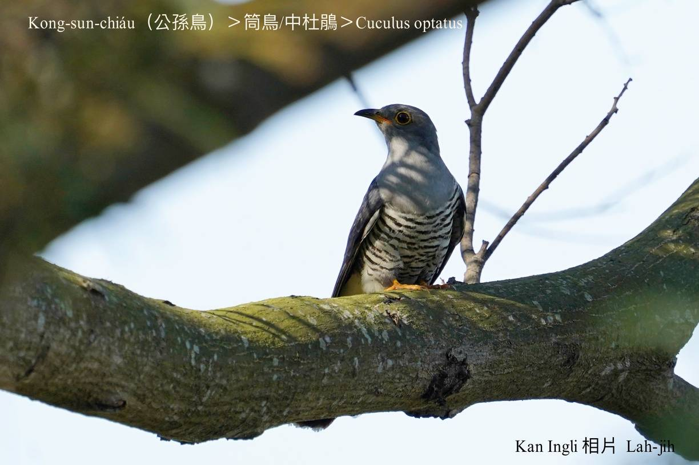
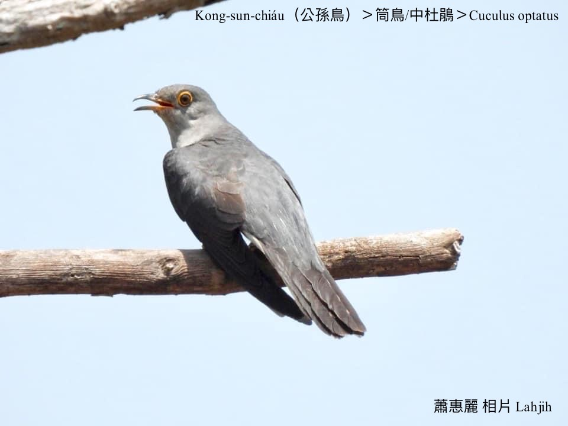
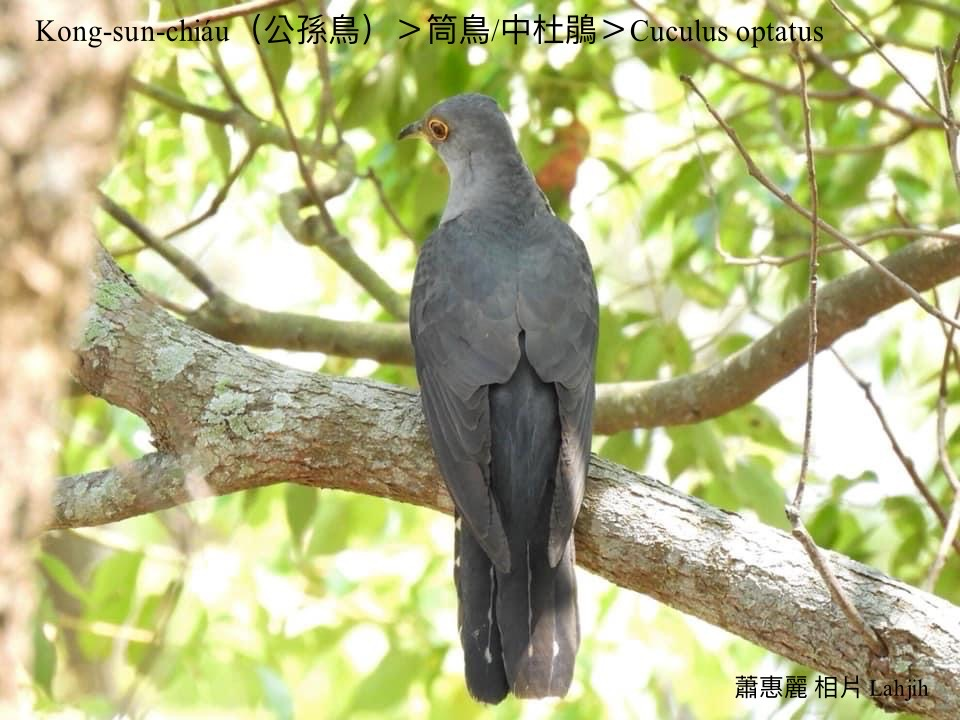

#### 20. Tō͘-koan Kho『杜鵑科』

|台灣名|中譯名|學名|
|Kong-sun-chiáu（公孫鳥）|筒鳥/中杜鵑|Cuculus optatus|

# 20-3. Kong-sun-chiáu（公孫鳥）

台灣亞種ê公孫鳥，是分布tī台灣ê杜鵑科鳥類中，唯一有生湠記錄ê『托卵性』鳥類，伊托卵ê對象是bāng-tang-tiuh-á ê siū內。不過公孫鳥tī台灣ùi山腳到低山區到高山溫帶林，是垂直線分布真闊ê鳥類，bāng-tang-tiuh-á kan-nā平洋kap低山區chiah有。

庄腳所在有án-ne ê傳說：「Bāng-tang-tiuh-á，生四粒卵，一粒孵出鷹á-kiáⁿ。」可能kap俗語「三隻鳥一隻鷹；三ê kiáⁿ一ê海瑞兵。」有關係。

另外chi̍t-ê傳說：「古早有兩ê公孫á，saⁿ-i-óa做夥生活，有一工為tio̍h掘竹筍止iau，soah hō͘人thâi死，chū-án-ne化做兩隻公孫鳥，每年春天新筍nā出，to̍h四界哀怨啼哭公孫！公孫！公孫！Háu無停。」

Kong-sun-chiáu mā叫做穀雨鳥，in tī每年穀雨節氣時，也to̍h是陽曆四月二十日a̍h是二十一日一定àn時出現háu叫。作田人聽tio̍h穀雨鳥ê叫聲，to̍h知影穀雨到--à，ē-sái-tit種豆á，所以有穀雨鳥ê名。「清明麻，穀雨豆」to̍h是講清明種麻á，穀雨種豆á，siāng chiàⁿ-pān。 

Kong-sun-chiáu ê叫聲「koko koko koko koko」，比pò͘-kok khah細聲khah低音。

### 【註解】

|詞|解說|
|bāng-tang-tiuh-á|『灰頭布袋鳥』。|
