#### 20. Tō͘-koan Kho『杜鵑科』

|台灣名|中譯名|學名|
|Ko͘-chiáu（姑鳥）|噪鵑|Eudynamys scolopaceus|

# 20-4. Ko͘-chiáu（姑鳥）

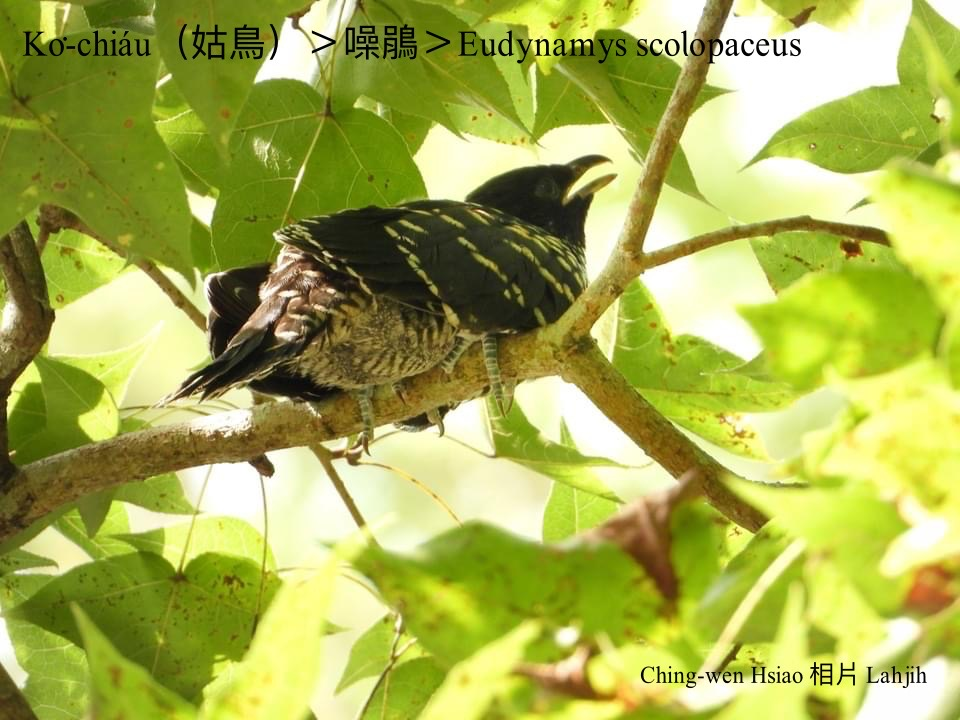

Ko͘-chiáu『噪鵑』是杜鵑科鳥類，台語叫做姑鳥，是罕有熱天渡鳥，是託卵高手，生卵寄人孵，出世寄人飼，大漢chiah ka chhōa走，chiâⁿ稀奇ê生存行為。

Ko͘-chiáu鳥公鳥毛暗khóng色，鳥母kap鳥kiáⁿ有花紋，bih-tiàm大叢ōm-ōm樹尾，叫聲「Kŏ͘！Kŏ͘！」有chhi-chhám牽聲，ná像leh叫「姑~姑~」。

Ko͘-chiáu過境期間，ē出現tī海岸、外島樹林，食果子、種子、蟲thōa。鳥母kā卵生tī客鳥、長尾山娘、鵁鴒siū內。

Ko͘-chiáu háu聲「kŏ͘~ kŏ͘~ kŏ͘~ kŏ͘~」聲音sió-khóa koân koh大聲，親像叫「kŏ͘姑~ kŏ͘姑~ kŏ͘姑~ kŏ͘姑~」，m̄-chiah hō͘人號做姑鳥。

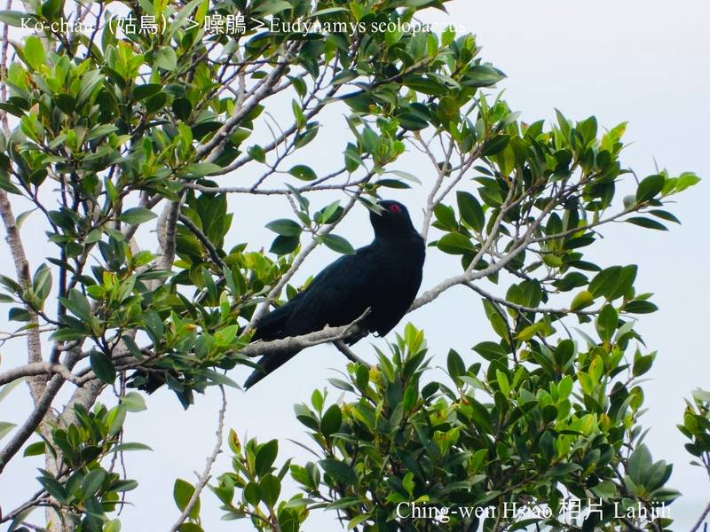
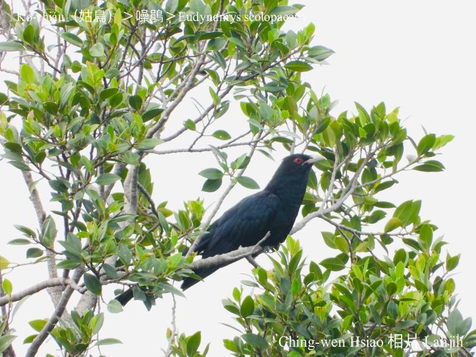
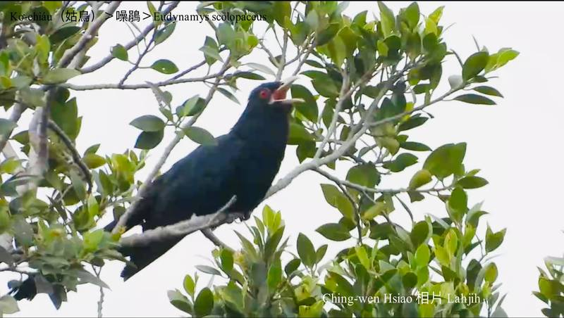
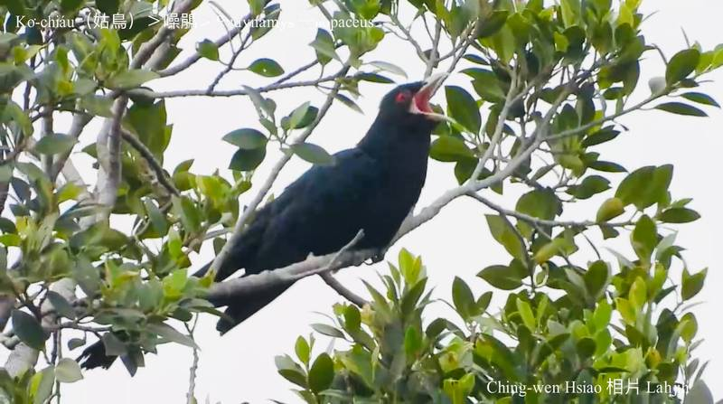
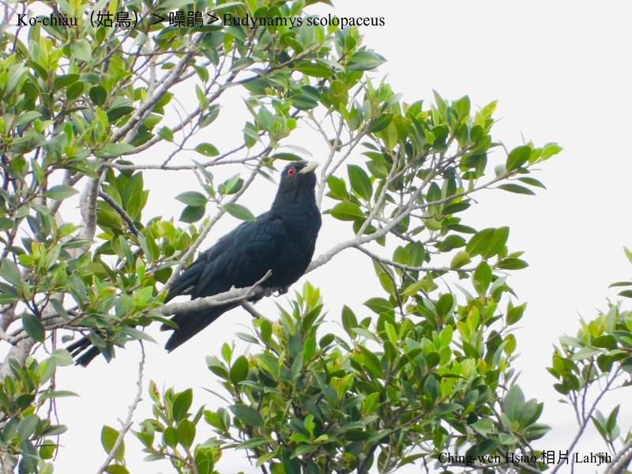
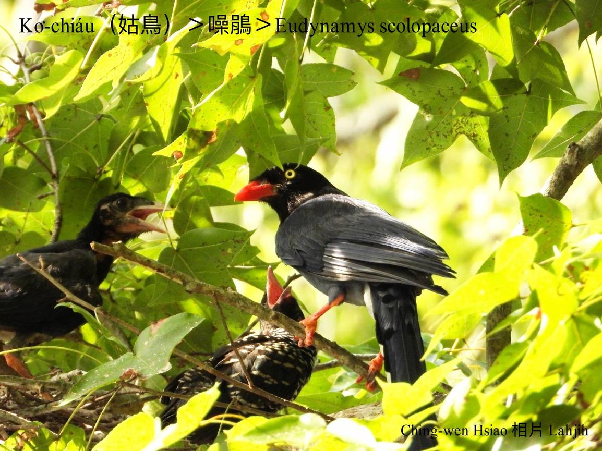
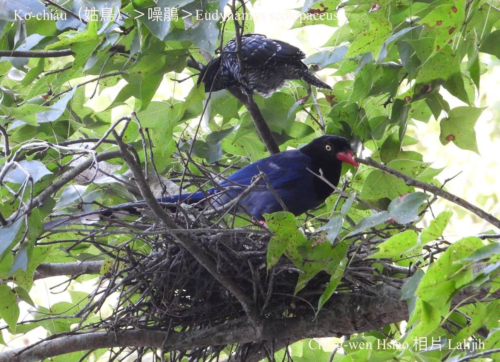
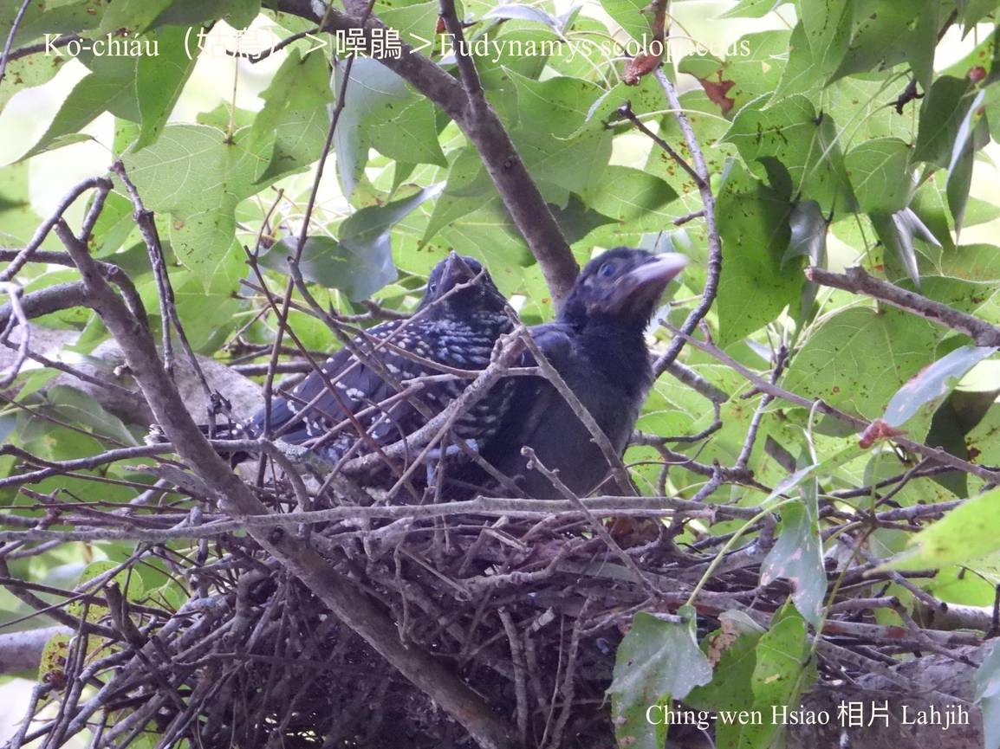
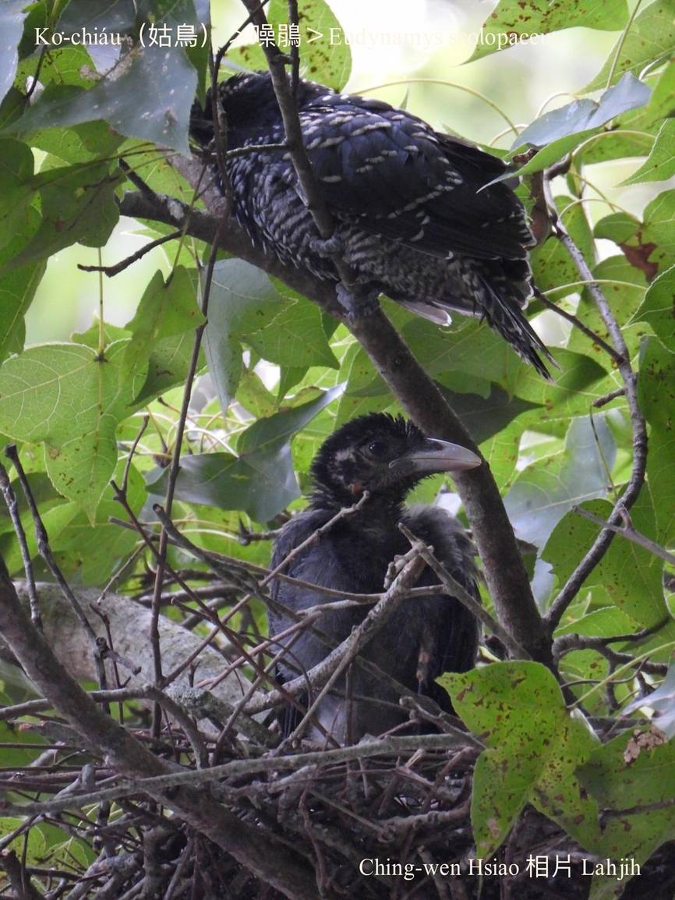
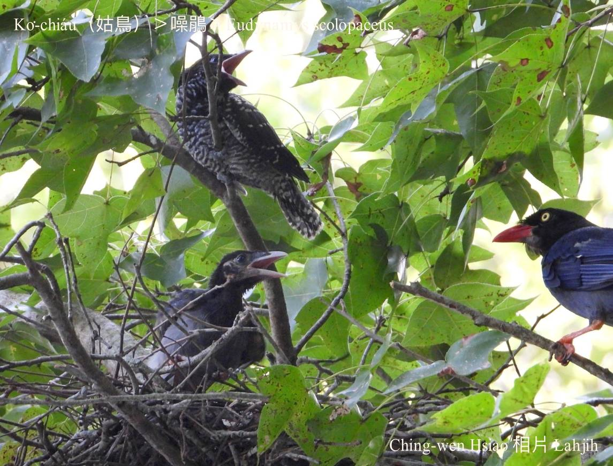
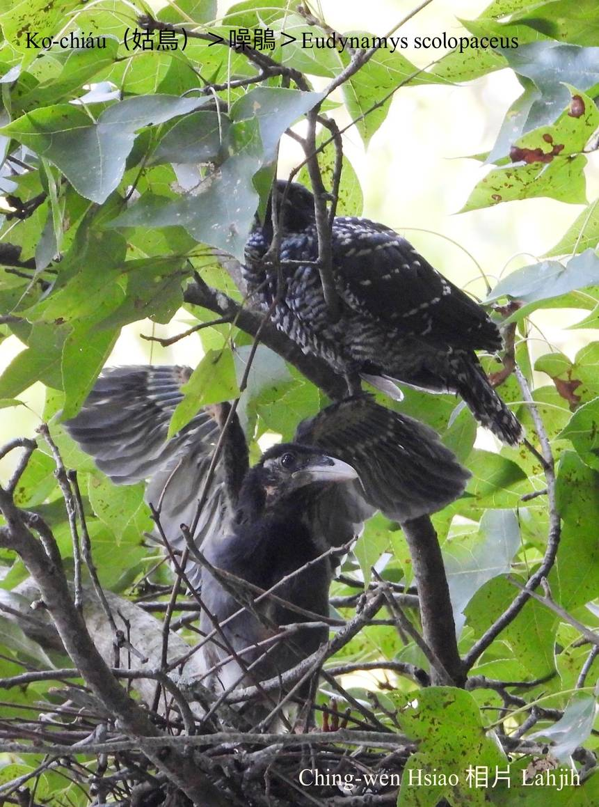

### 姑鳥ê故事
## **阿姑á！轉來--à！**

古早古早，二仁溪水頭，羅漢門地帶，有一ê真sàn-chhiah ê庄腳所在，tòa一口灶人，無爸無母，kan-nā大兄小妹兩人saⁿ-i-óa過日，大兄小妹感情chiâⁿ好。

後--來，大兄娶某成家，一家三人日子過了不止á幸福，可惜無外久，兄嫂細姑soah bē ha̍h，m̄知是阿嫂肚量siuⁿ狹，bē堪得款三頓hō͘細姑á食，koh-tio̍h了番薯á米，sian算算bē-hô；a̍h是細姑á條直bē-hiáu做人，一ki嘴含一ê舌，bē-hiáu sai-nai koh ham-bān講話，m̄-chiah bē得tio̍h阿嫂ê疼。

因為無父母thang âⁿ，soah hō͘阿嫂愈來愈m̄是款，piān-nā大兄出門去作穡，阿嫂to̍h想盡各種毒計boeh將chit-ê細姑á激出門。有一工，chit-ê無量ê阿嫂，iū-koh趁翁婿出門ê機會，將煮熟ê土豆，強迫小姑á提去山園á種，交帶tio̍h-ài等候土豆puh芽，chiah ē-sái-chit轉--來。

Boeh-àm-á兄哥轉--來，chhōe無小妹，心肝tio̍h急，sio-liân-sòa kúi-nā工四界走chhōe，lóng無消息，最後迫問ka-tī家後，chiah知in某ê毒計，to̍h強迫in某出去chhōe細姑á，而且交帶nā chhōe無伊ê小妹轉--來，「你mā m̄-thang kâ轉--來。」可憐ê阿嫂得tio̍h報應，因為chhōe無細姑á，m̄敢轉--來，soah消失tī山郊野外，化做一隻「姑鳥」，kui世人tī荒郊野外走chhōe小姑，不時tio̍h「Ko͘-ko͘-á！Ko͘-ko͘-á！Ko͘-ko͘-á！」Háu bē soah。

### 【註解】

|詞|解說|
|鵁鴒|Ka-lēng，『八哥』。|
|âⁿ|『偏袒掩護』。|

