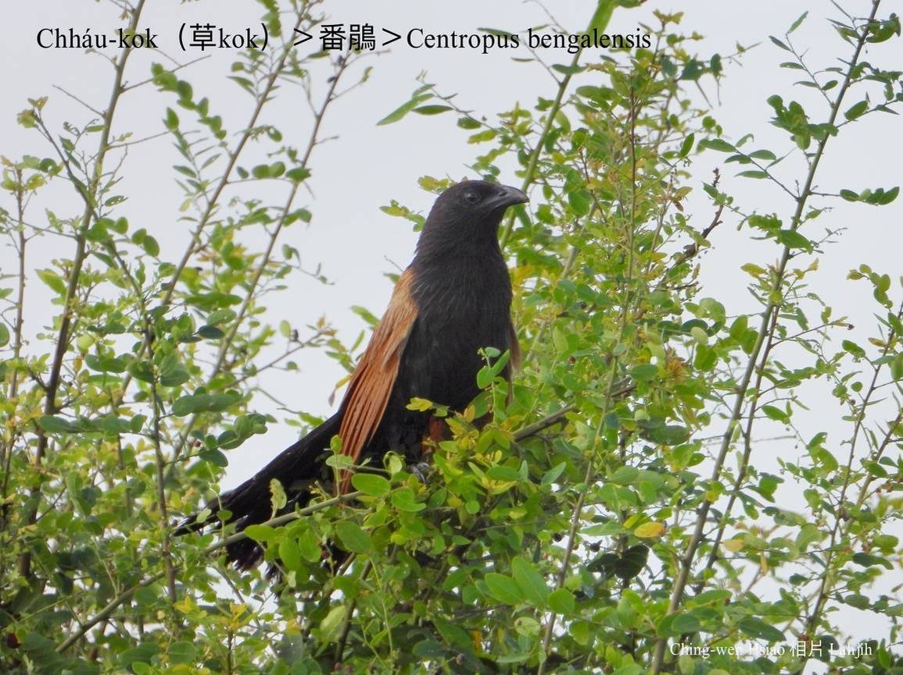
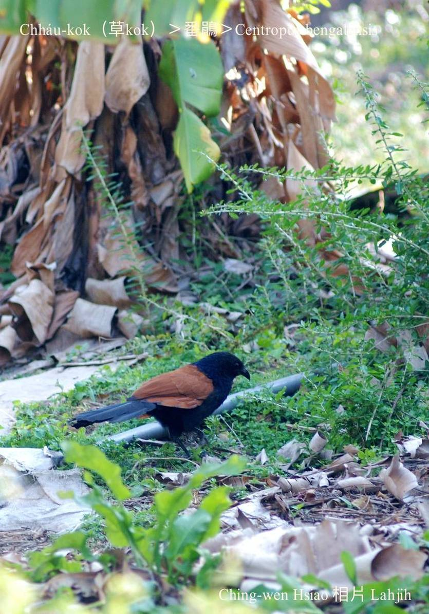
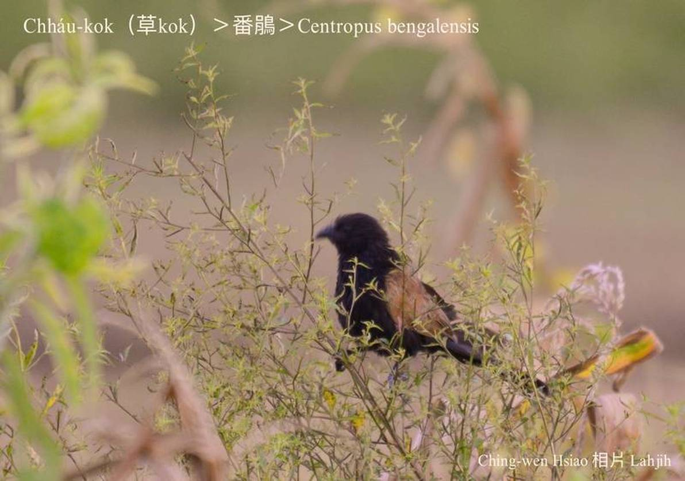
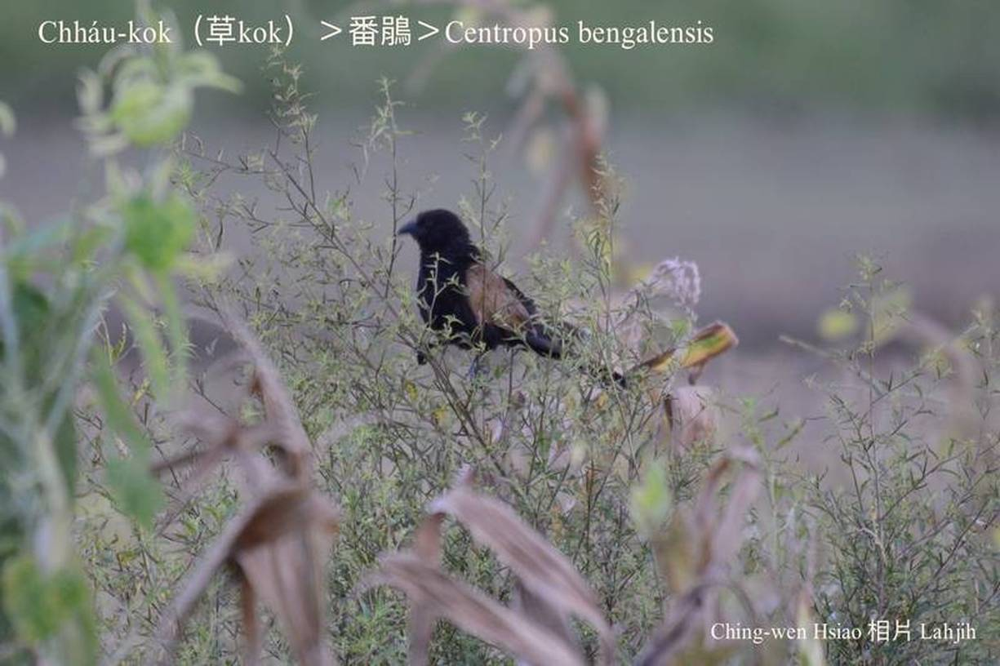
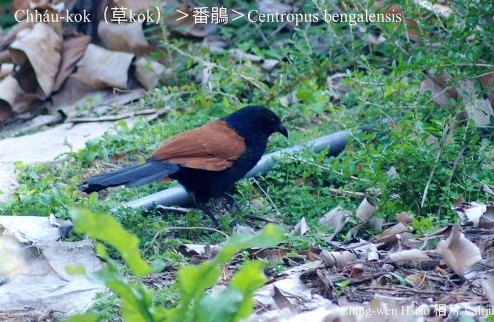

#### 20. Tō͘-koan Kho『杜鵑科』

|台灣名|中譯名|學名|
|Chháu-kok（草Kok）|番鵑|Centropus bengalensis|

# 20-6. Chháu-kok（草Kok）

Chháu-kok bih tiàm草phō內，「Kok！Kok！Kok！…」háu bē soah，生湠期間ê熱天鳥毛，是金sih-sih ê烏藍色，chhap淺茶紅色ê雙翼歇tī綠色ê草phō頂，猛日一下照，實在有影súi，活跳koh iáⁿ目，i ê雙翼kan-nā甘蔗ê kah-ha̍h，tī雲林嘉義一帶有「紅kah-ha̍h-á」ê外號。

Chháu-kok（紅kah-ha̍h-á），tī台灣本島kap紅頭嶼ê平洋、山崙、低山區lóng有伊ê腳跡，低樹林、甘蔗園、廬竹phō、茅á草真旺ê塚á埔，是伊出現ê所在，時常歇tī竹á、樹椏、甘蔗葉á ê尾溜。

Chháu-kok，tī東海岸常常tī塚á埔活動，致使hō͘原住民誤會chit種鳥仔ē挖墓壙，偷食屍體ê傳說，ka看做不祥ê鳥類。

Chháu-kok是台灣杜鵑科，唯一ka-tī做siū，ka-tī孵卵ê鳥類，做siū tī khah密ê草phō內、甘蔗園內，利用áu曲蔗葉á做空心球型ê siū，食大型ê蟲thōa、蛙類、tō͘-tēng、母舅蛇、土龍á chit款蜥類。

### 【註解】

|詞|解說|
|紅頭嶼|Âng-thâu-sū，『台東縣蘭嶼』。|
|腳跡|Kha-jiah。|
|樹椏|Chhiū-oe。|

