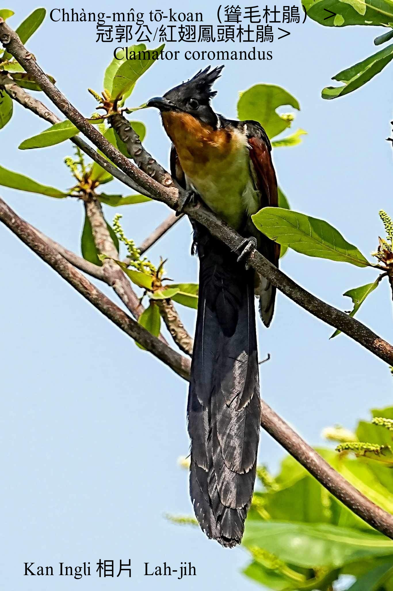
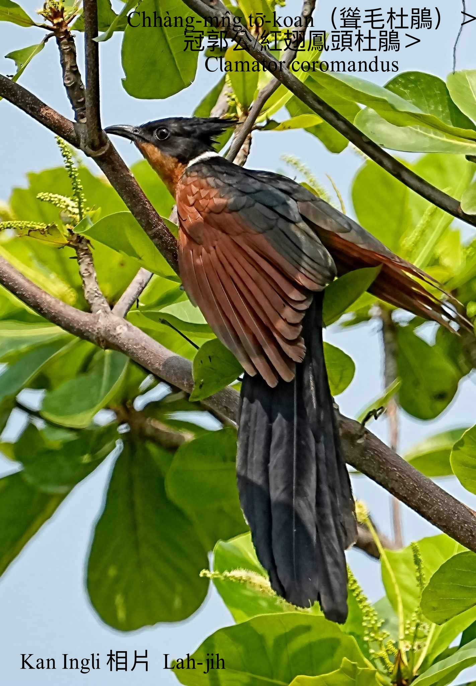
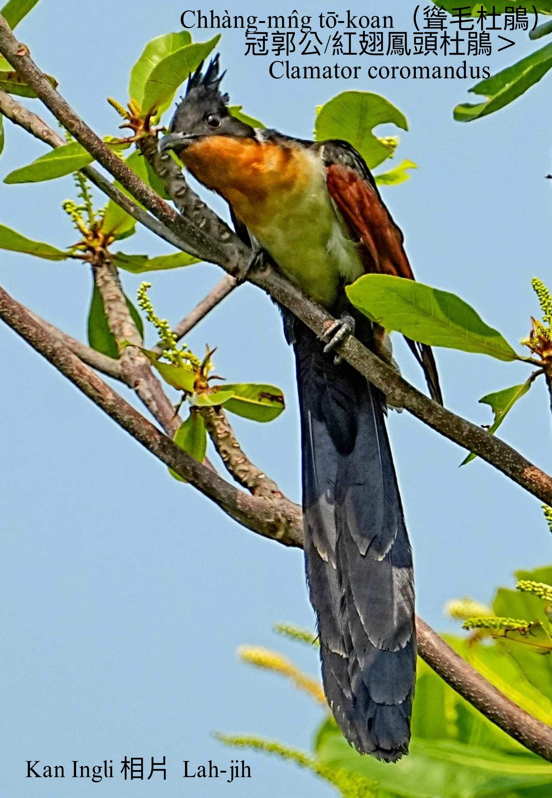
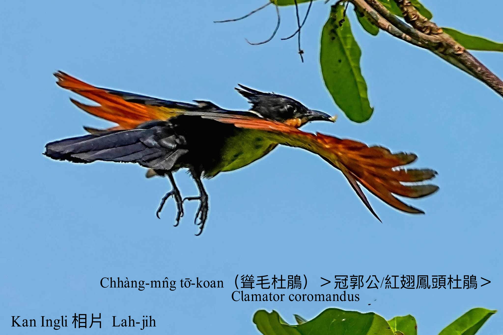
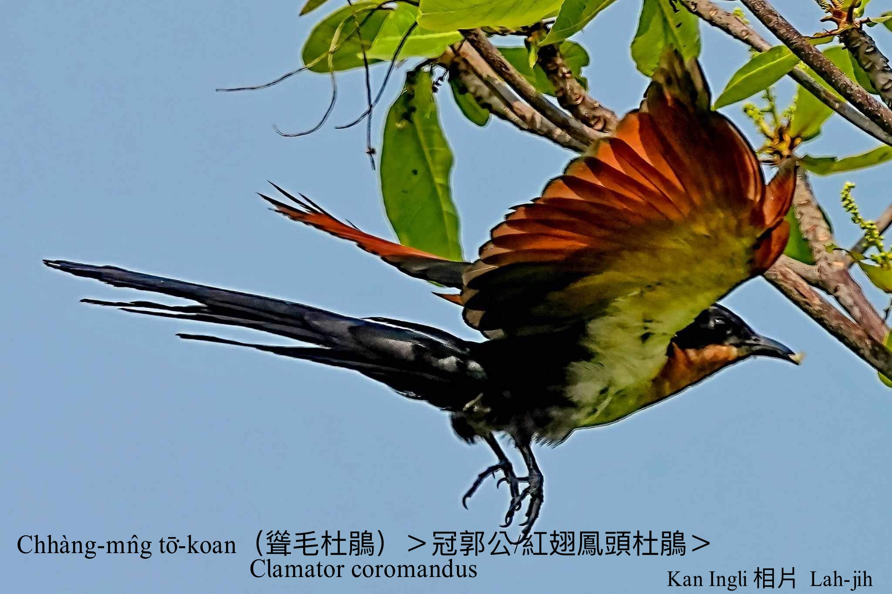

#### 20. Tō͘-koan Kho『杜鵑科』

|台灣名|中譯名|學名|
|Chhàng-mn̂g-tō͘-koan（聳毛杜鵑）|冠郭公／紅翅鳳頭杜鵑|Clamator coromandus|

# 20-7. Chhàng-mn̂g-tō͘-koan（聳毛杜鵑）

Chhàng-mn̂g-tō͘-koan tī台灣本島是真罕有ê過境鳥，金門khah捷出現。

Chhàng-mn̂g-tō͘-koan身長大約40 cm，頭殼毛chhàng-chhàng深珈琲色，尾大pha mā是深珈琲色，翼股下頷咖啡紅，下胸腹tó͘白色，看起來不止á影目。

    

### 1973 Embree台英辭典記載

Koan-keh-kong（冠郭公）對應英文red-winged crested cuckoo，Clamator coromandus，Google翻譯做「紅翅鳳頭杜鵑 Clamator coromandus」，m̄-chiah台灣名ka號做Chhàng-mn̂g-tō͘-koan（聳毛杜鵑）。

