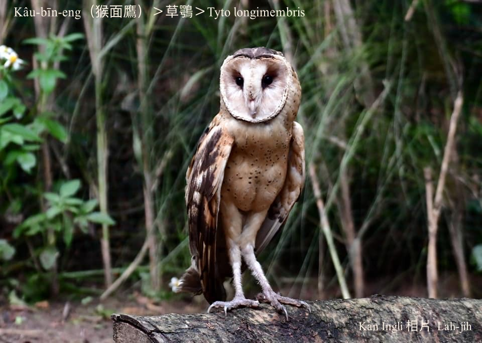
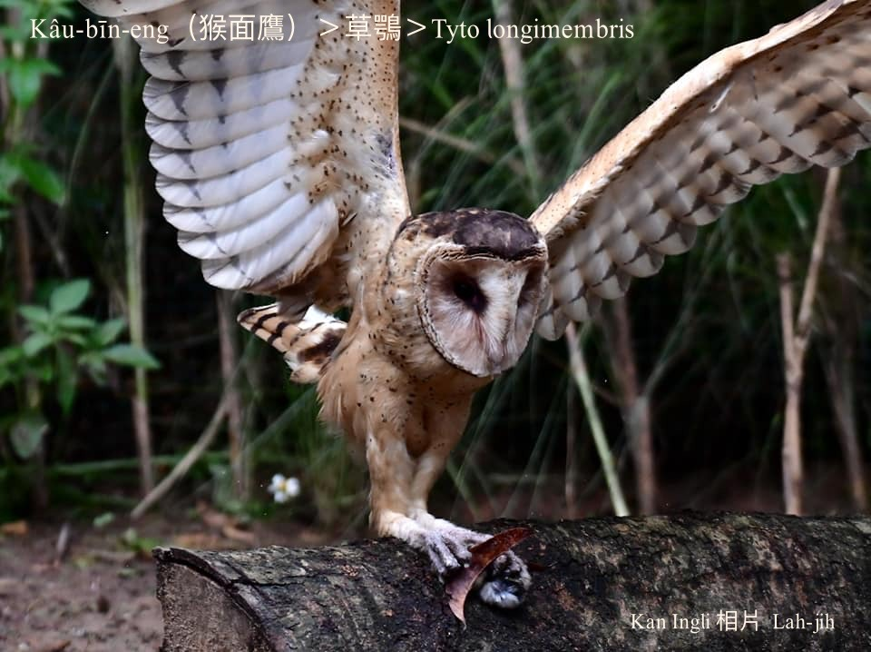
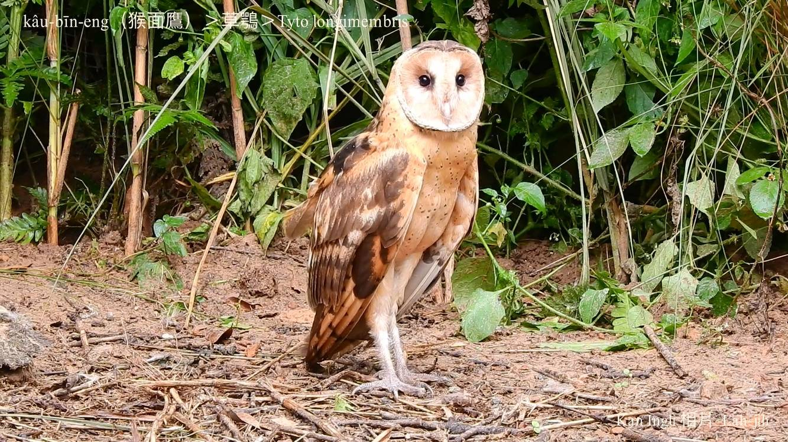

#### 21. Chháu-go̍k Kho『草鶚科』

|台灣名|中譯名|學名|
|Kâu-bīn-eng（猴面鷹）|草鶚|Tyto longimembris|

# 21-1. Kâu-bīn-eng（猴面鷹）

Kâu-bīn-eng面形像猴面，所以kā叫做猴面鷹。

一般暗光鳥屬樹棲性歇tī森林樹欉頂koân，kan-nā kâu-bīn-eng屬地棲性，生活tī草phō內，kap一般貓頭鳥無siáⁿ-kāng，夜行性hām貓頭鳥kāng-khoán。

Kâu-bīn-eng ê面模chiâⁿ特別，am-khàm暗光鳥夜生活巧妙ê結構，koân-kē耳，耳á生做koân-kē pêng，ba̍k-chiu大大蕊，聽覺視覺lóng真利。

### 【補充說明】

Àm-kong-chiáu（暗光鳥）是講包含ē-kha chit kúi種鳥仔hām半暝iáu未睏ê人類。

|台灣名|中譯名|學名|
|Niau-thâu-chiáu（貓頭鳥）|鴟鶚|Strigidae|
|Kâu-bīn-eng（猴面鷹）|草鶚|Tyto longimembris|
|Àm-kong（暗公）|夜鷺|Nycticorax nycticorax|
|Soaⁿ-àm-kong（山暗光）|黑冠麻鷺|Gorsachius melanolophus|

