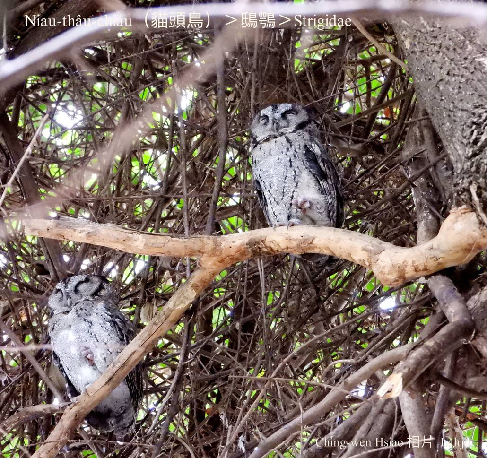

#### 22. Chhi-go̍k Kho『鴟鶚科』

|台灣名|中譯名|學名|
|Niau-thâu-chiáu（貓頭鳥）|鴟鶚|Strigidae|

# 22-1. Niau-thâu-chiáu（貓頭鳥）

Niau-thâu-chiáu是一種猛禽，大自然強--ê提去食ê食物鏈定律是自然法則，為tio̍h生存，必須lia̍h食kap防衛，長久以來to̍h演化出am-khàm羽色kap『擬態』行為。貓頭鳥ê頭殼形態，大概分做有角羽kap無角羽兩大類，chit種角羽mā叫做耳羽，是冠羽ê一種，m̄是耳á，因為有親像耳á ê角羽，koh配合i ê面模kap圓kùn-kùn大大蕊ê ba̍k-chiu，chiok sêng貓á頭，m̄-chiah hō͘人號做貓頭鷹a̍h是貓頭鳥。

Niau-thâu-chiáu ê頭殼，ē-tàng oa̍t 180度看後壁，腳短有力，腳爪oan-khiau尖koh lāi，ē-tàng自由chhun-kiu使用，lia̍h殺小動物非常好勢。

Niau-thâu-chiáu ê鳥毛柔軟，翼股ê羽毛尾溜sió-khóa pit叉，飛行時無聲無說，tiām-chut-chut，大部分ê貓頭鳥lóng是『樹棲性』，日--時bih tiàm樹林àm-sàm所在a̍h是樹洞內歇睏。

Niau-thâu-chiáu ê面型sêng貓á面，伊ê叫聲「ko͘~ ko͘~」，tī恒春地帶有「姑嫂鳥」ê稱號。

# 【Tâi-oân Chiáu-á Liām Koa-si】

### **Niau-thâu-chiáu Chhōe A-ko͘**

Lí hit-lia̍p thâu-khak, kài-sêng niau-á

Nn̄g lúi ba̍k-chiu, kim-khok-khok, chheⁿ-gìn-gìn

Lí sī teh khòaⁿ siáⁿ-mih 

Nā-sī àm-sî, he sī âng-gōa-sòaⁿ ê tiàu-kiàⁿ

Khó-sioh ji̍t-thâu nā chhut, lí to̍h ná chheⁿ-mê

Ko͘~ko͘~ko͘~, a-ko͘-á tńg--lâi-lah

Niau-thâu-chiáu, lí sī-m̄-sī teh chhōe a-ko͘-á

### 姑嫂鳥ê故事

兄嫂細姑自古以來，to̍h oh做夥tàu-tīn生活，m̄是阿嫂嫌細姑á pān-tōaⁿ，to̍h是細姑á kā ta-ke投東投西，講兄嫂ê pháiⁿ話，兄嫂心目中ê「細姑á猴」chiông-án-ne tiâu名。下面boeh講ê故事tú好顛倒反，是兄嫂細姑真bā有感情ê故事。

古早古早，有兄嫂細姑兩ê人，個性真bā，感情chiâⁿ好，厝內大細項tāi-chì lóng真有參詳，雙出雙入，是厝邊隔壁欣羨o-ló ê好樣。

有一年春天，新筍tăⁿ出，姑嫂雙人to̍h相招boeh去社頂附近山區竹á林挖幼筍，bô-gî-gō͘ gū-tio̍h大雨，到kah暗暝兩人lóng無轉--來，厝內ê人非常tio̍h急，to̍h派人上山四界走chhōe，chhōe真久lóng chhōe無in ê腳跡，最後chhōe到一欉茄苳樹腳，kan-nā聽見兩隻鳥á tī樹á頂hia leh háu 。講mā奇怪，in tau ê人轉來到厝裡了後，猶原聽tio̍h hit兩隻鳥á「ko͘~ ko͘~」háu無停，ta̍k工ùi boeh-àm-á一直háu kah天光。因為姑嫂兩人一去無回頭，所以厝內ê人nā聽tio̍h「ko͘~ ko͘~」ê叫聲，to̍h想tio̍h兄嫂細姑in兩人，mā因為chit種鳥á ê叫聲「ko͘~ ko͘~」kài-sêng leh叫阿姑á~ 阿姑á--leh，所以ta̍k ê認為有可能是姑嫂兩人ê化身，所以tī墾丁所在，貓頭鳥有「姑嫂鳥」ê稱號。

### 貓頭鳥報喜ê故事

這是日月潭所在Thao ê神話，in一直相信貓頭鳥是來報喜事ê靈鳥，而且禁止lia̍h殺。

古早古早，Thao族ê部落內，有chi̍t-ê真súi ê少女，伊iáu未結婚to̍h有身--a，chū-án-ne hō͘ in父母kap族人責備táⁿ-tia̍p，伊無法度忍受，to̍h趁chi̍t-ê暗暝偷偷á離開in tau。

Kúi-nā工後，有一位族人tī山內phah獵，發現chit ê cha-bó͘-gín-á死tī路邊，而且漸漸變成一隻貓頭鳥。日子一工一工過去，族人也漸漸bē記得chit ê少女。

有一工暗時，部落內有chi̍t-ê婦jîn人，眠夢一隻貓頭鳥當面kā伊講：「你boeh做老母--à！」隔轉工，chit ê cha-bó͘-lâng tī潭á邊洗衫，ta̍k ê閒閒phò-tāu開講中間，chiah發現，原來有真chē人tī懷胎有身中間，lóng bat做過kāng-khoán ê眠夢，而且隔轉工to̍h有一隻貓頭鳥，tiām-tiām khiā tī厝前ê樹á尾頂，親像leh kā人講有好消息boeh報人知ê款。

Chū-án-ne以後，Thao族ê族人to̍h相信，貓頭鳥nā飛--來，to̍h是cha-bó͘-lâng有身ê好消息到--à。以後in對貓頭鳥漸漸感覺敬畏，同時mā禁止lia̍h殺貓頭鳥，而且ài保護貓頭鳥。

### 【註解】

|詞|解說|
|bā|親密。|
|腳跡|Kha-jiah。|
|Thao|邵族。|
|táⁿ-tia̍p|懲罰gín-á。|

