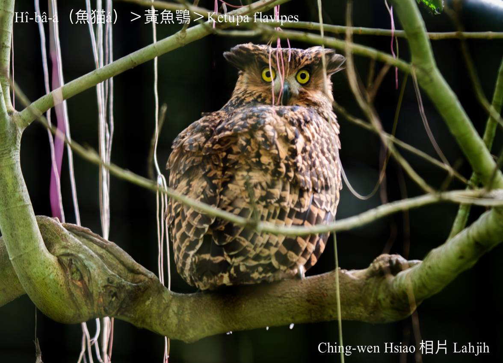
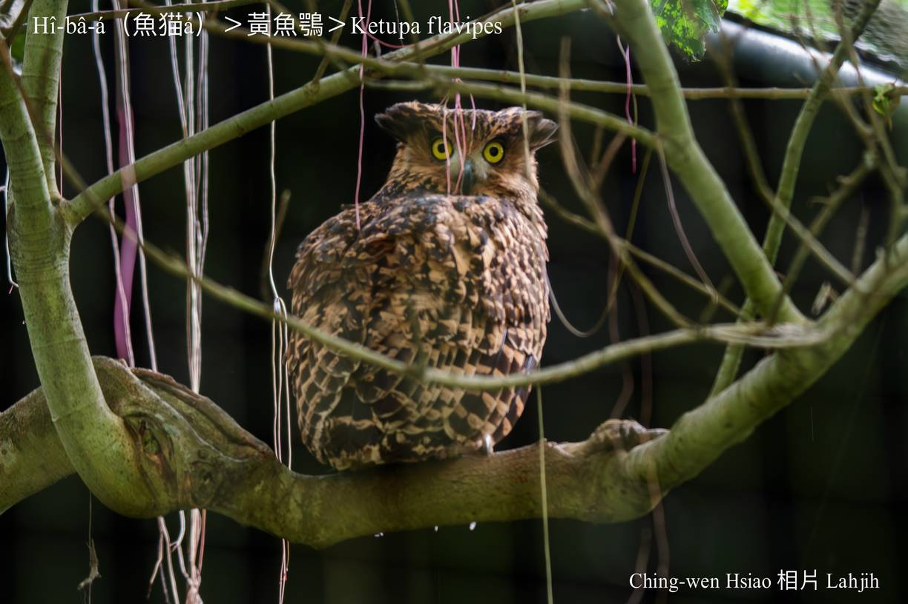

#### 22. Chhi-go̍k Kho『鴟鶚科』

|台灣名|中譯名|學名|
|Hî-bâ-á（魚猫á）|黃魚鶚|Ketupa flavipes|

# 22-2. Hî-bâ-á（魚猫á）

Hî-bâ-á m̄是hî-niau-á，面形sêng貓á，觸角敏感，ē-sái-tit暗時lia̍h食，lia̍h魚類為主，所以ka叫做hî-bâ-á。

Hî-bâ-á ê食物大多數是水棲a̍h半水棲動物，像溪魚苦花、蟹類、蝦á、蟾蜍a̍h是樹蛙等等，罕得食土面ê動物。

Hî-bâ-á是夜間活動為主ê鳥類，不過寒天時a̍h是生湠期，mā-ē tī日--時出來chhōe食，東部海拔100公尺到中南部1700公尺，溪岸有原始森林ê所在，lóng有in ê蹤跡。

### 【補充說明】

Niau-á、bâ-á，漢字lóng寫做「貓á」，niau-á是『家貓』，bâ-á是『貍』，『果子貍』叫kóe-chí-bâ。

### 【註解】

|詞|解說|
|觸角|Chhiok-kak。|
|蹤跡|Chong-chek。|
