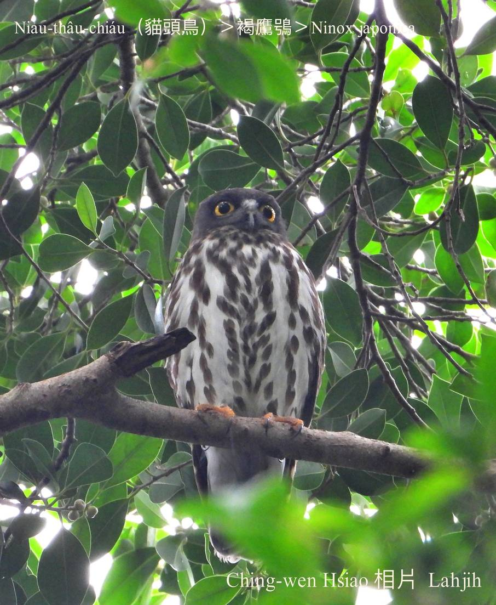
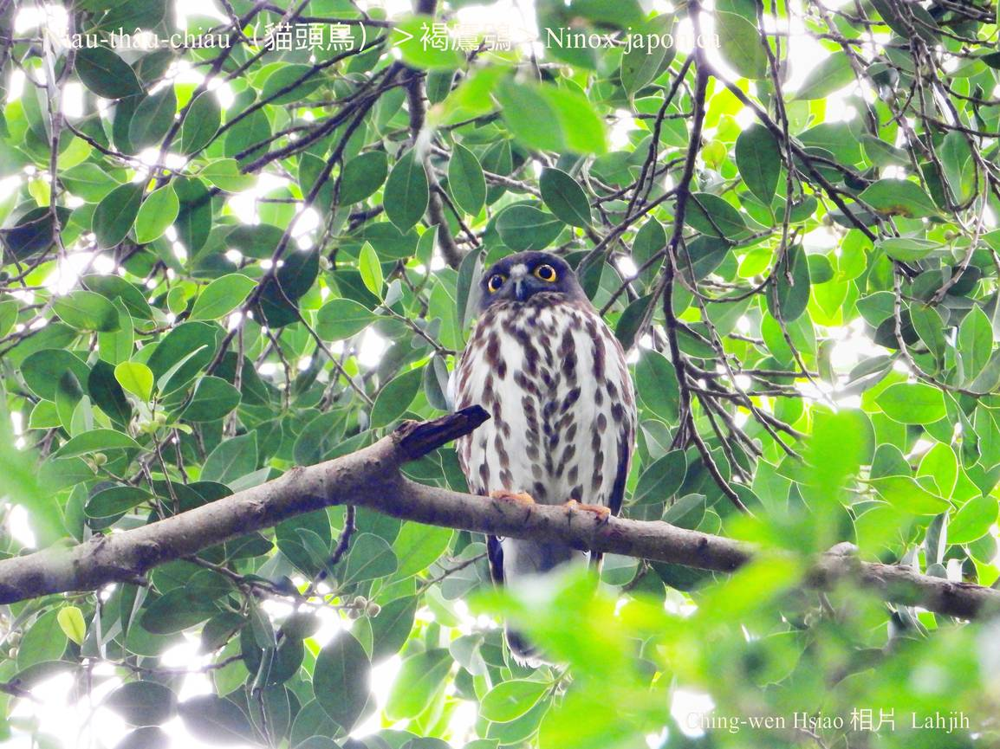
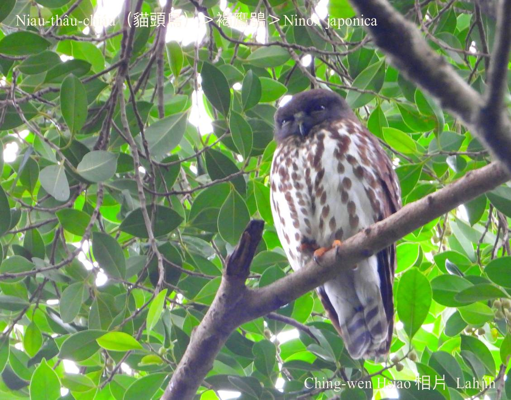
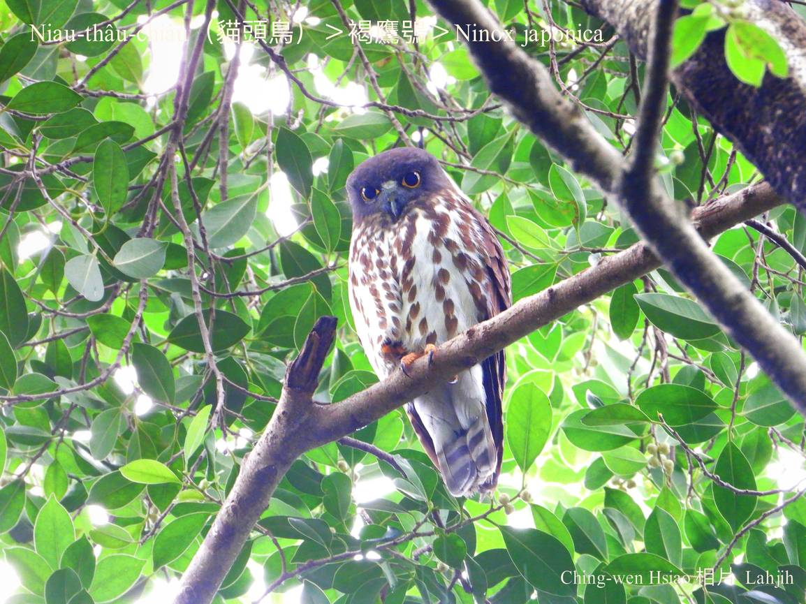

#### 22. Chhi-go̍k Kho『鴟鶚科』

|台灣名|中譯名|學名|
|Niau-thâu-chiáu（貓頭鳥）|褐鷹鴞|Ninox japonica|

# 22-3. Niau-thâu-chiáu（貓頭鳥）

『褐鷹鴞』是一種小型貓頭鳥。

頭、kha-chiah-phiaⁿ o͘-ka-pi色，腹肚白色chhap o͘-ka-pi色噴點長chōa花紋，頭殼無角羽，ba̍k-chiu大大蕊khong黃sûn。

Niau-thâu-chiáu tī台灣hioh-tī中低海拔山區，出現tī曠闊視線kng-iāⁿ所在，khiā tī樹頂電線頂等待lia̍h食飛來ê蠓蟲。

Niau-thâu-chiáu飛行技術láu-tâu，叫聲chē音節變化chin-chē。

