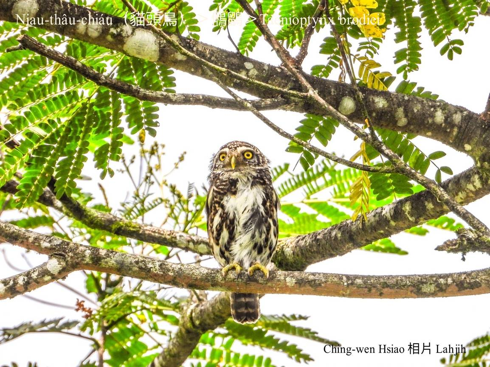
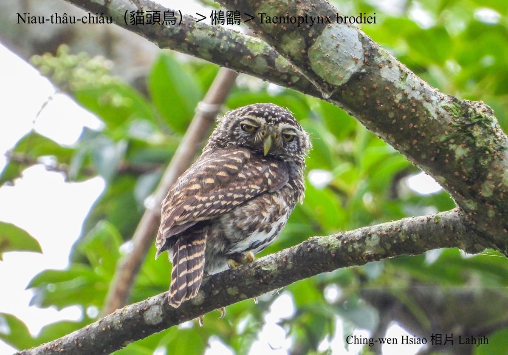
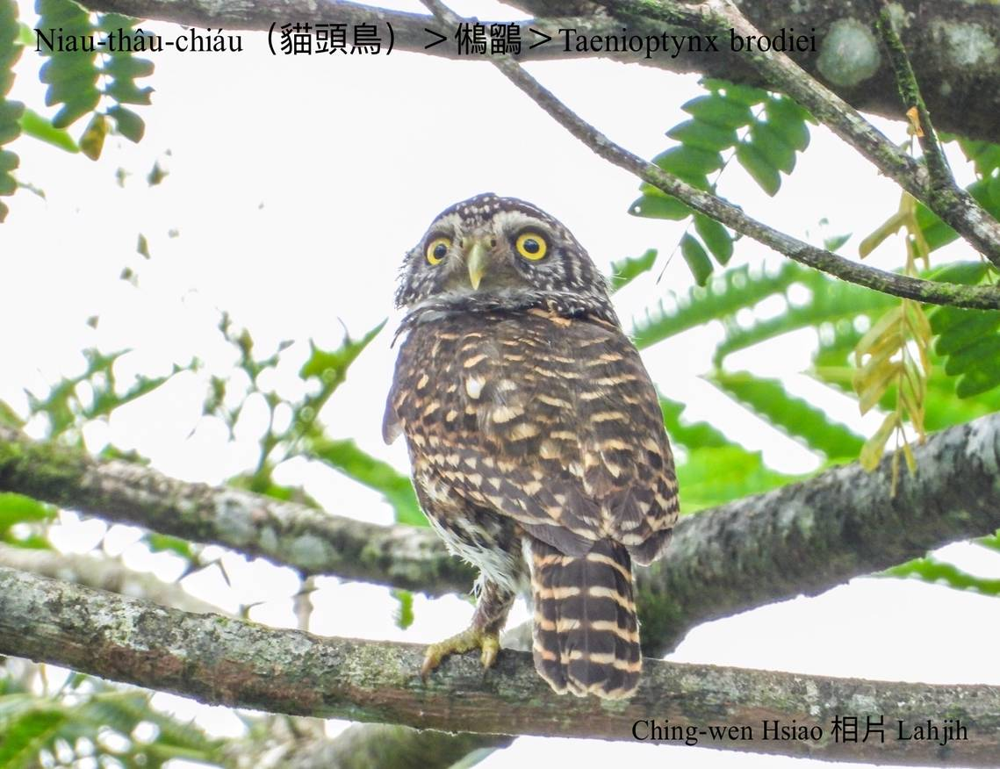
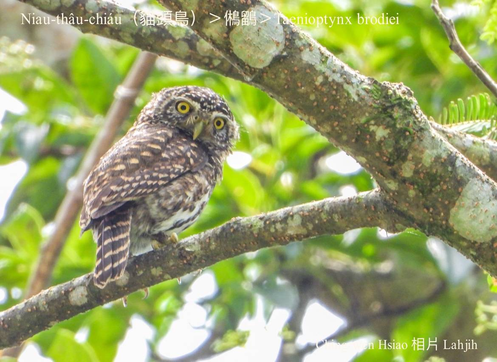
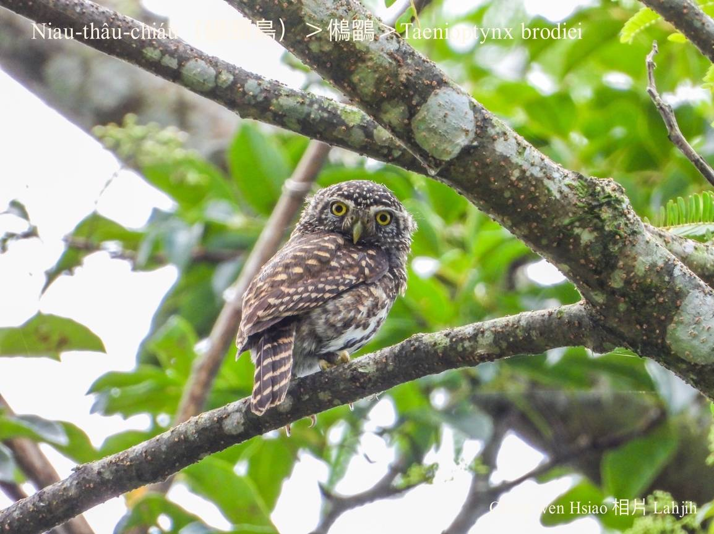
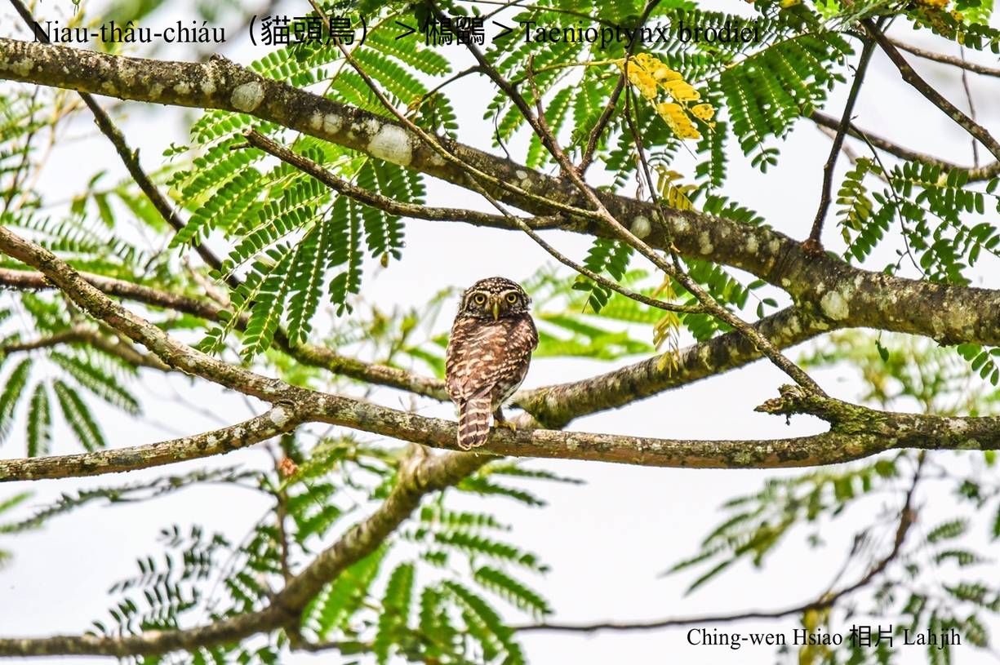
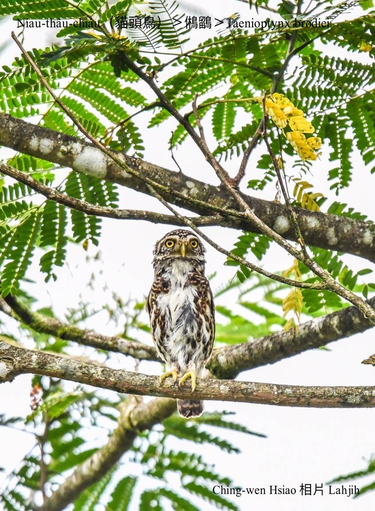
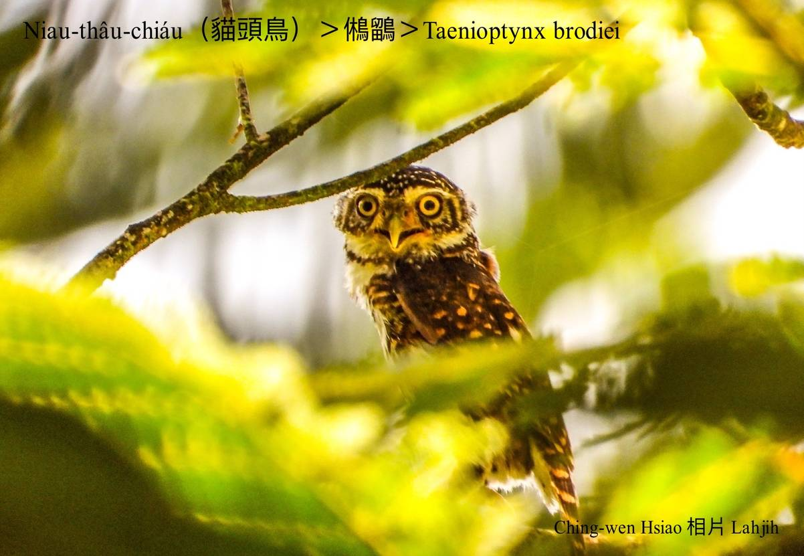
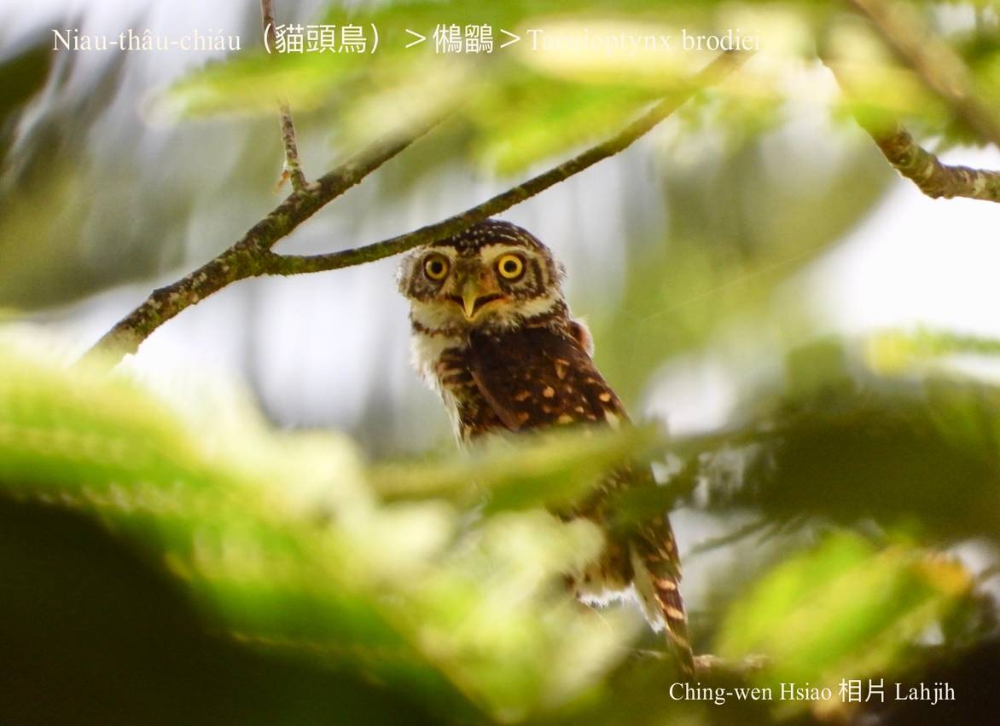

#### 22. Chhi-go̍k Kho『鴟鶚科』

|台灣名|中譯名|學名|
|Niau-thâu-chiáu（貓頭鳥）|鵂鶹|Taenioptynx brodiei|

# 22-4. Niau-thâu-chiáu（貓頭鳥）

Taenioptynx brodiei是台灣貓頭鳥類siāng-kài細隻ê貓頭鳥，是台灣特有亞種，普遍hioh-tī中低海拔闊葉林a̍h-sī針闊葉混合林，體形比粟鳥á較大chi̍t-sut-á niā-niā，chiok古錐--ê。因為細隻古錐，mā號做sió-niau-thâu-chiáu。

Sió-niau-thâu-chiáu（Taenioptynx brodiei）sui-bóng是暗光鳥，日--時mā-ē出來活動，鳥毛花花有保護色，tiām-tiām bih-tī樹椏看--起-來ná樹lui，oh tit khoàiⁿ，hèng食niáu鼠、細隻鳥á、蟲thōa a̍h-sī大隻昆蟲。

M̄-thang kioh-sī Taenioptynx brodiei貓頭鳥細隻真古錐，個性khiok-sī ok-khia̍k-khia̍k hiông-kài-kài，伊ê頭殼ē-sái-tit 270度tńg-se̍h，後斗殼á koh有兩蕊假目chiu，實在是細隻動物ê剋星。

Taenioptynx brodiei貓頭鳥háu聲「ko͘，ko͘ ko͘，ko͘！Ko͘，ko͘ ko͘，ko͘！」koân音bē尖chiâⁿ kiat chiâⁿ好聽。因為生做古錐sió-lia̍p-chí，soah siâⁿ人ka lia̍h去賣。

# 【Tâi-oân Chiáu-á Liām Koa-si】

### **Kó͘-chui ê Sió-niau-thâu-chiáu**

Ko͘, ko͘ ko͘, ko͘! Ko͘, ko͘ ko͘, ko͘!

Hó-thiaⁿ koh bē thiàu-chiam

Sió-niau-thâu-chiáu kang-hu put-tek-liáu

Sè bòng sè

Niáu-chhí sè-chiah chiáu-á khòaⁿ-tio̍h lí

Kiaⁿ kah chhia-pùn-táu

### 【註解】

|詞|解說|
|樹lui|Chhiū-lui，樹木ê瘤。|
|khoàiⁿ|Khòaⁿ-kìⁿ ê合音。|

