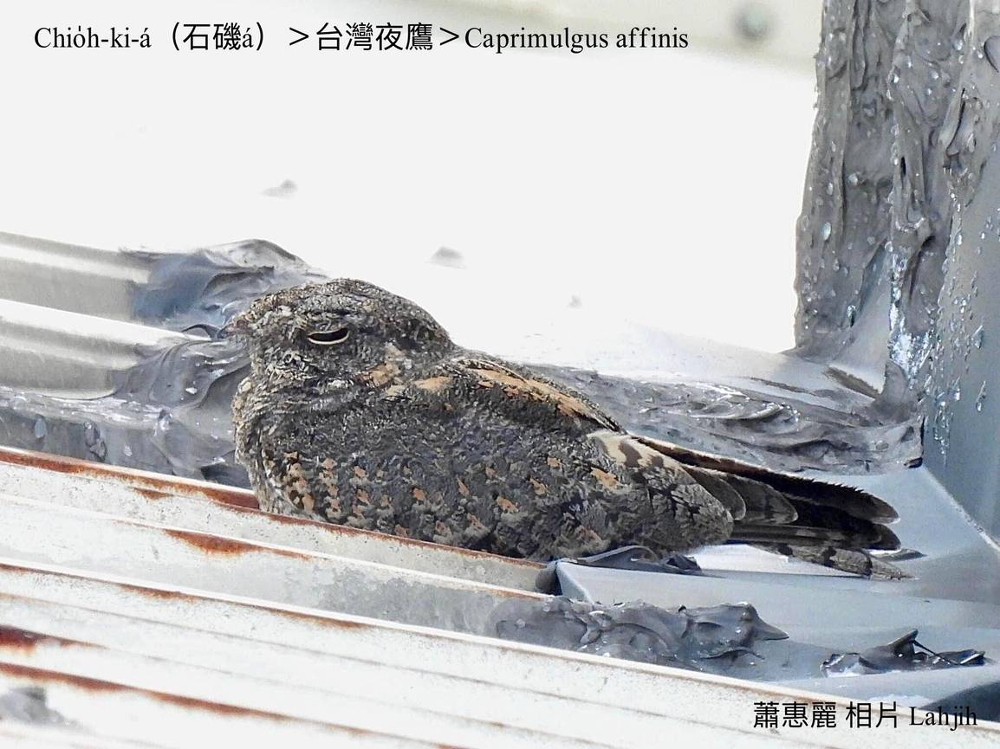

#### 23. Iā-eng Kho『夜鷹科』

|台灣名|中譯名|學名|
|Chio̍h-ki-á（石磯á）|台灣夜鷹|Caprimulgus affinis|

# 23-1. Chio̍h-ki-á（石磯á）

Chio̍h-ki-á kah意歇tī乾燥有草ê石頭沙á溪埔，tī台灣是chiâⁿ普遍ê在地鳥。

因為chio̍h-ki-á主要歇tī溪埔、甘蔗園、旺梨園裡，愛鳥人士khah bē去注意--tio̍h，而且in是夜行性鳥類，日--時bih tiàm石頭giat-á真chē ê草埔，boeh-àm-á以後chiah出來活動，所以khah少人去記錄。

Chit-mái暗時chin-chia̍p聽tio̍h chio̍h-ki-á ê háu聲，chiok吵。

Chio̍h-ki-á鳥毛àm-phú色chhap烏色斑紋，hioh tiàm溪埔砂石所在，nā mài振動，實在真oh發現，m̄-koh有人行óa i ê邊--a，i soah m̄知影thang徙位，實在無警覺性。

### 【註解】

|詞|解說|
|石頭giat-á|碎石。|

