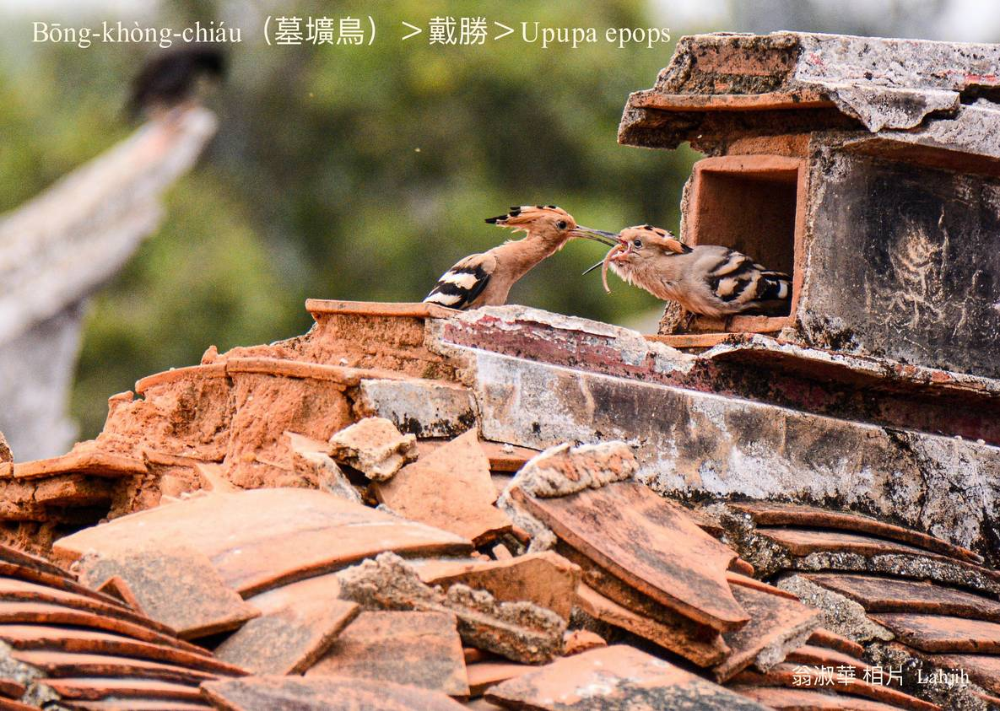

#### 25. Tì-sèng Kho『戴勝科』

|台灣名|中譯名|學名|
|Bōng-khòng-chiáu（墓壙鳥）|戴勝|Upupa epops|

# 25-1. Bōng-khòng-chiáu（墓壙鳥）

Bōng-khòng-chiáu tī台灣是無普遍ê過境鳥，飛行時，冠羽合合，飛bē緊，tī土腳走真緊，hèng食蜘蛛、草蜢á、肚蚓、杜定、蛙類，mā-ē hop蠓á、胡蠅。

金門chin-chē chit款鳥á，因為時常出入tī墓á埔，hō͘人不吉ê感覺，金門人ka號做墓壙鳥。

Bōng-khòng-chiáu ê羽冠像展開ê葵扇，嘴pe尖koh長，sió-khóa khiàu-khiàu，方便插入土khang chhōe食。

