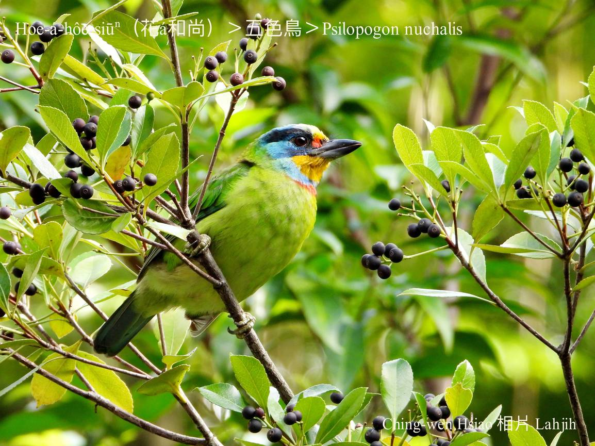
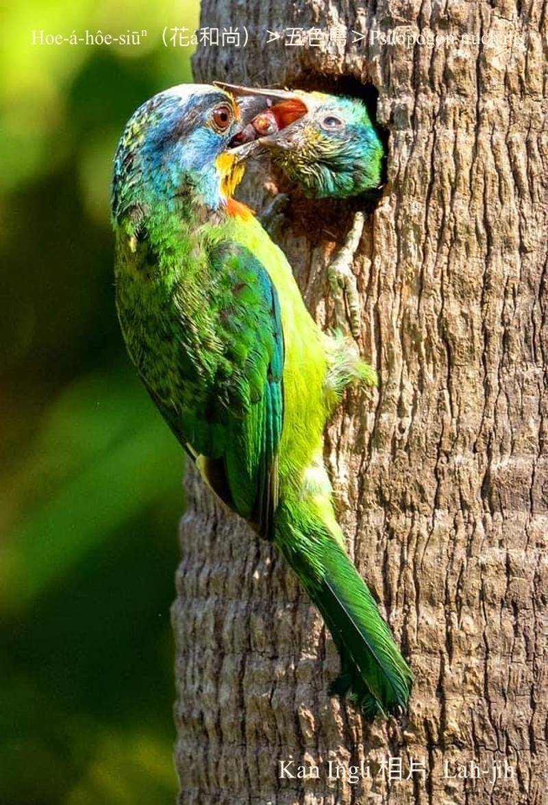
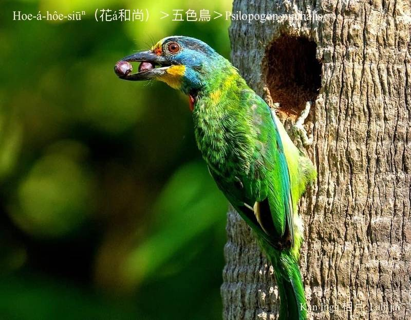
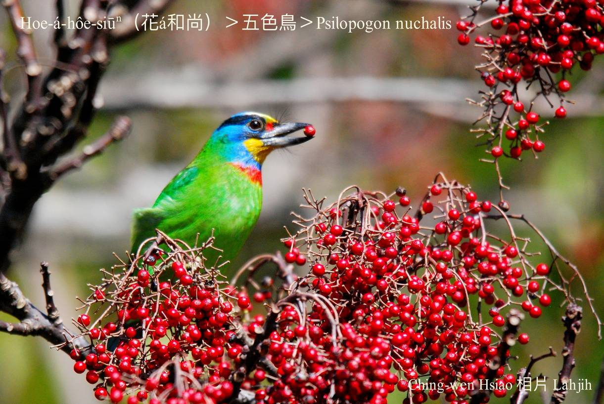
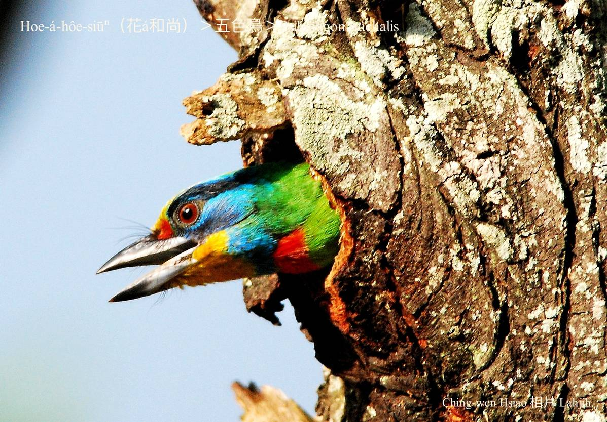
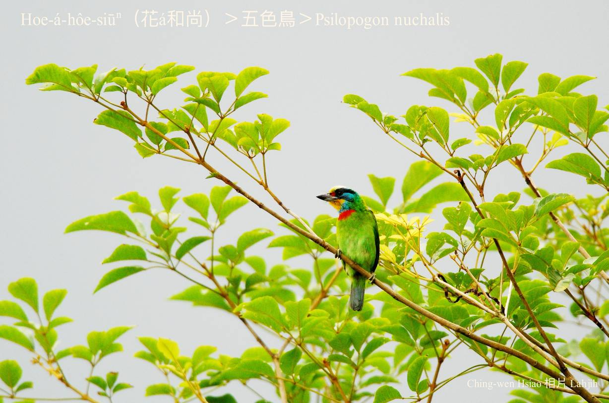

#### 26. Ngó͘-sek-chiáu Kho『五色鳥科』

|台灣名|中譯名|學名|
|Hoe-á-hôe-siūⁿ（花á和尚）|五色鳥|Psilopogon nuchalis|

# 26-1. Hoe-á-hôe-siūⁿ（花á和尚）

Hoe-á-hôe-siūⁿ kui身軀是五花十色ê花紋，色水chiâⁿ豔，háu聲「kok kok kok kok…」低低沈沈，親像和尚誦經敲木魚ê聲音。

Hoe-á-hôe-siūⁿ雖然是啄樹鳥類ê宗親，m̄-kú kan-nā啄樹挖khang做siū是kāng-khoán習性，in無啄樹lia̍h蟲ê才調，愛食果子、榕á籽，mā-ē食蟲thōa。

Hoe-á-hôe-siūⁿ kap一般鳥á無kāng，大部分ê鳥á lóng hioh tī樹椏睏，in將雙腳屈--落-去，kā關節ê筋腱giú-ân，腳爪khip ân樹椏，所以睏--去mā bē liàn--落-來。Hoe-á-hôe-siūⁿ先天無chit款本能，in只好kā腹肚貼tiàm樹洞內歇睏，m̄-chiah有花á和尚出現ê樹林，一定有chiâⁿ-chē樹洞。

# 【Tâi-oân Chiáu-á Liām Koa-si】

### **Hoe-á-hôe-siūⁿ Khok Khok Khok Khok**

Kiâⁿ tī chhiū-nâ-lāi

Thiaⁿ-tio̍h khok khok khok khok bo̍k-hî siaⁿ

Bián hoâi-gî, pah-bīn sī goán hoe-á-hôe-siūⁿ

Teh phò-tāu poa̍h kám-chêng

Ài-súi, chhēng ngó͘-chhái hoe-á-saⁿ 

Pó-chèng m̄-sī hong-liû-kheh

Sui-bóng kha-chhiú bô-kài liú-lia̍h

Khiok-sī thiàⁿ-bó͘ kò͘-kiáⁿ ê hó-iūⁿ

### 【註解】

|詞|解說|
|樹椏|Chhiū-oe。|

