#### 27. Tok-bo̍k-chiáu Kho『啄木鳥科』

|台灣名|中譯名|學名|
|Sió-tok-chhiū-chiáu（小啄樹鳥）|小啄木|Yungipicus canicapillus kaleensis|

## 27-2. Sió-tok-chhiū-chiáu（小啄樹鳥）

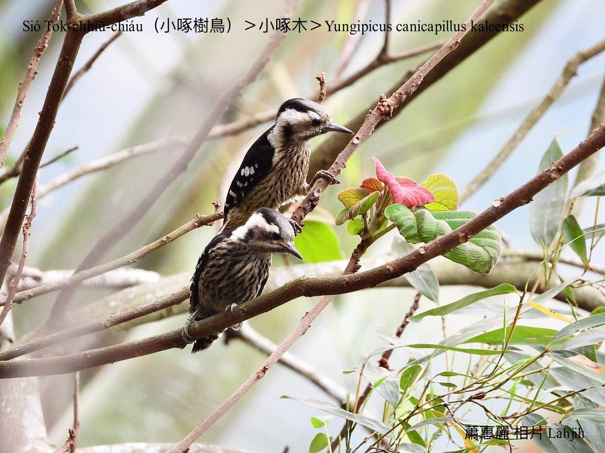

Sió-tok-chhiū-chiáu是台灣特有亞種，是小型啄樹鳥。體型比粟鳥á大chi̍t-sut-á，是siāng細隻ê啄樹鳥。

Sió-tok-chhiū-chiáu鳥毛烏chhap白，koh有樹á皮黃，chhap kah hoe-pa-lí-niau，是chiok讚ê保護色，sui-bóng是真普遍在地鳥，總--是無容易發現。

Sió-tok-chhiū-chiáu kah意khi̍p tiàm樹椏chhōe蟲食，是有名ê樹醫生，因為時常thán-khiā khi̍p tī樹kho͘，腳爪演化成兩前兩後，增加peh樹能力，而且尾溜羽毛特別ngē-chiāⁿ，ē-tàng幫助kā身軀thèⁿ-tiâu。時常「pĭ pĭ pĭ」háu he尖koh koân ê聲音。

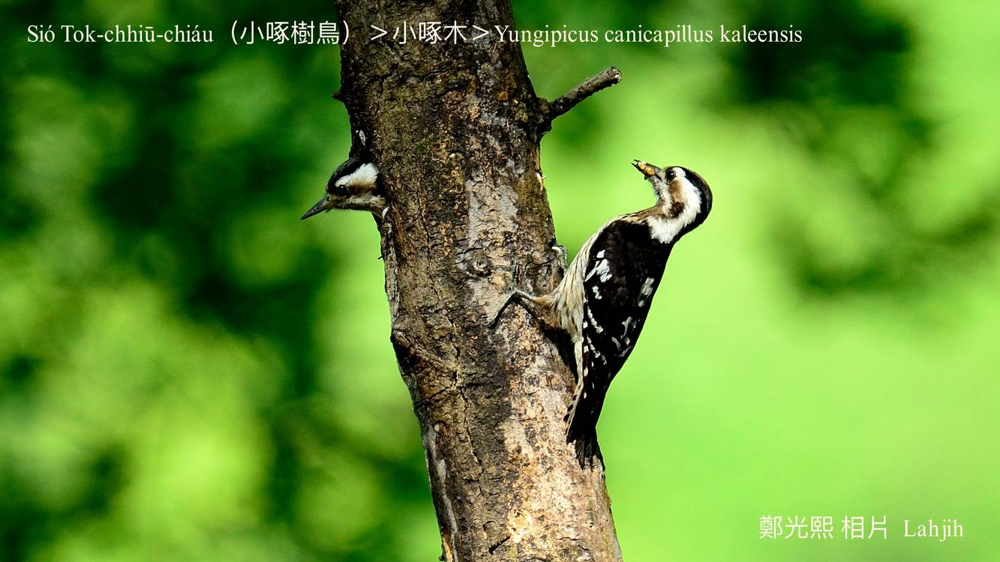
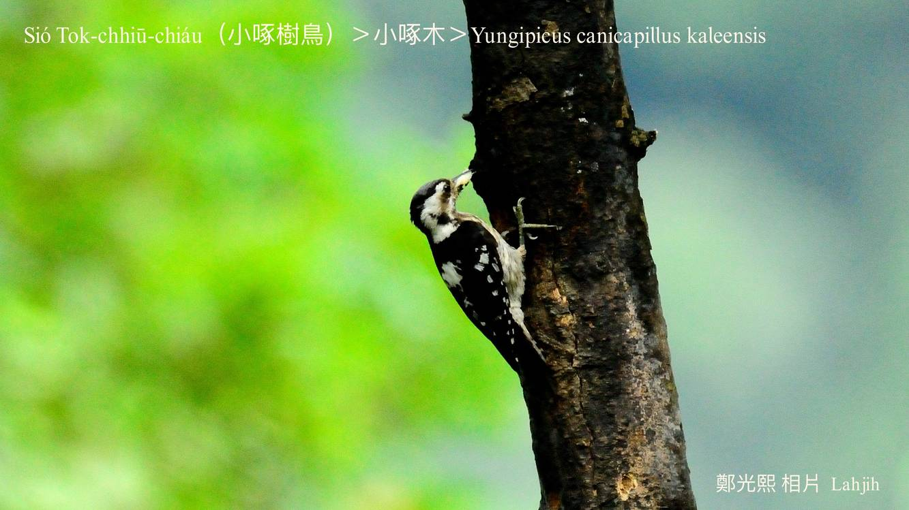
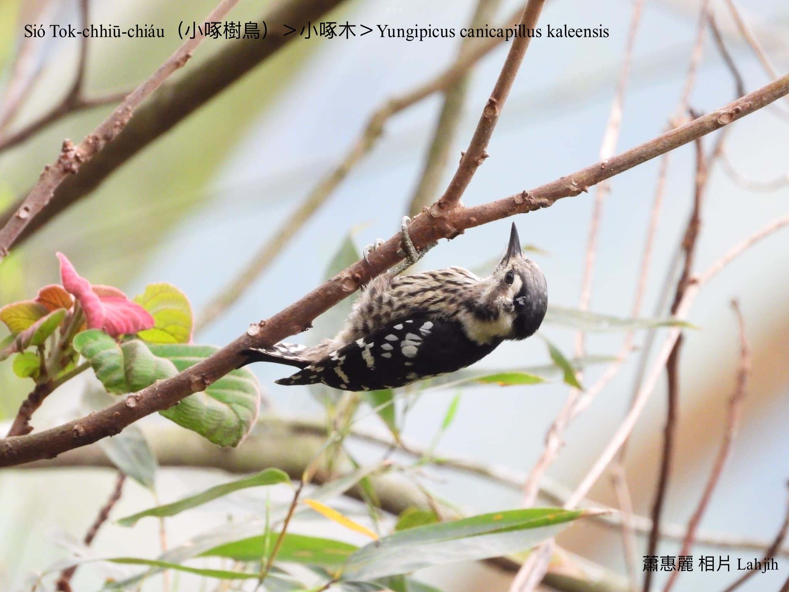
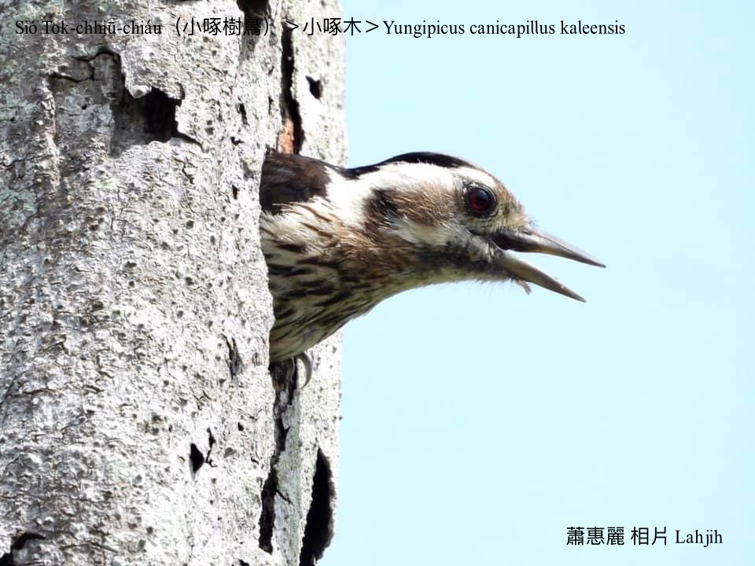
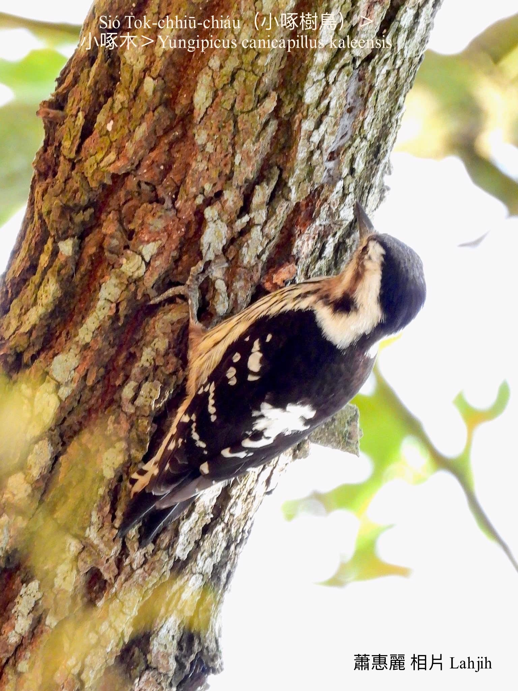
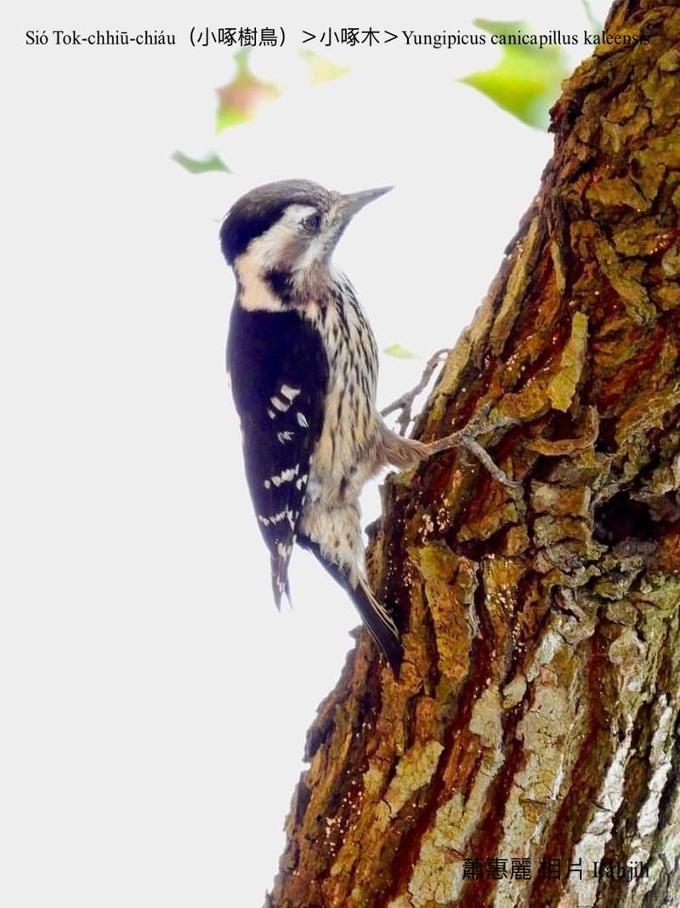
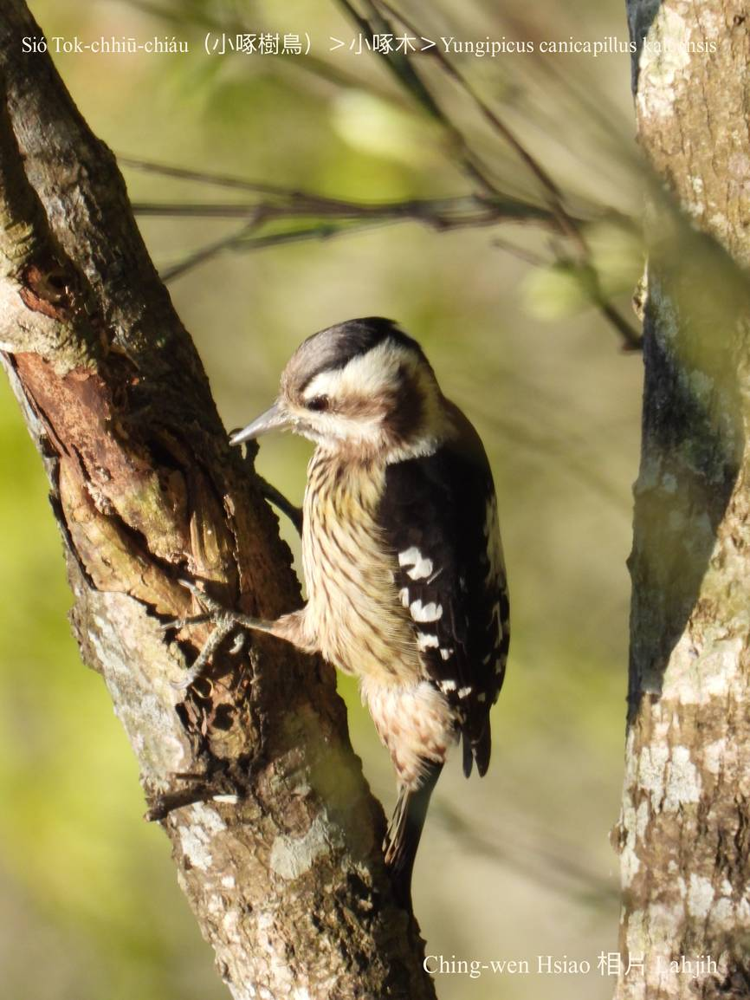
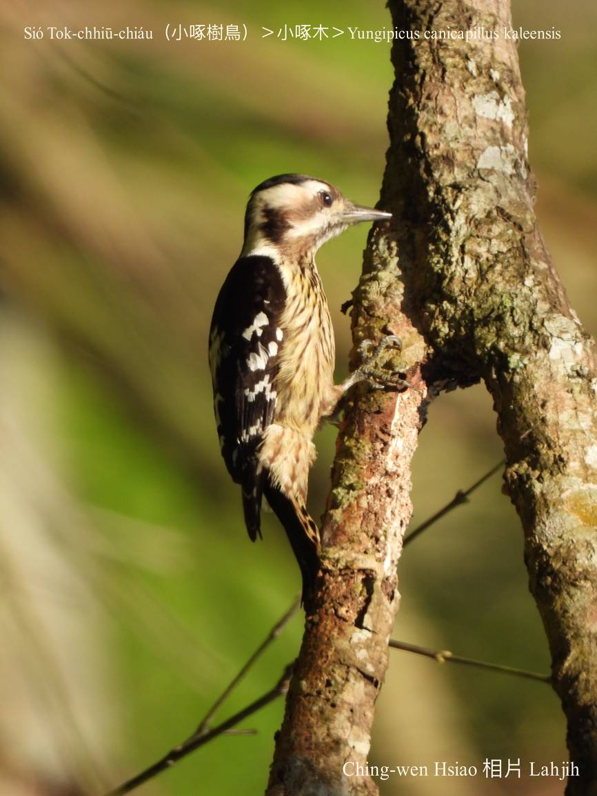
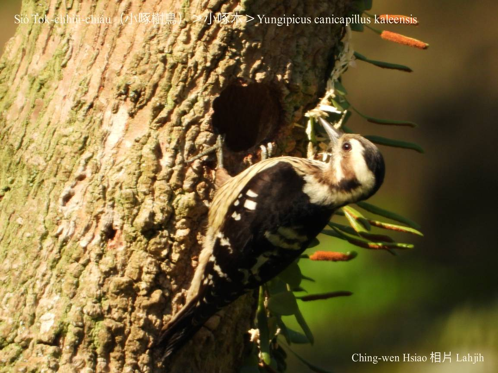
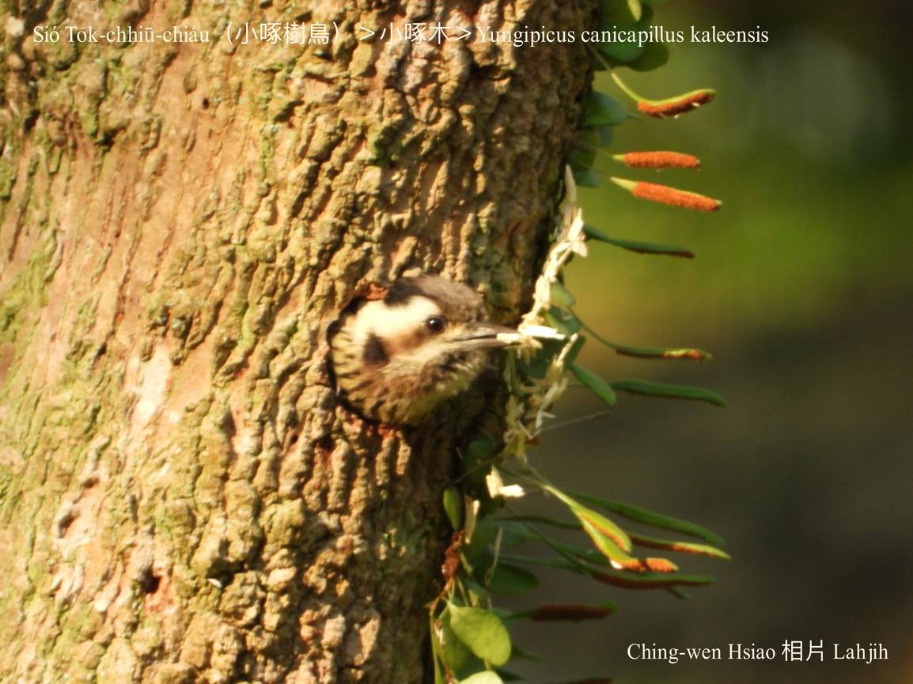

### 【註解】

|詞|解說|
|樹椏|Chhiū-oe。|

