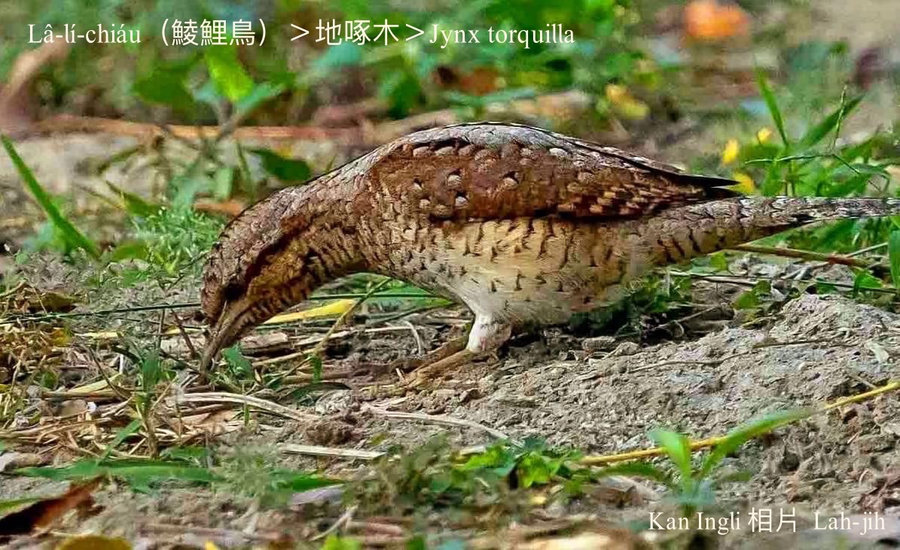

#### 27. Tok-bo̍k-chiáu Kho『啄木鳥科』

|台灣名|中譯名|學名|
|Lâ-lí-chiáu（鯪鯉鳥）|地啄木|Jynx torquilla|

# 27-3. Lâ-lí-chiáu（鯪鯉鳥）

Lâ-lí-chiáu sui-bóng屬tī『啄木鳥科』，m̄-koh bē tiàm樹頂tok樹kho͘ chhōe蟲食。Khah-chia̍p tī海邊樹林a̍h是草埔土腳活動，食káu-hiā、白蟻、thâng-thōa，i ê尾溜鳥毛mā無特別ngē-chiāⁿ。Tī台灣罕得khoàiⁿ，是寒天過境鳥，m̄-koh tī金門是穩定ê過冬鳥。

中國古早kā『地啄木』號做『蛇頭鳥』，因為i kah意tī土腳用尖koh長ê嘴舌食káu-hiā，kap鯪鯉chiok kāng-khoán，所以ka號做鯪鯉鳥。

### 【註解】

|詞|解說|
|鯪鯉|『穿山甲』。|
|khoàiⁿ|Khòaⁿ-kìⁿ ê合音。|

