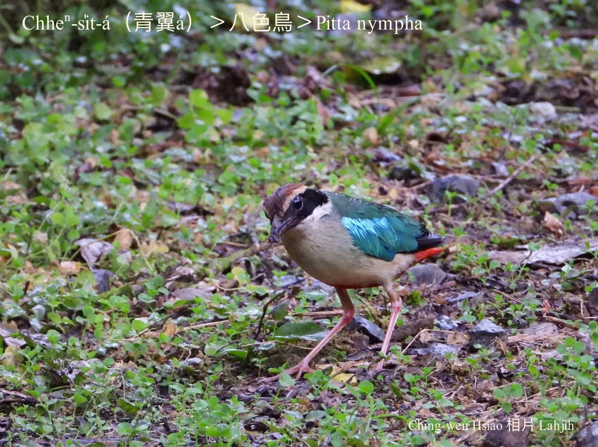

#### 28. Peh-sek-chiáu Kho『八色鳥科』

|台灣名|中譯名|學名|
|Chheⁿ-si̍t-á（青翼á）|八色鳥|Pitta nympha|

# 28-1. Chheⁿ-si̍t-á（青翼á）

Chheⁿ-si̍t-á ê翼股頭所在，有青藍色金sih-sih影目ê鳥毛，chiâⁿ súi，m̄-chiah ka號做青翼á。

Chheⁿ-si̍t-á tī台灣是罕有ê夏候鳥，生活tī低山區樹林下，近水邊陰溼ê所在。兩支腳骨chiâⁿ勇，tī土腳跳來跳去chhōe物食。短距離ê飛行kap釣魚翁kāng-khoán，快速無聲直飛，歇tī樹頂時，尾sìm--一-下，sìm--一-下ê動作kap釣魚翁mā chiâⁿ kāng-khoán，做siū tī雜木林樹á頂，鳥á-kiáⁿ tī母鳥嘴內討食了後，習慣性lóng-ē順sòa放屎，屎ná像kian-tàng ê『果凍』，鳥母ē隨時用嘴pe kā伊咬去tàn掉。

林內鄉湖本ê chheⁿ-si̍t-á，時常tī竹葉lak kah滿土腳ê竹腳出現，hō͘人kioh-sī是leh khioh樹葉á，原來i是leh chhōe tō͘-kín-á食，m̄-chiah hō͘人叫做khioh-ha̍h-á。

# 【Tâi-oân Chiáu-á Liām Koa-si】

### **Chheⁿ-si̍t-á Ū-kàu Phāⁿ**

Thâu-khak-sim âng-âng

Pak-tó͘ ē mā âng-âng

Nâ chheⁿ kha-chiah-phiaⁿ kim-sih-sih

Koh khan o͘-jîn ba̍k-kiàⁿ

Khioh-ha̍h-á

Lí tiàm àm-sàm tek-kha chhut-ji̍p

Ná-tio̍h chng kah chiah-nī phāⁿ

### 【註解】

|詞|解說|
|影目|Iáⁿ-ba̍k。|
|tō͘-kín-á|Tō͘-ún，『蚯蚓』。|

