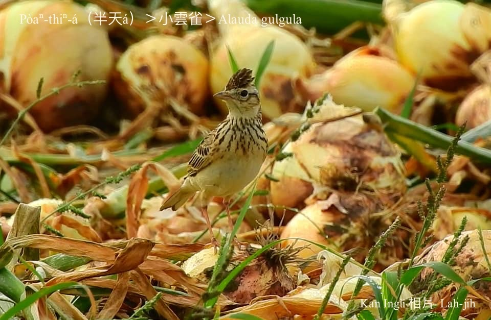
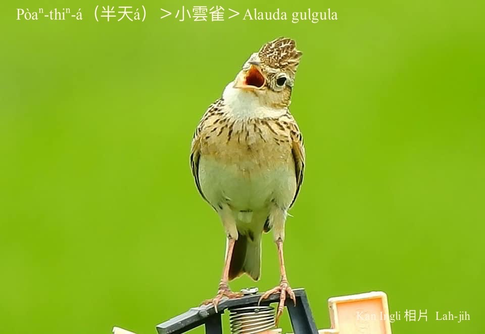
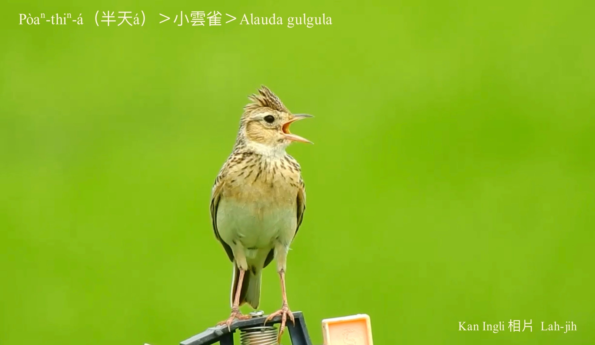
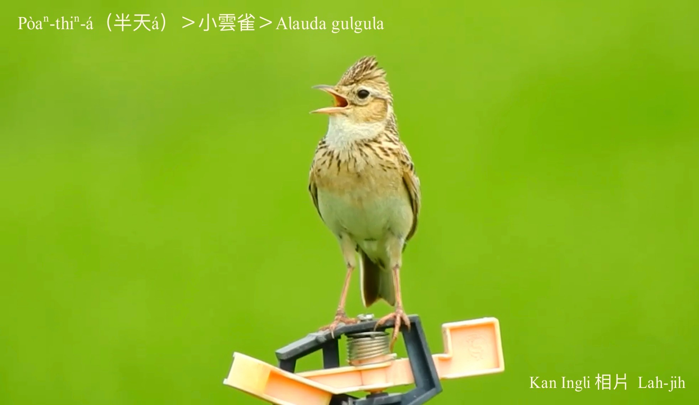

#### 29. Hûn-chhiak Kho『雲雀科』

|台灣名|中譯名|學名|
|Pòaⁿ-thiⁿ-á（半天á）|小雲雀|Alauda gulgula|

# 29-1. Pòaⁿ-thiⁿ-á（半天á）

Pòaⁿ-thiⁿ-á，kan-nā聽名to̍h知影伊是常常飛tiàm半空中ê鳥仔，而且ná飛ná kho͘-si-á，iù-iù lia̍p-chia̍p聲音好聽bē chhò-lâng-hīⁿ。

Pòaⁿ-thiⁿ-á tī台灣是特有亞種，身軀毛草ná粟鳥仔，無kài影目，頭殼比粟鳥仔khah bái koh chhàng-mn̂g，m̄-koh歌聲好聽，歇tī草埔á、ta園a̍h是塚á埔曠闊ê所在，ná飛ná háu，有夠lio̍k-thiòng。

# 【Tâi-oân Chiáu-á Liām Koa-si】

### **Pòaⁿ-thiⁿ-á Gâu Kho͘-si-á**

Pòaⁿ-thiⁿ-á chiok kia̍p-chhùi

Hèng kho͘-si-á

M̄-koh chin-hó-thiaⁿ

Ū-sî ná poe ná kho͘-si-á

Poe tiàm pòaⁿ-khong-tiong

Soah siâⁿ lâi eng-chiáu kā i thiah-chia̍h

### 【註解】

|詞|解說|
|影目|Iáⁿ-ba̍k。|
|chhò-lâng-hīⁿ|『擾人清靜』。|

