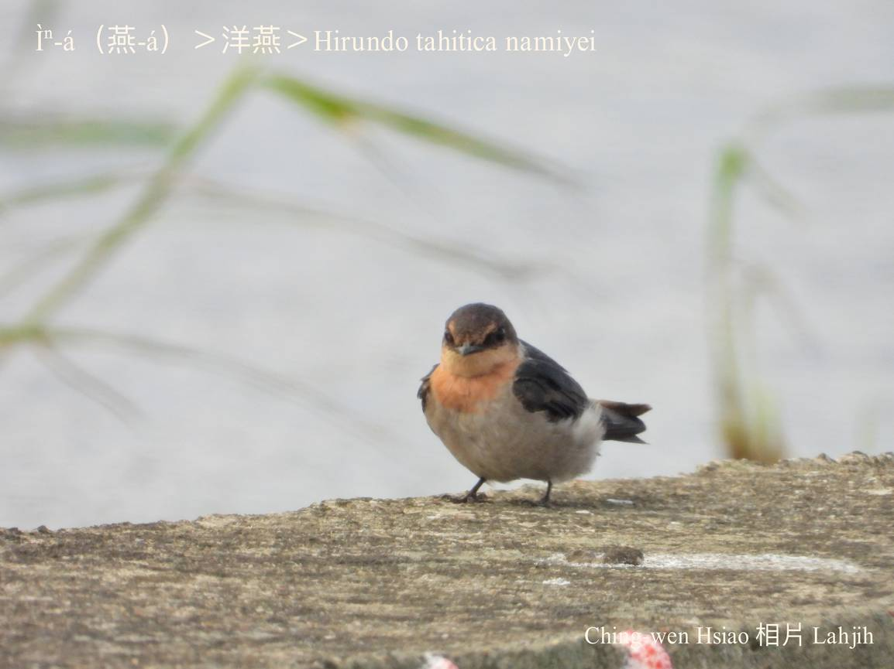

#### 30. Iàn Kho『燕科』

|台灣名|中譯名|學名|
|Ìⁿ-á（燕-á）|洋燕|Hirundo tahitica namiyei|

# 30-2. Ìⁿ-á（燕-á）

Ìⁿ-á『洋燕』tī台灣是普遍ê在地鳥，固定tòa kāng chi̍t-ê所在，無koh徙位。

時常田園、庄腳khiā家、山坪空中hop蠓蟲，khah捷4-5隻做夥飛，khah bē絞群mā bē飛siuⁿ koân。Kah意hioh tiàm電線頂á-sī曠闊有ta樹椏面頂。

### 【註解】

|詞|解說|
|樹椏|Chhiū-oe。|

