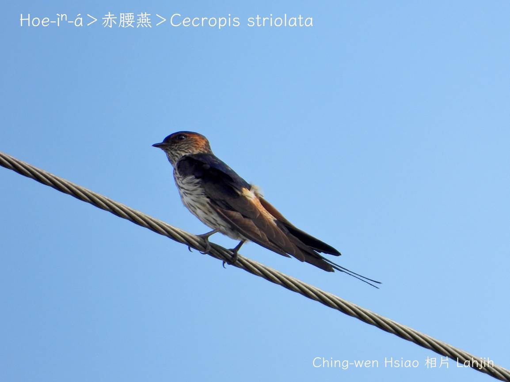
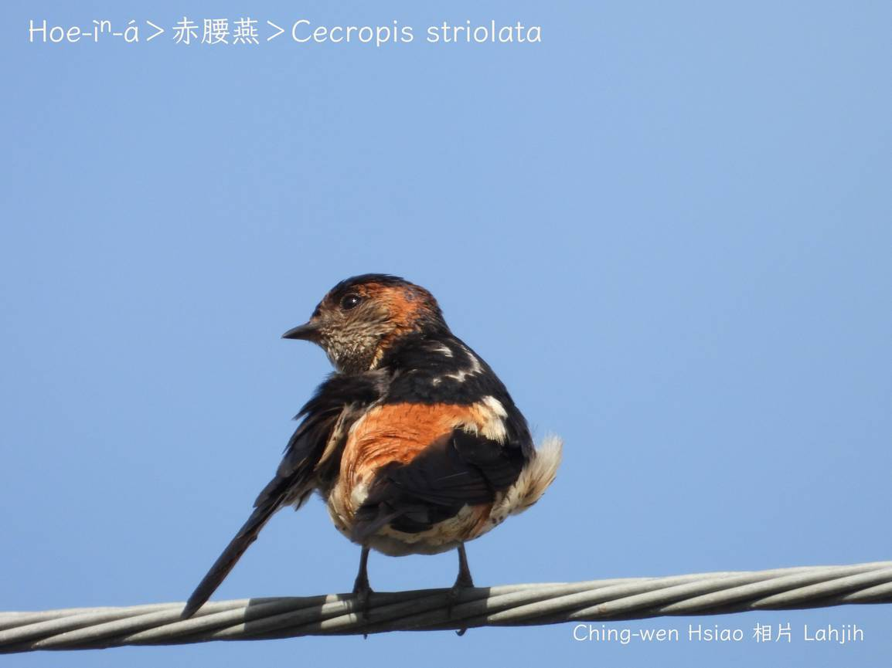
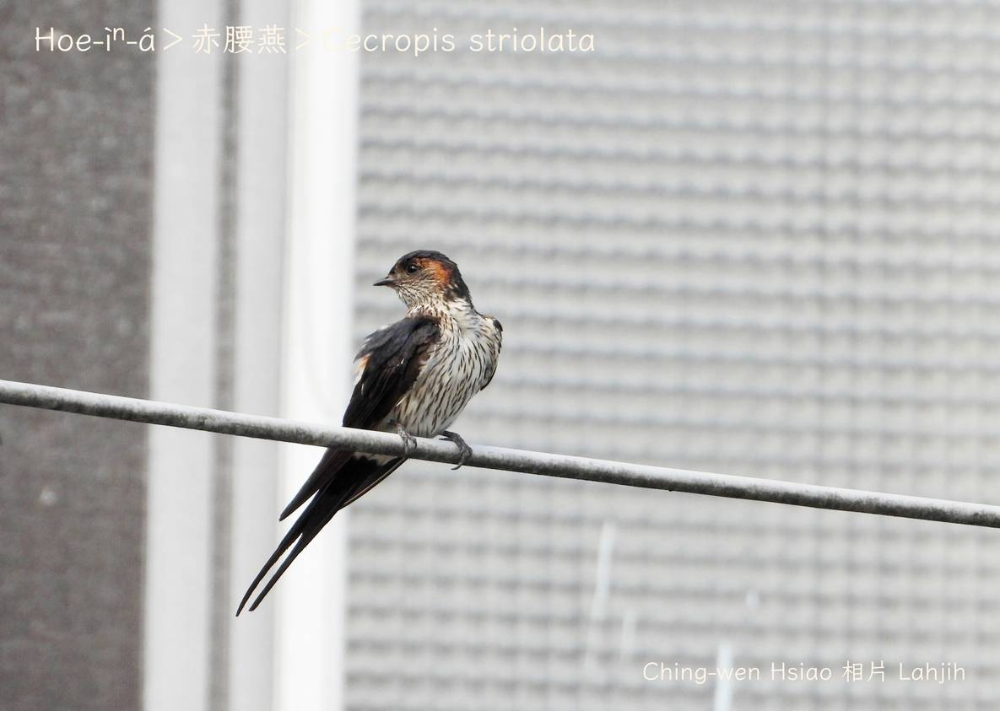
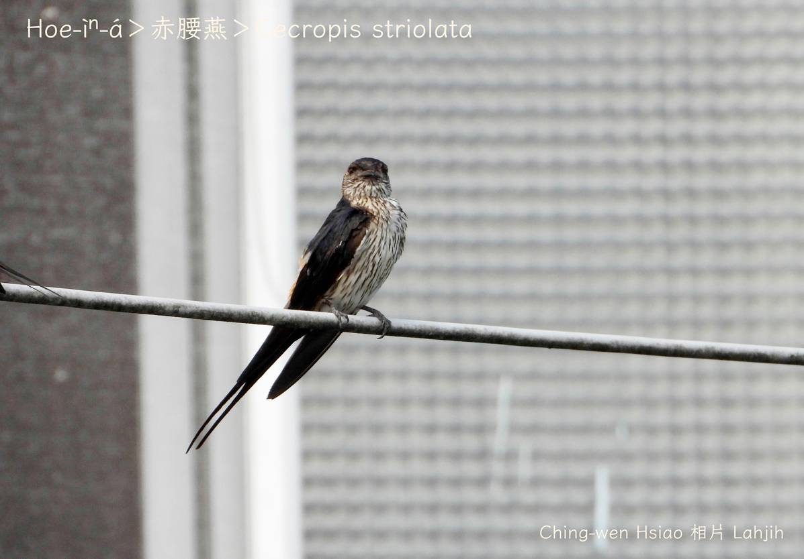
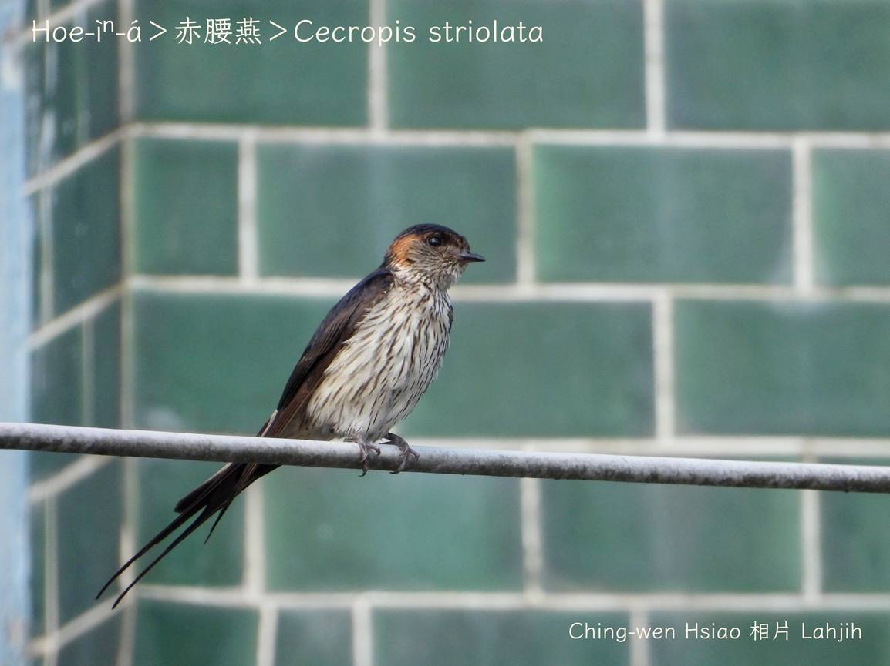
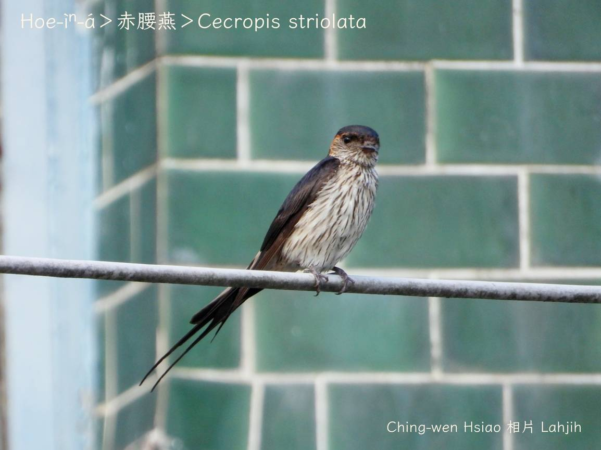

#### 30. Iàn Kho『燕科』

|台灣名|中譯名|學名|
|Hoe-ìⁿ-á（花燕á）|赤腰燕|Cecropis striolata|

# 30-3. Hoe-ìⁿ-á（花燕á）

Hoe-ìⁿ-á頭尾約20公分，kha-chiah-phiaⁿ暗khóng色，翼股、尾溜暗咖啡色，腰身紅咖啡色，ām-kui、khim-heng、腹肚白phú色有暗色花紋。

Hoe-ìⁿ-á是台灣在地燕科鳥類siāng大隻燕á，飛行比其他燕á加真慢優雅，ē-tàng看tio̍h pit-chhe ê燕á尾。

Hoe-ìⁿ-á生活tī 2000公尺以下ê城市、庄腳所在，單獨a̍h是kui群tiàm空中thóng食蠓蟲，kah意tiàm建築物內做像大支花瓶ê siū。

### 【註解】

|詞|解說|
|ām-kui|Ām-kún ê nâ-âu所在，『脖子』。|
|khim-heng|鴨kap雞等胸坎ê肉。|

