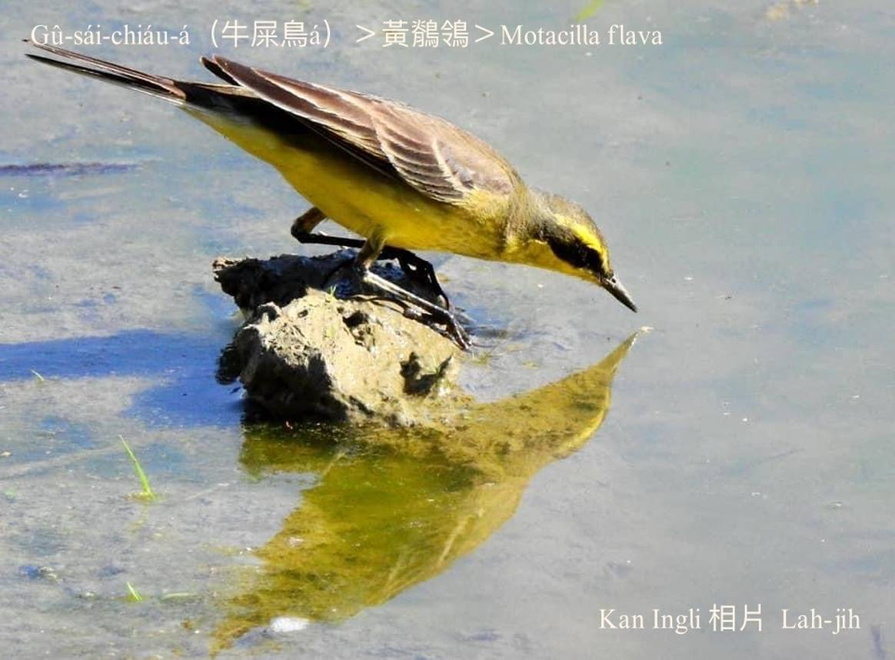

#### 32. Chit-lêng Kho『鶺鴒科』

|台灣名|中譯名|學名|
|Gû-sái-chiáu-á（牛屎鳥仔）|鶺鴒|Motacillidae|

# 32-1. Gû-sái-chiáu-á（牛屎鳥仔）

Gû-sái chiáu-á，生活tī草埔、溪埔，kah意tī牛屎堆內chhōe  báng-thâng、hô͘-sîn a̍h是in-ê chhi食，m̄-chiah hō͘人號做牛屎鳥仔，雖然無好聽，m̄-kuh chiâⁿ有鄉土味。

Gû-sái chiáu-á tī台灣iáu有黃牛屎鳥仔、白牛屎鳥仔、phú牛屎鳥仔，lóng是普遍ê過冬鳥。In tī開闊ê田園、溪埔á、塚á埔、poh岸活動，tī水邊chhōe食，看tio̍h飛蟲隨時起飛thóng食，飛行姿勢sêng「~~~~~」波浪形，tī地面走，走chiok kín，停睏時尾會sìm--leh sìm--leh，真kó͘-chui。

# 【Tâi-oân Chiáu-á Liām Koa-si】

### **Gû-sái-chiáu-á Miâ Pháiⁿ-thiaⁿ**

Khòaⁿ goán ê thé-châi, si̍t-chāi chiâⁿ-súi

Thiaⁿ góa ê miâ, ná-ē chiah pháiⁿ-thiaⁿ

Lóng-sī in-uī hèng-chia̍h báng-thâng

Chó͘-sian chiah kà goán tiàm gû-sái-tui thó-chia̍h

Soah hō͘-lâng hō-chò chit-khoán miâ

Ūi-tio̍h seng-oa̍h, su-iàu poe koh su-iàu gâu-cháu

Goán chia̍h báng-thâng, tùi lín jîn-lūi lâi-kóng

Sī chi̍t chiah hó-chiáu

### 【註解】

|詞|解說|
|chhi|蛆，『幼蟲』。|
|poh岸|Poh-hōaⁿ，堤岸（『壩岸』、溪岸）。|

