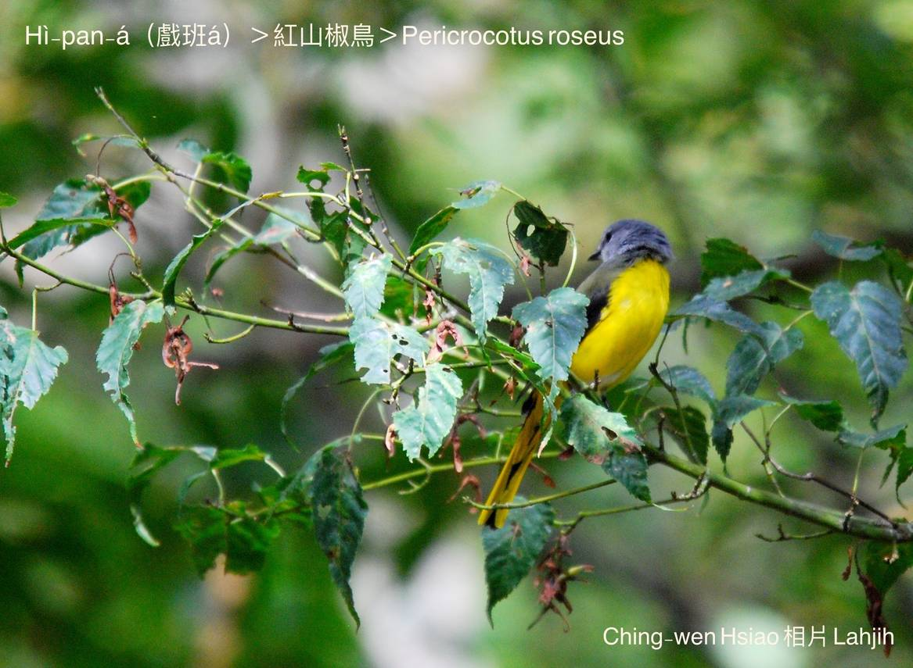

#### 33. Soaⁿ-chiau-chiáu Kho『山椒鳥科』

|台灣名|中譯名|學名|
|Hì-pan-á（戲班á）|紅山椒鳥|Pericrocotus roseus|

# 33-1. Hì-pan-á（戲班á）

Hì-pan-á，古早mā叫做五色鳥，Kap-má-lân廳志：『五色鳥，出柑á潭。大小不一，數十為群，啁啾互答，巧輕如戲。』

Hì-pan-á，公--ê鳥毛以印色紅為主，母--ê是黃色chiâⁿ豔ê黃色。M̄是生湠ê期間，時常kap山烏鶖tàu-tīn活動，數十隻tī樹林頂層a̍h是大樹頂，因為山烏鶖ê羽毛hō͘日頭光chhiō--tio̍h，pìⁿ-chiâⁿ光艷ê藍青色，樹á腳koh是暗烏暗烏，soah變做青、藍、黃、紅、烏五彩插雜ê鳥群，名為五色鳥。

Mā常常有大目khóng-á tòe tī後壁，戲班á全長17cm，山烏鶖21cm，『大小不一，數十為群，啁啾互答，巧輕如戲。』Hì-pan-á to̍h是án-ne號名。

Hì-pan-á生活tī中、低海拔山區闊葉樹林內，波浪形飛行，毛色影目，食thâng-thōa kap in-ê幼蟲，『漿果』kap果子。

# 【Tâi-oân Chiáu-á Liām Koa-si】

### **Hì-pan-á Boeh Poaⁿ-hì**

Hì-pan-á hèng poaⁿ-hì

I chio Soaⁿ-o͘-chhiu hām Tōa-ba̍k-khóng-á

Ta̍k ê hì-ho̍k chhēng súi-súi

Tiàm chhiū-nâ téng

Poaⁿ chi̍t-chhut gō͘-hoe cha̍p-sek ê

Hiān-tāi kio̍k

### 【註解】

|詞|解說|
|Kap-má-lân|宜蘭縣。|
|影目|Iáⁿ-ba̍k。|

