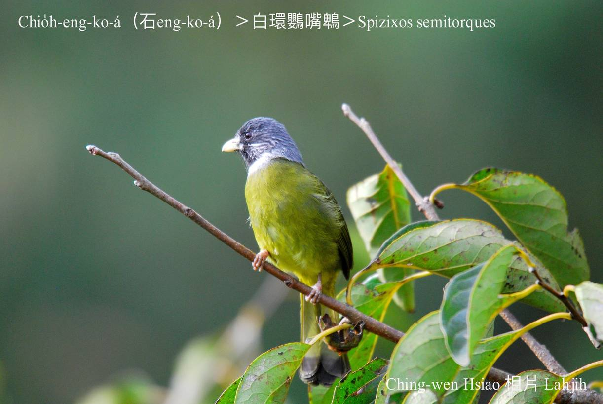

#### 34. Pit Kho『鵯科』

|台灣名|中譯名|學名|
|Chio̍h-eng-ko-á（石Eng-ko-á）|白環鸚嘴鵯|Spizixos semitorques|

# 34-1. Chio̍h-eng-ko-á（石Eng-ko-á）

Chio̍h-eng-ko-á，短短ê白色嘴pe，面頂ê嘴pe向下彎曲，像鸚哥嘴，chiah ka號名石鸚哥á，ām-kún圍一環白色ê羽毛。

Chio̍h-eng-ko-á，tī台灣分布tī山坪到山崙地帶，低海拔山區，tī海拔2300m附近ê清水溪谷bat發現--過。普通二~三隻一堆，tī草phō a̍h是低樹phō頂面活動，háu聲「pi、pi、pi、pi …」kài大聲，食幼葉、果子、『漿果』、蟲thōa kap伊ê幼蟲。Kah意絞群tiàm低海拔山區、開闊草phō、電線頂唱歌。

### Pit-kho『鵯科』鳥類

|Pe̍h-thâu-khok-á（白頭Khok-á）|白頭翁|Pycnonotus sinensis|
|O͘-thâu-khok-á（烏頭Khok-á）|烏頭翁|Pycnonotus taivanus|
|Âng-chhùi-pit-á（紅嘴Pit-á）|紅嘴黑鵯|Hypsipetes leucocephalus|
|Chio̍h-eng-ko-á（石Eng-ko-á）|白環鸚嘴鵯|Spizixos semitorques|

Lóng-sī台灣時常khoàiⁿ--tio̍h，in lóng kah意食肉chē有汁ê果子kap蟲thōa，gâu háu、大聲響亮、nńg-loán歌聲變化好聽，mā是特色。

### Bunun ê習俗

Gín-á開始學行學講話，ē-hiáu食固體食物時，lia̍h石eng-ko-á、番薯á鳥、bi̍t-lô-á，ho͘烘鳥á-pa á-sī tīm鳥á肉hō͘ gín-á食，講án-ne gín-á真緊to̍h ē-hiáu講話，因為chia-ê鳥á lóng真gâu háu。

### 【註解】

|詞|解說|
|鵯|日義漢字。|
|khoàiⁿ|Khòaⁿ-kìⁿ ê合音。|
|nńg-loán|『柔軟』。|
|Bunun|布農族。|

