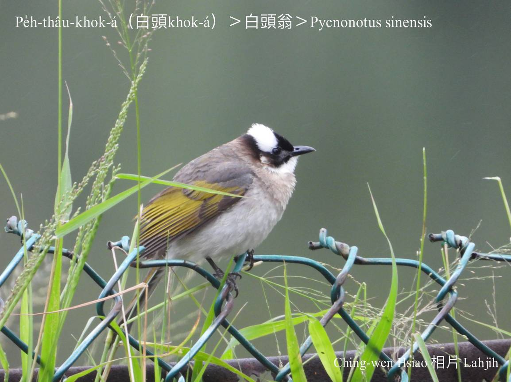
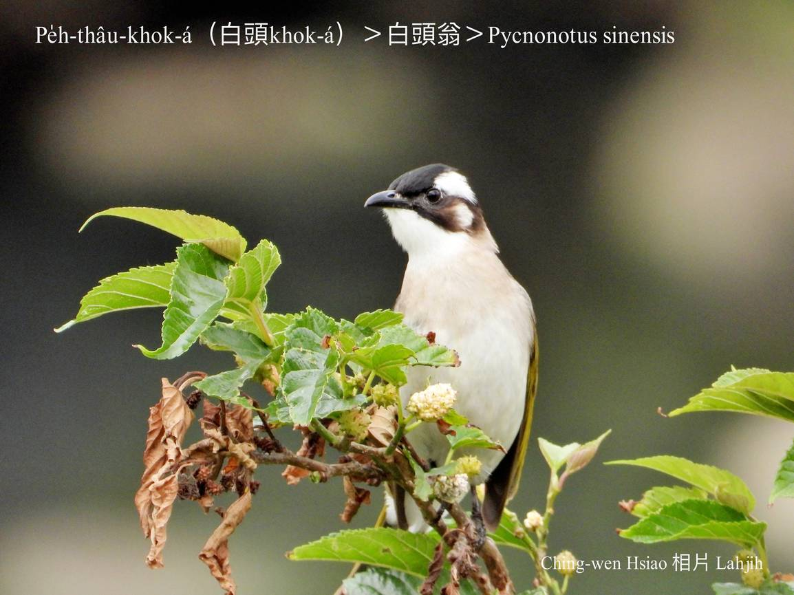
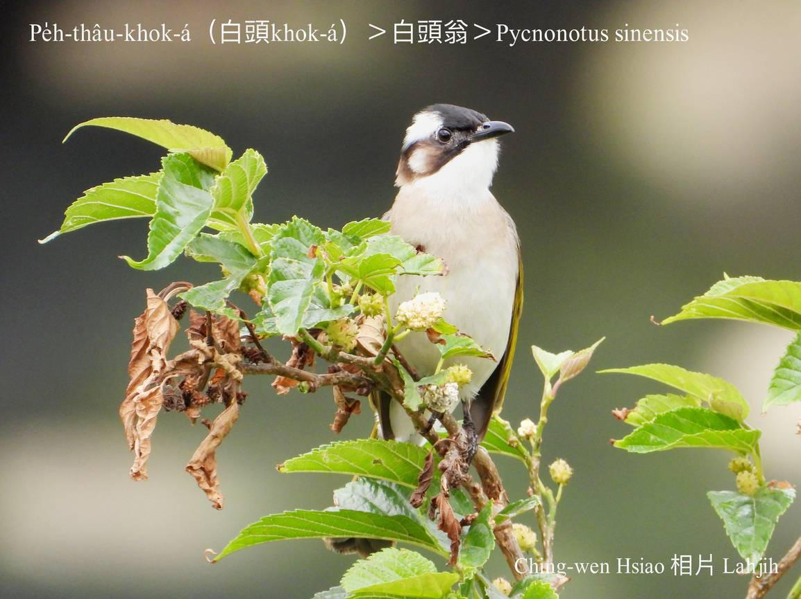
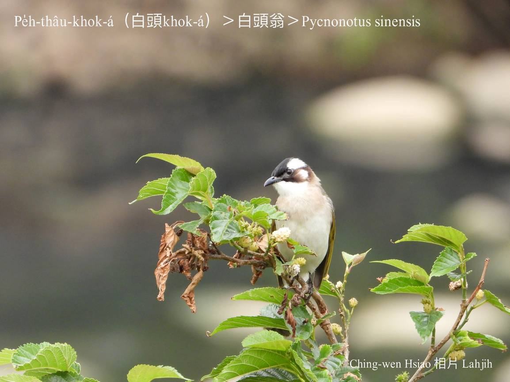
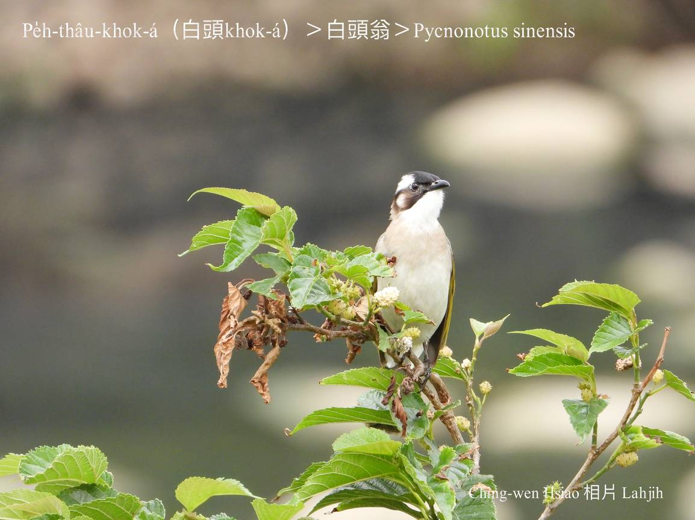
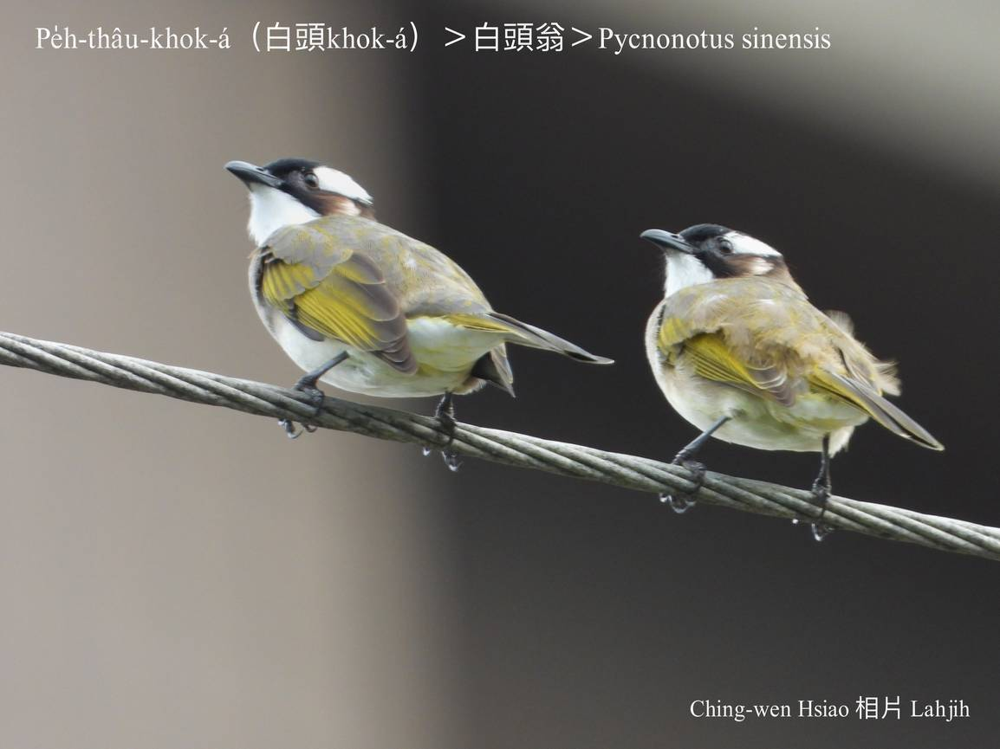
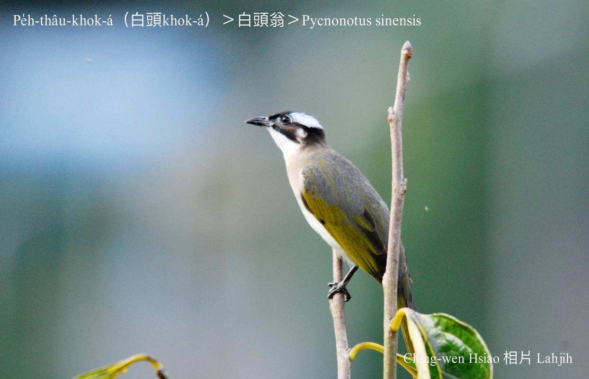
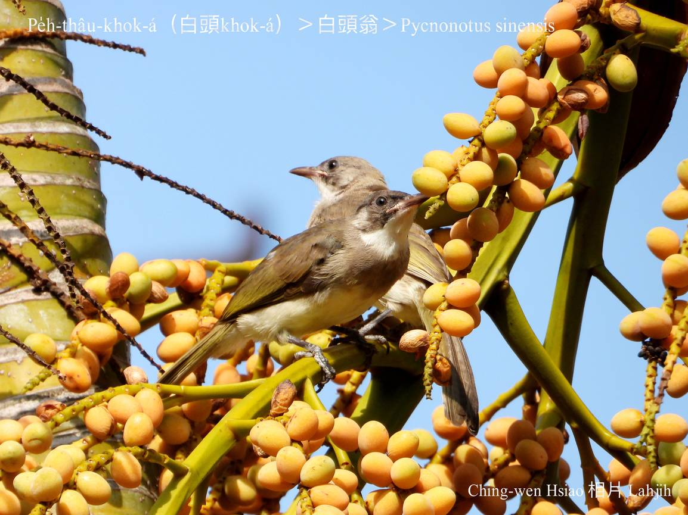

#### 34. Pit Kho『鵯科』

|台灣名|中譯名|學名|
|Pe̍h-thâu-khok-á（白頭Khok-á）|白頭翁|Pycnonotus sinensis|

# 34-2 Pe̍h-thâu-khok-á（白頭Khok-á）

Pe̍h-thâu-khok-á，tī台灣平地siāng kài-chia̍p khoàiⁿ--tio̍h，chiâⁿ普遍ê鳥仔，頭殼頂有一chhop白毛，pe̍h-thâu-khok-á、pe̍h-thâu-khok-á，to̍h án-ne叫tiâu名。

Pe̍h-thâu-khok-á，ki-ki kā-kā，叫聲真吵，m̄-kuh真好聽，千變萬化，有時孤單哀怨，有時kho͘-si-á ná唱歌，歇tī樹尾頂，無張無持白膏li ê屎尿ùi空中lak--lo̍h-lâi，hō͘人a̍h好氣a̍h好笑，ná-ē chiah tú好，來去買彩卷包ē-tio̍h。

「Pe̍h-thâu-khok-á，戴白帽，親像阿公--a ê白頭毛；kho͘-si-á Chocolate Chocolate，無張無持kā阿公--a phùi白膏。」

憲兵戴白色鋼盔，mā hō͘人號做pe̍h-thâu-khok-á。

Pe̍h-thâu-khok-á，tī台灣分布tī屏東楓港以北ê西部平地到低山區；東台灣出現tī花蓮以北ê平洋。公園、學校、厝宅lóng有伊ê腳跡，有時kui陣chiâⁿ百隻，活跳liú-lia̍h愛sńg，háu聲無停優美好聽，食蟲thōa、鳥榕、榕á ê『漿果』。

Pe̍h-thâu-khok-á台灣亞種是在地鳥。

### Pe̍h-thâu-khok-á kap O͘-thâu-khok-á ê關係

|O͘-thâu-khok-á（烏頭Khok-á）|烏頭翁|Pycnonotus taivanus|
|Pe̍h-thâu-khok-á（白頭Khok-á）|白頭翁|Pycnonotus sinensis|

台灣特有種烏頭khok-á外形kap白頭khok-á chiâⁿ kāng-khoán，差別tī頭殼。O͘-thâu-khok-á kan-nā台東、花蓮、恆春半島有，原本chit兩種鳥仔分別tòa兩位，無相交插，因為交通因素hām無妥當ê放生，sòa漸漸sio-lām雜交生湠共同特徵ê灰頭khok-á。

# 【Tâi-oân Chiáu-á Liām Koa-si】

### **Pe̍h-thâu-khok-á Lāi Chhùi-chi̍h**

Pe̍h-thâu-khok-á, gâu kóng-ōe, koh-ē liām koa-si

Hoaⁿ-hí sî-chūn, boeh-chia̍h chhiok-khu-liat-to͘h

Chocolate Chocolate hoah bô-thêng

Siū-khì sî-chūn, mē-lâng khōng-ku-lí khōng-ku-lí

Hō͘-lâng koaiⁿ-tī chiáu-lang-á lāi

I tō chhoh--lâng hō͘-lí sí hō͘-lí sí hō͘-lí sí hō͘-lí sí

### 【註解】

|詞|解說|
|khoàiⁿ|Khòaⁿ-kìⁿ ê合音。|
|腳跡|Kha-jiah。|
|雞膏|雞ê軟屎。Lah-jih ê腔口是講雞膏li。Só͘-pái pe̍h-thâu-khok-á ê屎，白白膏膏，Lah-jih ka講 "白膏li"。|

