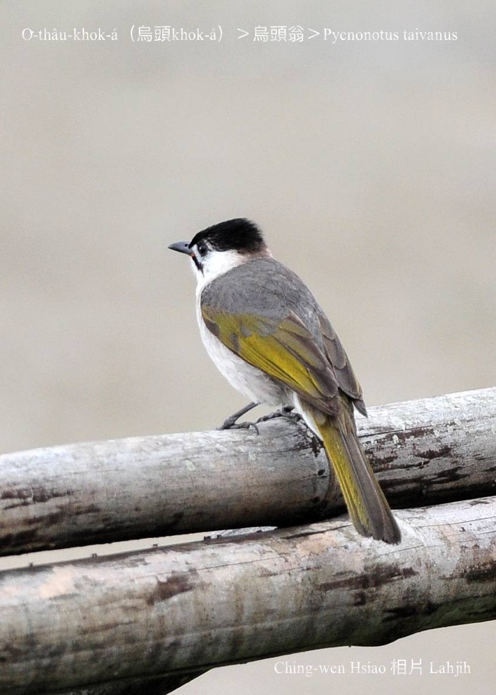
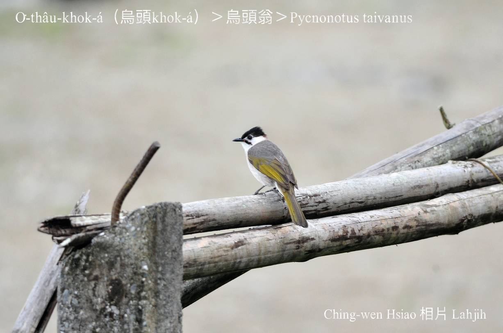
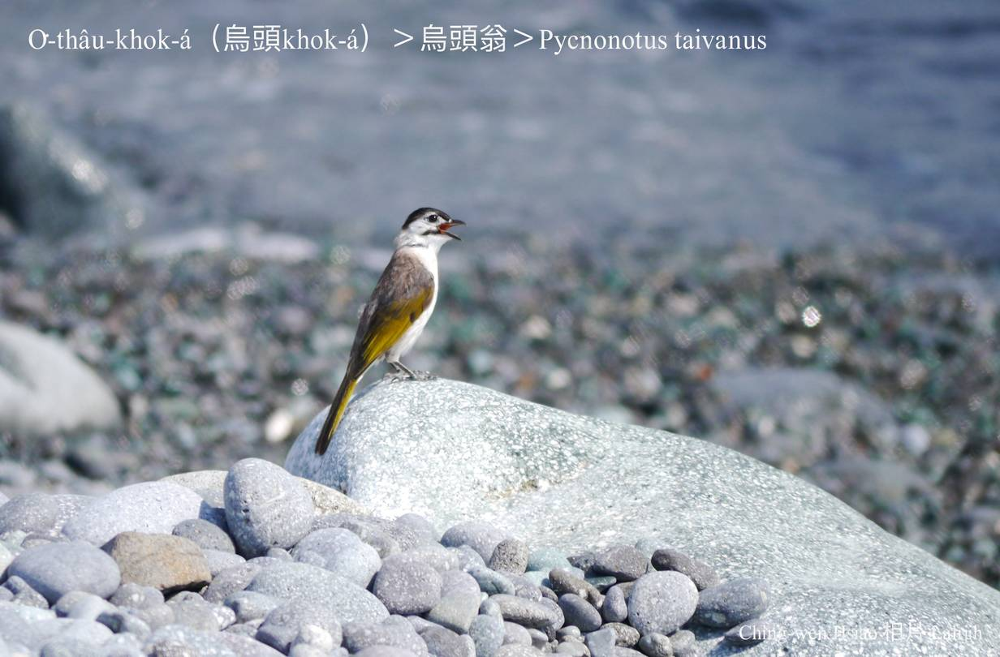
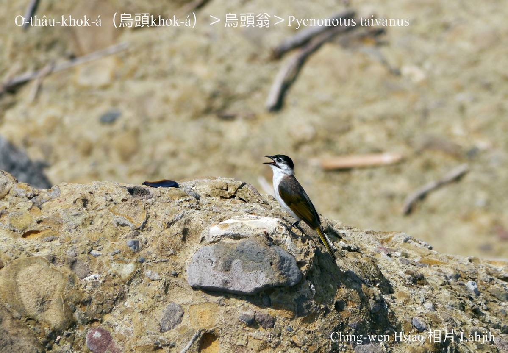
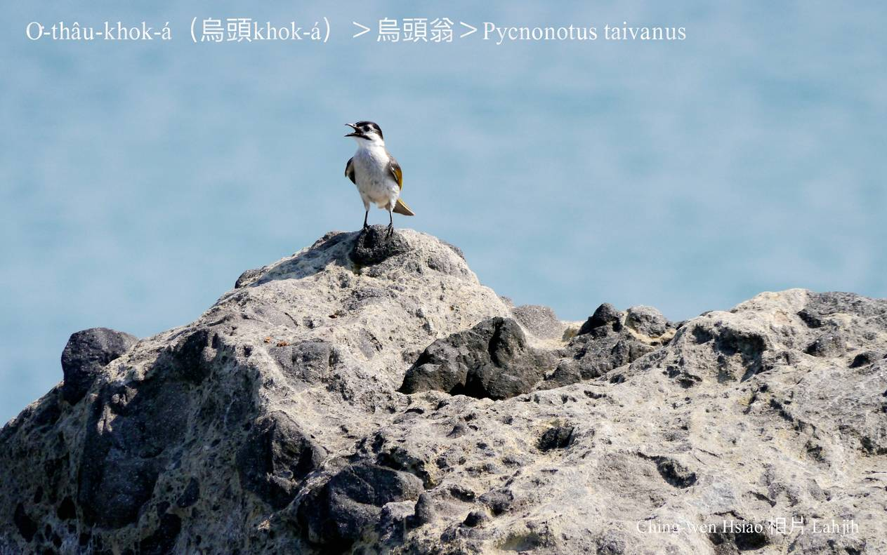
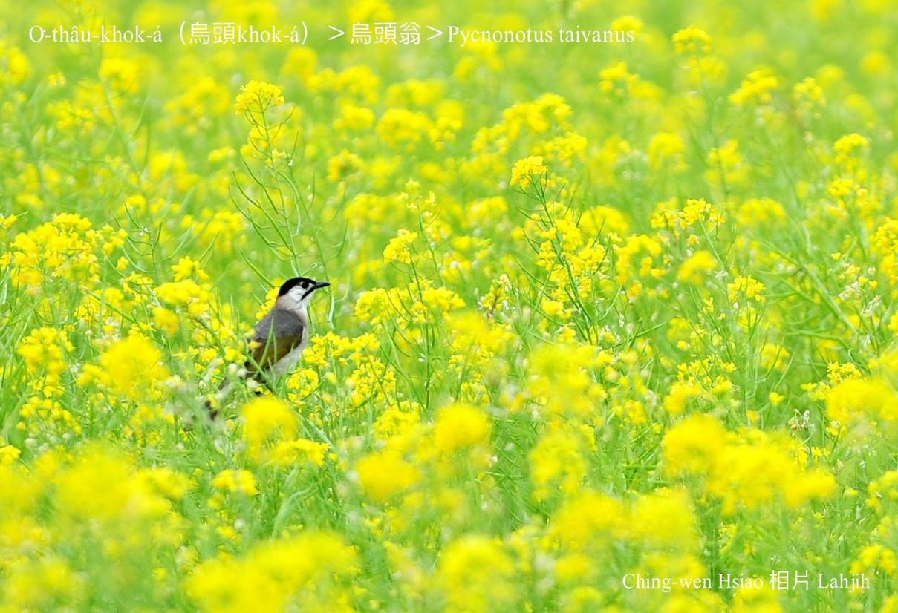
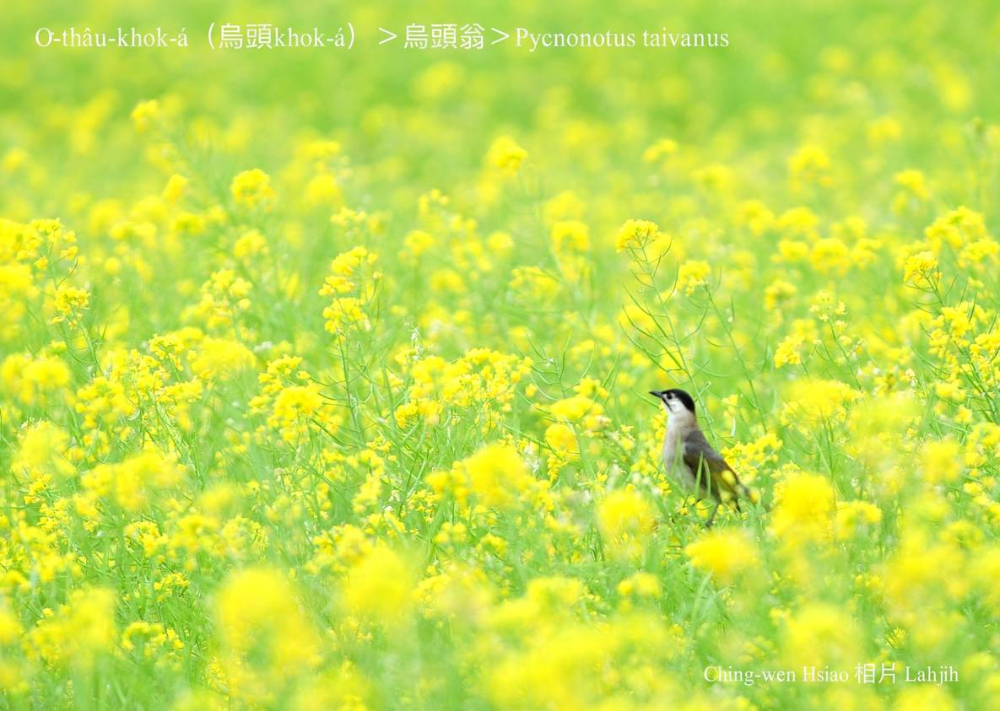

#### 34. Pit Kho『鵯科』

|台灣名|中譯名|學名|
|O͘-thâu-khok-á（烏頭Khok-á）|烏頭翁|Pycnonotus taivanus|

# 34-3. O͘-thâu-khok-á（烏頭Khok-á）

O͘-thâu-khok-á，形體kap白頭khok-á kāng-khoán，sió-khóa khah大隻，形態、習性kap外觀lóng真sio-siāng，kan-nā頭殼頂hit chhop毛無kāng，是烏色--ê。

O͘-thâu-khok-á，sī台灣是特有種，是二級珍貴保育類，恒春半島楓港到花蓮以南ê平地，kap白頭khok-á形成奇妙ê地理分隔現象。

### **白頭Khok-á kap烏頭Khok-á**
>**Lahjih**

樹林內tòa 1 tīn白頭khok-á，ta̍k日lóng tiàm-tī樹á尾溜食果子，食飽tio̍h ki-ki-kia̍uh-kia̍uh phò-tāu、唱歌，a̍h是相罵、答嘴鼓，過快樂ê日子。有1工飛來兩隻烏頭khok-á，生做kap in真kāng-khoán，kan-nā頭殼頂hit chhop毛無sio-kāng，白頭khok-á是白--ê，烏頭khok-á是烏--ê，所以in lóng kā烏頭khok-á看做ka-tī ê兄弟，kā伊tàu招呼，kā伊tàu幫忙，歡歡喜喜。

1禮拜後，烏頭khok-á兄kā烏頭khok-á小弟講：「咱ná-ē生做chiah-nī bái？」

「Kám-ē？阿兄，你ná-ē án-ne想--leh？」烏頭khok-á小弟應阿兄。
 
「小弟，你看，白頭khok-á in頭殼頂hit-chhop毛白白白，有夠súi，咱ê頭殼頂hit-chhop毛烏sô-sô有夠bái，你kám無感覺？」 

「Ah無，咱來提白粉kā咱ê頭殼頂染做白--ê，án-ne to̍h kap in平súi--à！」烏頭khok-á兄感覺小弟講了有道理，兩兄弟to̍h用白粉kā頭殼頂hit-chhop毛染kah白siak-siak 。

隔轉日，in透早to̍h飛去樹á頂食果子，食到9點外，白頭khok-á大--ê大聲問ta̍k ê：「Súi koh漂撇ê烏頭khok-á兄弟ná-ē無來？是走去tah位？」

Ta̍k ê你看我，我看你，lóng chhōe無烏頭khok-á兄弟。 

「Kám有to̍h 1隻鳥仔看in無起？A̍h是怨妒in生做比咱khah súi？害in m̄敢kap咱做堆？」

「無--leh！阮lóng真疼惜in，mā lóng o-ló in生做真súi。」Ta̍k ê chhōe kah心狂火to̍h，chiok m̄甘in離開。

突然間：「實在真pháiⁿ-sè，來chia hō͘恁疼惜，soah惹恁操煩，lóng是阮m̄-tio̍h，lóng是阮無信心，kan-nā siàu想boeh kap恁kāng-khoán，m̄-chiah kā阮ê頭殼染kah白siak-siak。」烏頭khok-á兄一直tìm頭會失禮。 

白頭khok-á大--ê án-ne勉勵ta̍k ê：「白頭殼烏頭殼平平súi，ta̍k ê ài有自信，相信ka-tī，án-ne咱chiah ē-tàng kap別種鳥仔pí-phēng。」

