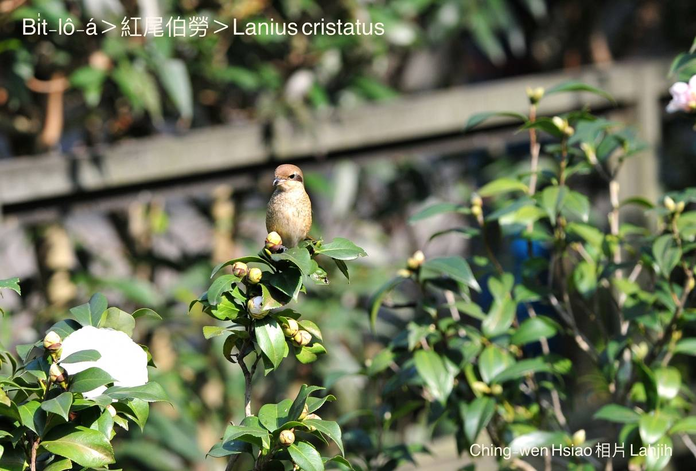

#### 35. Pit-lô Kho『伯勞科』

|台灣名|中譯名|學名|
|Bi̍t-lô-á|紅尾伯勞|Lanius cristatus|

# 35-1. Bi̍t-lô-á

Bi̍t-lô-á有人講pit-lô-á，是紅尾bit-lô-á，tī台灣是chiâⁿ普遍ê過冬鳥kap過境鳥，每年9--月tī恒春半島ē-tàng看tio̍h大量ê搬徙，是chiâⁿ罕有ê過冬鳥；nā是虎斑bit-lô-á是chiâⁿ稀罕ê過境鳥，lām tī紅尾bit-lô-á tàu-tīn來台灣。

Tī台灣過冬ê紅尾bit-lô-á，一般lóng hioh tī草埔、田園、山地疏林區，活動chhōe食，行動活跳liú-lia̍h，時常khiā tī柴khi̍t-á、樹椏、電線頂，偷siòng獵物，háu聲chha̍k耳響亮，頭taⁿ-taⁿ，尾khiàu-khiàu，雄kài-kài，有精神。本性兇猛，嘴pe腳爪tēng-pak有力，看tio̍h獵物sûi-sî cho̍k-lo̍h-khì啄食，有時mā-ē攻擊khah細隻ê鳥仔，a̍h是tī土腳地面chhōe蟲thōa、水蛙食。

Bit-lô-á有kā食chhun--ê ê蟲thōa、水蛙、『蜥蜴』等，掛tiàm樹椏ê習性。

Bit-lô-á ē lia̍h食為害農作物ê草蜢á害蟲，應該tio̍h ka保護，m̄-thang lia̍h來piak鳥仔-pa。

# 【Tâi-oân Chiáu-á Liām Koa-si】

### **Pit-lô-á Chiok Pháiⁿ-miā**

Kĕ~ò͘ kĕ~ò͘, kĕ~ò͘ kĕ~ò͘

Put-hēng ê pit-lô-á iū-koh tio̍h-tiàu

Siáⁿ-lâng chiah-nī iau-siū

Iōng chiáu-á-ta̍h kā goán lia̍h

Khó-liân goán ná-ē chiah pháiⁿ-miā

Boeh-chai mā bô-ài lâi tòa lín-chia

### 【註解】

|詞|解說|
|樹椏|Chhiū-oe。|
|柴khi̍t-á|Chhâ-khi̍t-á，『木樁』。|
|chiáu-á-ta̍h|『捕鳥圈套』。|