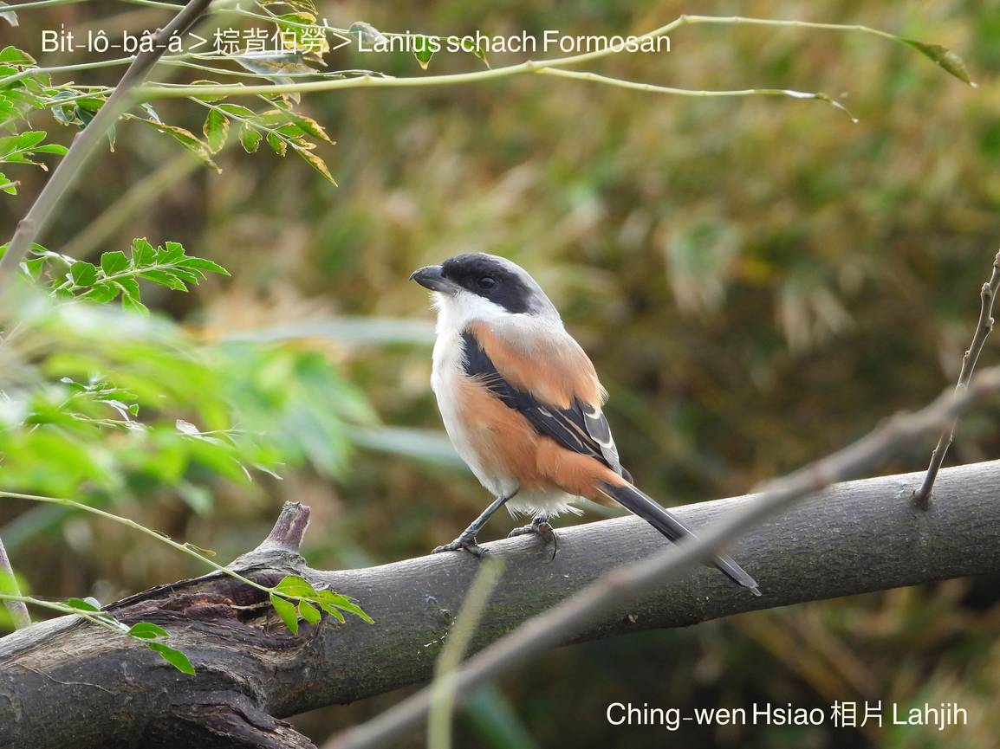
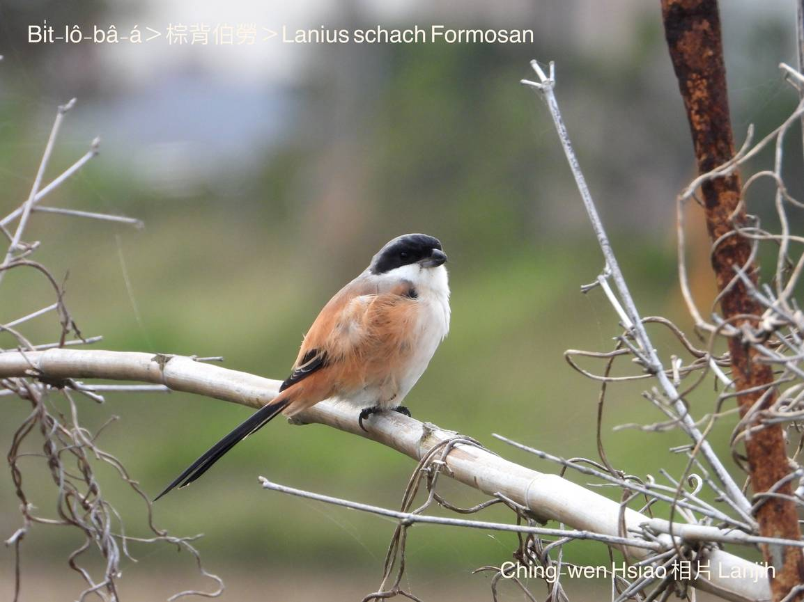
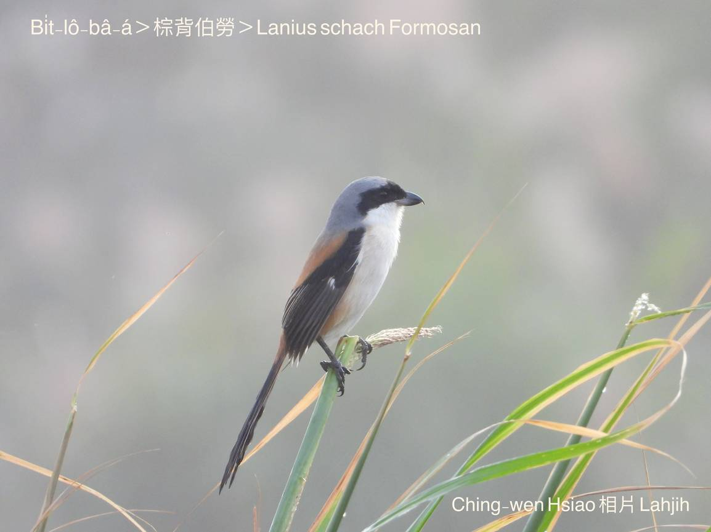
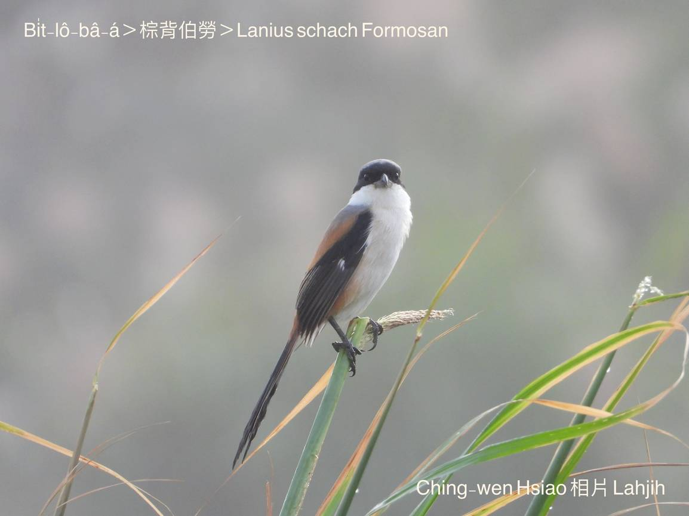
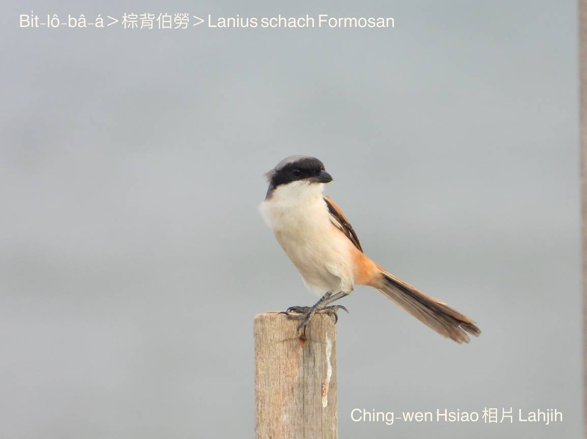
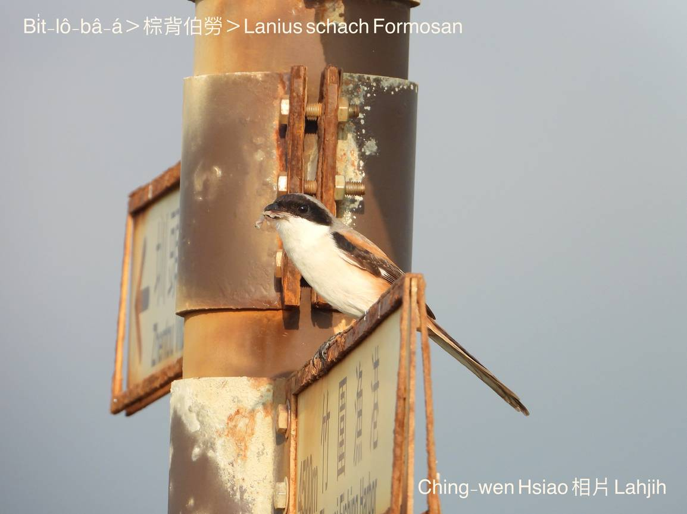
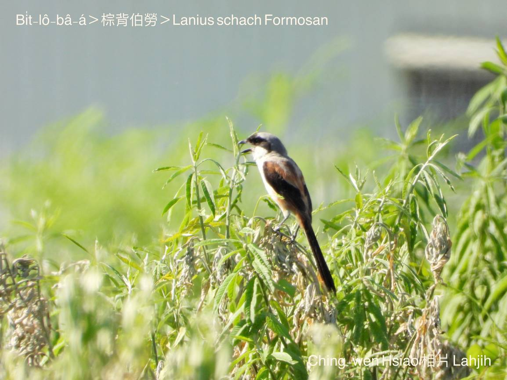
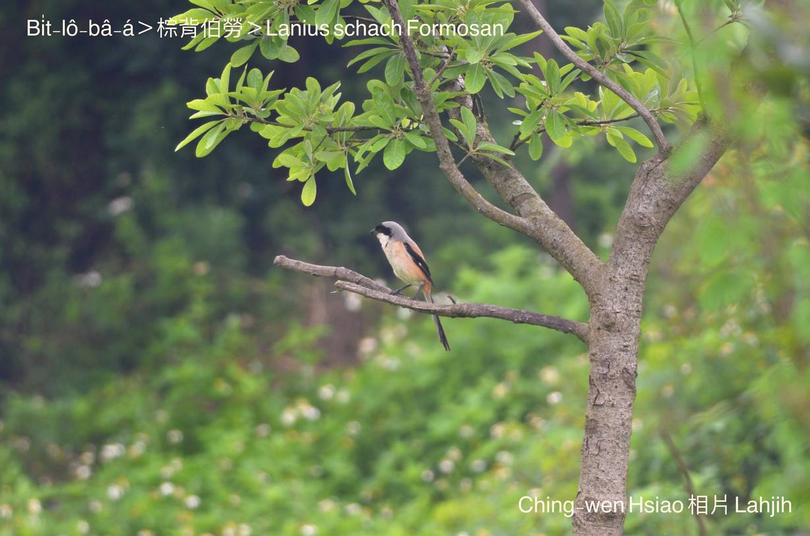

#### 35. Pit-lô Kho『伯勞科』

|台灣名|中譯名|學名|
|Bi̍t-lô-bâ-á|棕背伯勞|Lanius schach Formosan|

# 35-2. Bi̍t-lô-bâ-á

Bit-lô-bâ-á有人講pit-lô-bâ-á，bit-lô-bâ-á比bit-lô-á koh-khah pháiⁿ-chhèng-chhèng，嘴pe腳爪lóng真尖koh真利，時常攻擊chheⁿ-tî-á、o͘-chhùi-pit-á a̍h是bāng-tang-tiuh-á細隻鳥類。伊hiông-kài-kài ê面腔，ná像soaⁿ-bâ-á，m̄-chiah號做bit-lô-bâ-á。

Bit-lô-bâ-á是Kebalan人ê po̍ah-kòa鳥，Kebalan人ta̍k日開門boeh出外作穡時，nā是bi̍t-lô-ko-á歇tiàm門前樹頂ki-ki-kā-kā háu無停，to̍h表示不吉ê前兆，是祖先託靈暗示，今á日m̄-thang做重要tāi-chì。

Bi̍t-lô-bâ-á，常在歇tī農家ê竹模、樹á頂háu bē-soah，所以nā boeh phì-siùⁿ chi̍t-ê人kui日一支嘴se̍h-se̍h唸bē soah，to̍h講伊ná bi̍t-lô-bâ-á--leh。

Bit-lô-bâ-á gâu háu，可惜叫聲粗尖鑿耳，有一句俗語án-ne講：「Bit-lô-bâ-á，嘴開開，有嘴講別人，無嘴講ka-tī。」

Bi̍t-lô-bâ-á是台灣特有亞種，平地到山崙地帶lóng有，是普遍ê在地鳥，tī西部平洋、蘭陽平洋kap花東平洋lóng看ē-tio̍h，in kap烏鶖、白頭khok-á、紅嘴pit-á，是分布tī台灣平洋到低海拔山區ê代表鳥類。

Bi̍t-lô-bâ-á kha-phiaⁿ紅ka-pi色，ba̍k-chiu周圍烏跡pí bi̍t-lô-á加真闊。Hèng食thâng-thōa、水蛙、蟹á、tō͘-tēng、細隻鳥仔。時常ka-tī一隻khiā tiàm樹椏、柴khi̍t-á、電線頂瞭望。

# 【Tâi-oân Chiáu-á Liām Koa-si】

### **Bit-lô-bâ-á Pháiⁿ Kiat-tiāu**

Kĕ--ò͘ kĕ--ò͘

Bit-lô-bâ-á, lí mài koh háu--à

Ā m̄-sī tio̍h-tiàu, ná-ē háu  kah chiah pháiⁿ-thiaⁿ

Lóng-sī lí bit-lô-bâ-á, hiah-nī phòa-keh kāu-ōe

Kha̍p-bē-tio̍h to̍h kĕ--ò͘ kĕ--ò͘ meh-meh-háu

M̄-chiah hāi gún chhut-mn̂g lóng kiaⁿ tn̄g-tio̍h lí,

Bit-lô-bâ-á,

Pháiⁿ kiat-tiāu

Pài-thok lí mài koh háu--à

### 【註解】

|詞|解說|
|樹椏|Chhiū-oe。|
|soaⁿ-bâ-á|山貓á，『狸』。|
|Kebalan|平埔族。|
|柴khi̍t-á|Chhâ-khi̍t-á，『木樁』。|
