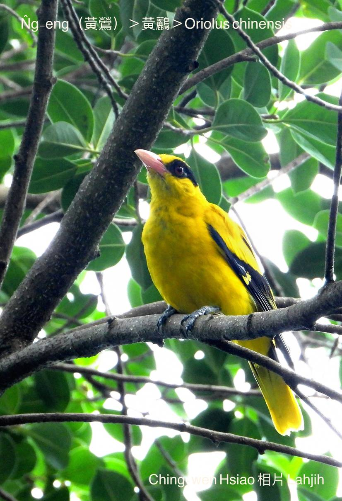
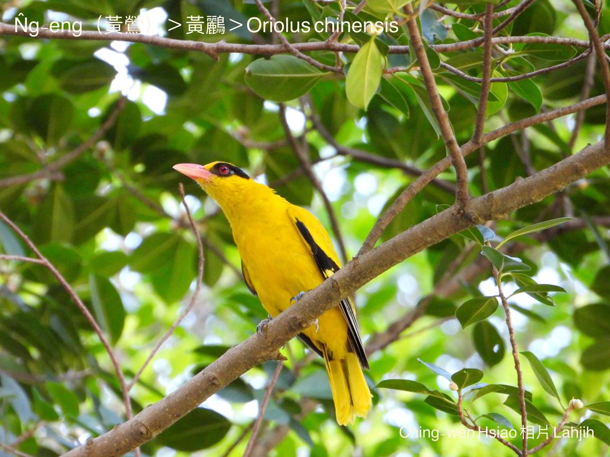
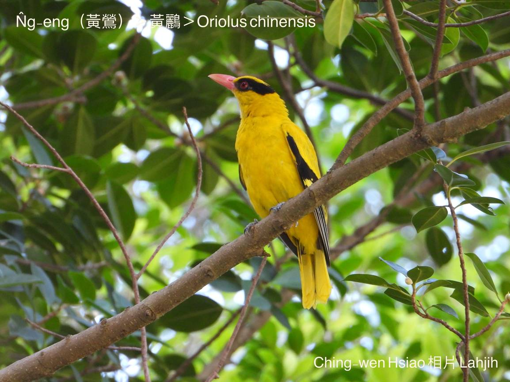
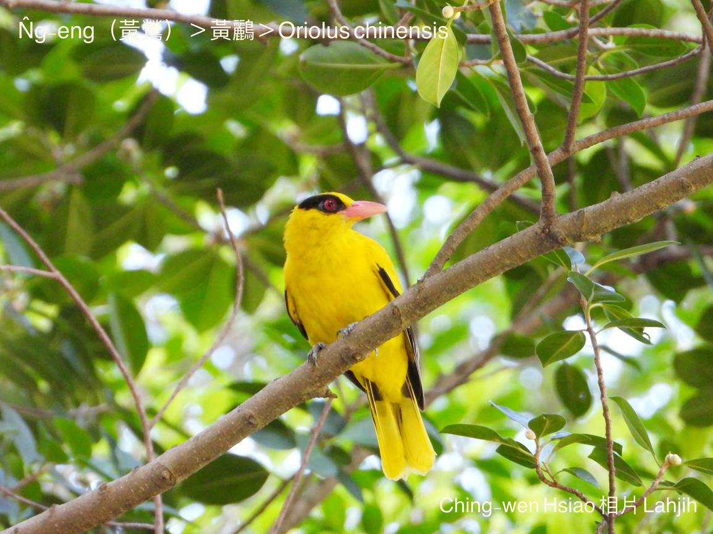
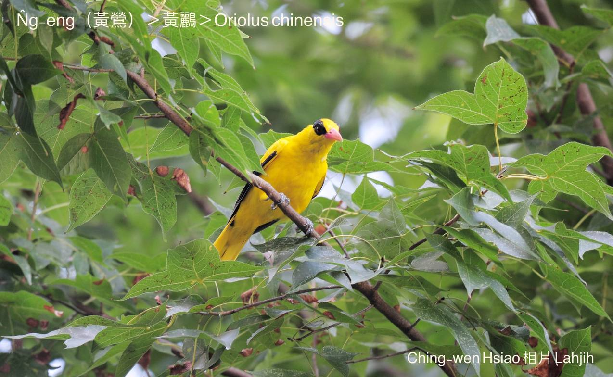
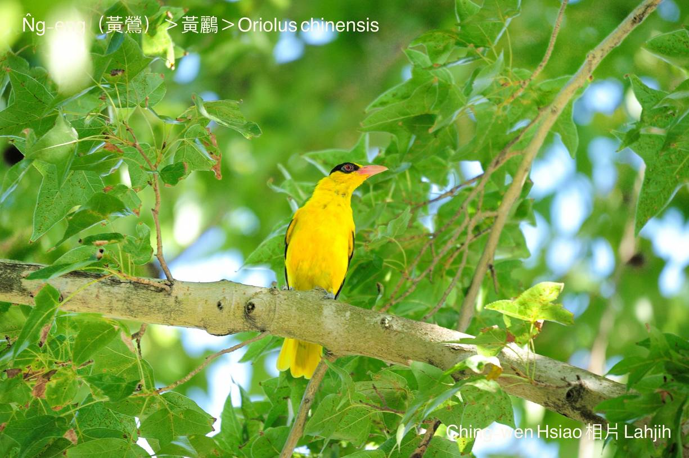

#### 36. N̂g-lî Kho『黃鸝科』

|台灣名|中譯名|學名|
|N̂g-eng（黃鶯）|黃鸝|Oriolus chinensis|

# 36-1. N̂g-eng（黃鶯）

N̂g-eng háu聲bē尖bē濁bē sau聲，屬中音，實在好聽。

N̂g-eng有chiâⁿ súi ê黃色鳥毛，親像中國古早皇帝ê黃袍；ah烏鶖一身烏烏ê羽毛，ná科甲無tiâu ê落魄秀才；
lāi-hio̍h是火灰色，koh ài偷咬雞á栽，ká-ná乞食kāng-khoán，m̄-chiah古早有chit句：

「黃鶯皇帝，烏鶖落第，bā-hio̍h乞食」ê俗語。

N̂g-eng tī百幾年前tī南台灣是真普遍ê鳥類，可惜chit-mái已經真少。

N̂g-eng ê羽毛，kui身軀有黃gâm-gâm ê黃色，kan-nā翼股、尾溜、ba̍k-chiu chhap chi̍t-kóa烏色，看起來mā kài tōa-pān súi-tang-tang。

N̂g-eng是cha̍p-chhò食鳥類，m̄-koh iáu是khah kah意食thâng-thōa果子。

N̂g-eng ê生存危機是hioh-siū所在改變á-sī消失，目前已經是giōng-boeh che̍h-chéng ê野生動物。

### 【註解】

|詞|解說|
|雞á栽|雞á-kiáⁿ。|
|che̍h-chéng|絕種。|

