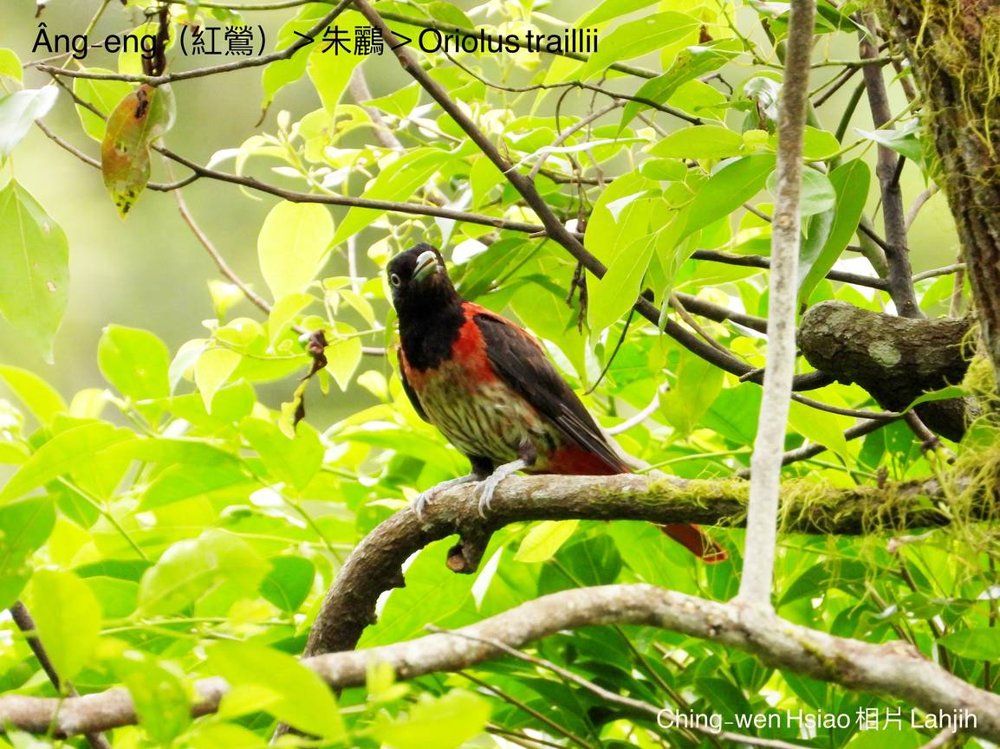

#### 36. N̂g-lî Kho『黃鸝科』

|台灣名|中譯名|學名|
|Âng-eng（紅鶯）|朱鸝|Oriolus traillii|

# 36-2. Âng-eng（紅鶯）

Âng-eng正港是「紅súi烏tōa-pān」ê鳥隻，kui身軀紅--ê âng-phà-phà，烏--ê o͘-sìm-sìm，頭殼、翼股烏色，身軀、尾溜朱紅色，kan-nā嘴pe、ba̍k-chiu、腳骨白色，影目súi-tang-tang。

Âng-eng分布tī中、低海拔山區，bih tiàm闊葉樹林內，m̄-bat出現tī高海拔ê山區，單獨a̍h是雙雙對對生活tī疏林、溪谷樹林內、tī中層到樹尾頂chhōe食活動，食蟲thōa、有chiap果子為主食，是cha̍p-chhò食ê鳥類，常常kap山烏鶖、白耳á、ka-ka-á、染布鳥lām tàu-tīn活動。

生湠期間，鳥母負責做siū、生卵；公鳥負責警戒。鳥仔-kiáⁿ孵出chiah共同養飼，離siū後主要由公鳥飼食。生湠期間公、母鳥lóng-ē趕侵入者，包含ka-ka-á、tn̂g-bóe-soaⁿ-niû、âng-chhùi-pit-á、粉鳥鷹kap phòng鼠。

Âng-eng是在地鳥，mā是花蓮縣縣鳥。

Âng-eng háu聲好聽ná kho͘-si-á，iù-jī有bô-kāng變化bē刺鑿，比n̂g-eng有khah細聲。

# 【Tâi-oân Chiáu-á Liām Koa-si】

### **Âng-eng Gâu Chhēng-saⁿ**

O͘-sìm-sìm ê thâu-mn̂g

Âng phòe o͘ ê sin-chhēng

Táⁿ-pān chéng-chê súi-tang-tang

Âng súi, o͘ tōa-pān

Chiáu-cho̍k nā boeh sî-chong piáu-ián

Siāng-kài chhia-iāⁿ--ê

To̍h sī âng-eng lín chi̍t-ke

Âng-eng 

Lí ná-ē chiah-nī-gâu chhēng-saⁿ

### 【註解】

|詞|解說|
|影目|Iáⁿ-ba̍k。|

