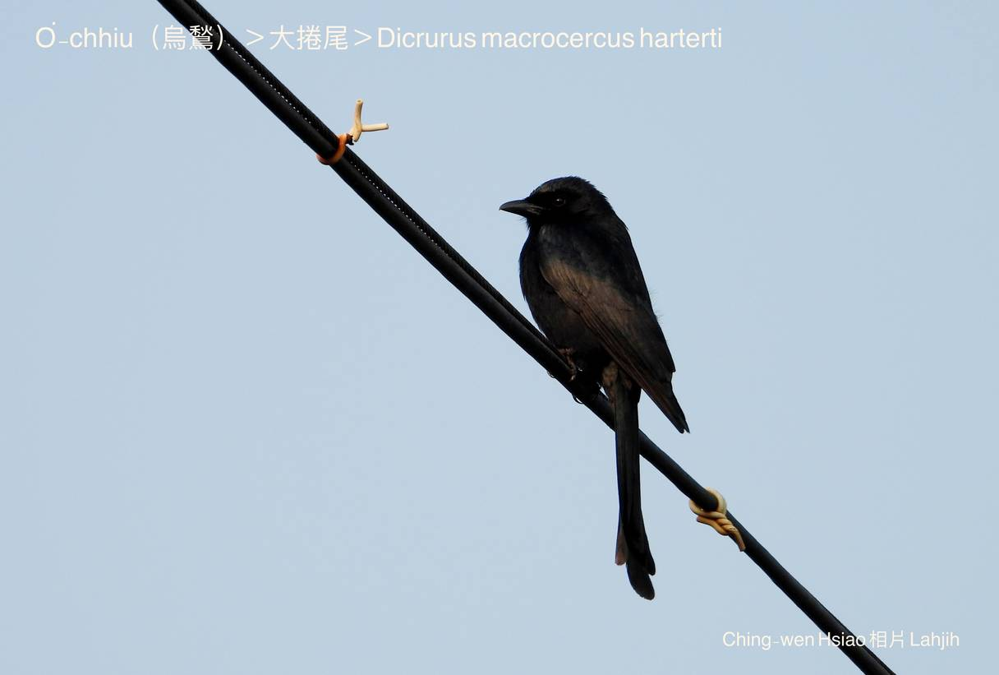
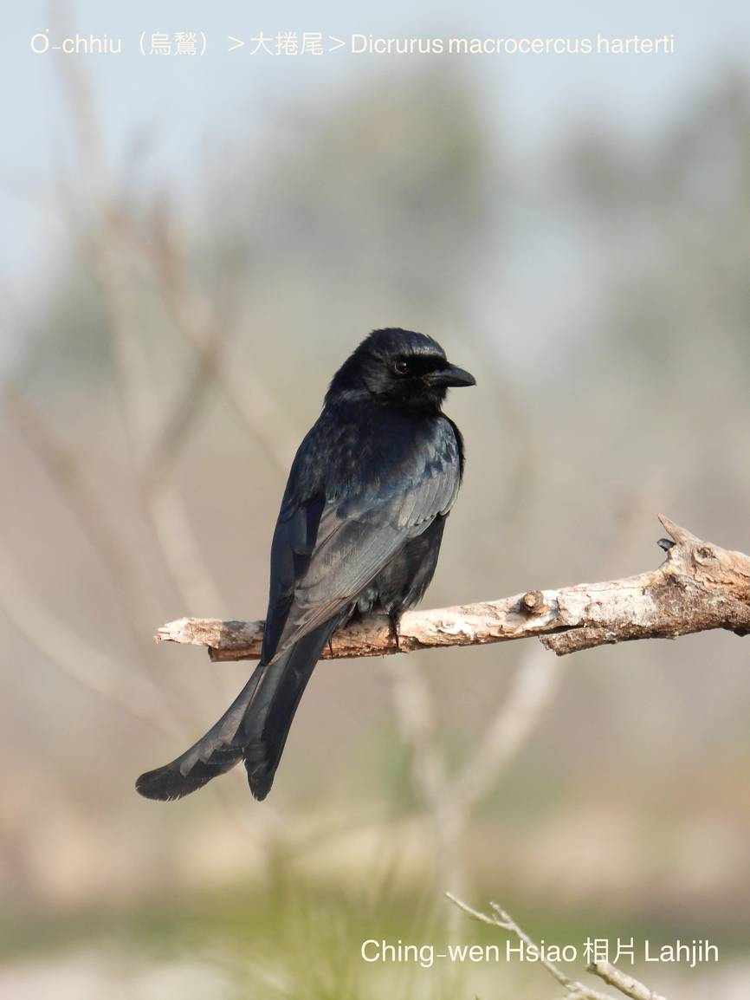
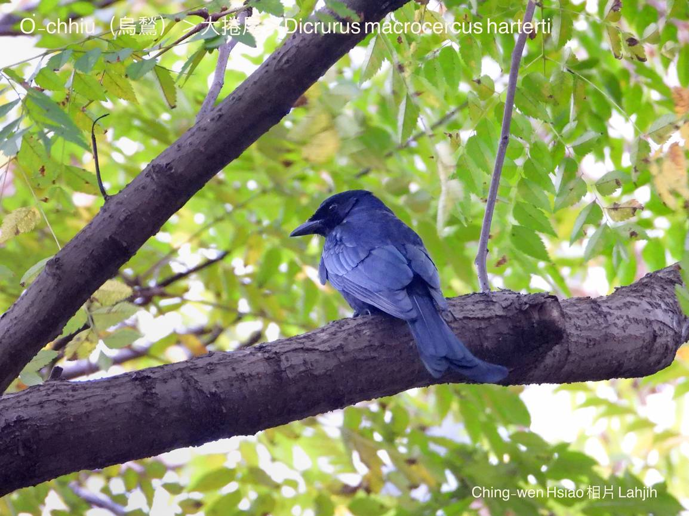
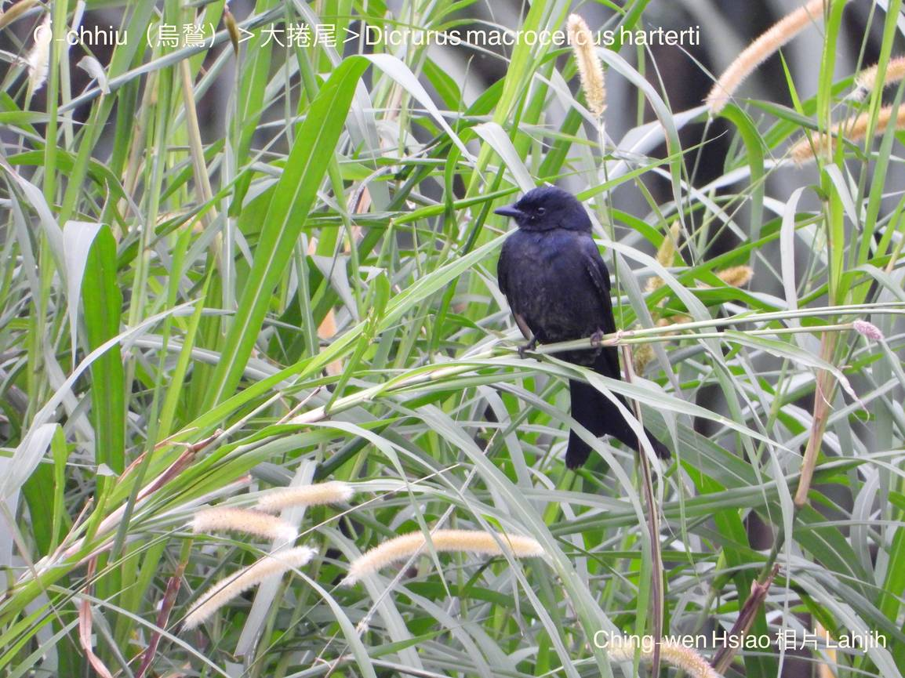
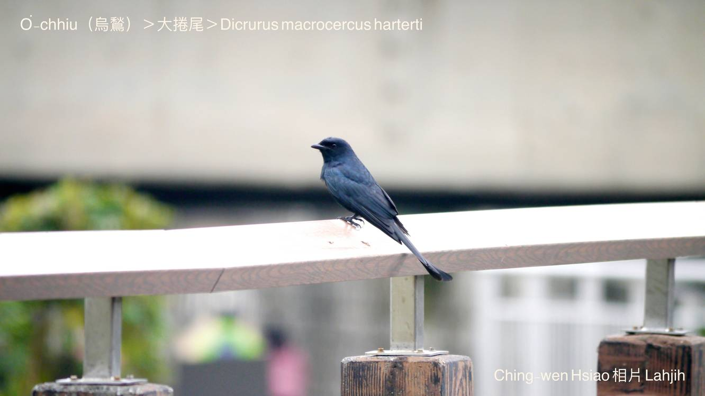
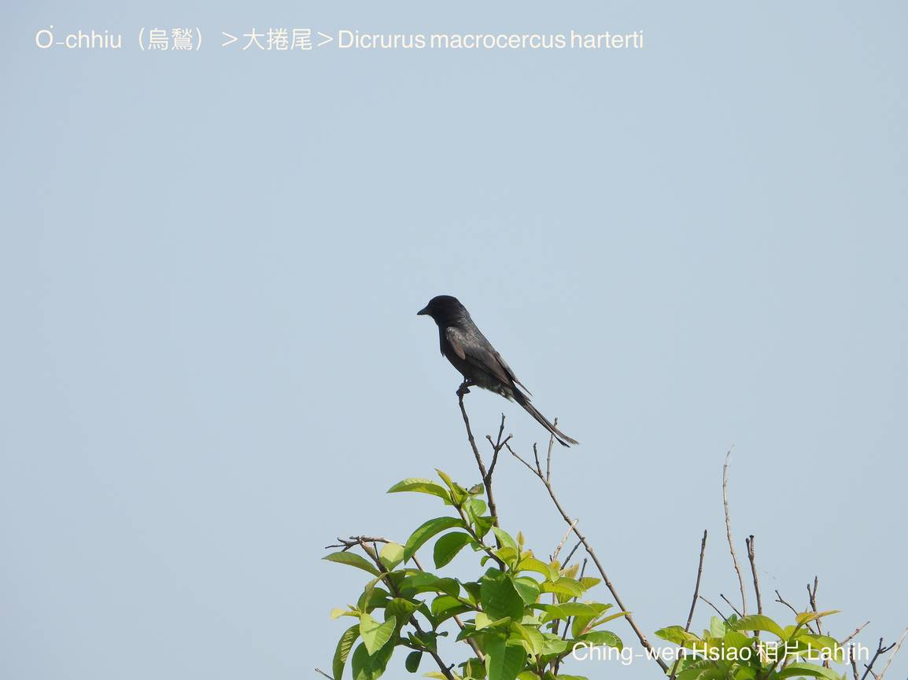

#### 37. Kńg-bóe Kho『捲尾科』

|台灣名|中譯名|學名|
|O͘-chhiu（烏鶖）|大捲尾|Dicrurus macrocercus harterti|

# 37-1. O͘-chhiu（烏鶖）

O͘-chhiu，kui身軀鳥仔毛o͘-sô-sô ná火炭，嘴尖，尾長，gâu jiok lāi-hio̍h，常常歇tī電線頂，牛kha-chiah-phiaⁿ，「烏鶖騎水牛」，nā發現牛食草a̍h是犁田土時，to̍h thèng-hāu boeh食飛出來ê蠓蟲。

O͘-chhiu ê地盤性kài強，對大型ê猛禽，像蛇鵰、lāi-hio̍h、烏鴉，伊lóng無leh lún--i，一定kā in趕走，jiok kah無看影。

O͘-chhiu生活tī人類環境附近，平洋田地、山崙、低海拔山區，m̄驚人，kah意hioh tī樹椏、電線、厝頂，等待討食。生湠期間，ok-khia̍k-khia̍k，ē主動攻擊人kap精牲。

O͘-chhiu tī台灣本島是普遍在地鳥，kan-nā少數ē向南過冬。

### Kap烏鶖有關聯ê唸謠、俗語

「烏鶖！烏鶖！咬咬kiŭ，蟲á肉ùn豆油。」

「烏鶖！烏鶖！烏liu-liu，看tio̍h lāi-hio̍h啄ba̍k-chiu。」

「Lāi-hio̍h bā雞á栽，烏鶖tòe後壁。」

# 【Tâi-oân Chiáu-á Liām Koa-si】

### **O͘-chhiu Kā-kiu**

O͘-chhiu, o͘-chhiu, kā-kā-kiu 

Chhēng o͘-saⁿ, tn̂g bóe-liu, chia̍h ti-bah, ùn tāu-iû

O͘-chhiu, o͘-chhiu, pháiⁿ-sèng-tē

Chhùi chiam-chiam, bóe pit-chhe

Jiok lāi-hio̍h, m̄ hō͘ i thau kā ke

### 烏鶖復仇記

聽講古早古早ê時代，烏鶖是1隻chiâⁿ有正義感chiâⁿ有孝ê鳥仔，為tio̍h boeh hō͘ i ê父母生活khah快活，食khah好穿khah燒--leh，i to̍h出外去做生理趁錢thang kā厝--裡tàu相添。

有1工，厝--裡傳來消息，講故鄉ê老母破病chiâⁿ沈重，而且siàu念kiáⁿ兒，煩惱kah消瘦落肉，烏鶖to̍h無khà做生理，kā艱苦趁來ê金錢，先去買一寡名貴ê藥材kap 1塊真大塊ê三層肉，拜託i ê má-chih lāi-hio̍h提轉去hō͘ in老母治病kap補身體。

Lāi-hio̍h正腳kōaⁿ三層肉，tò腳kōaⁿ藥材，隨時出發飛向故鄉，一時á都無停睏。Lāi-hio̍h ná飛風ná吹，hiông-hiông phīⁿ-tio̍h chi̍t-chūn芳味，chim-chiok phīⁿ詳細，原來是kah意ê豬肉氣味，「Tio̍h lún--leh m̄-thang siàu想，che是烏鶖ê孝心，千萬m̄-thang siàu想。」

Lāi-hio̍h ná飛風ná吹，iū-koh chi̍t-chūn豬肉芳chhèng鼻孔，實在siâⁿ人流嘴nōa，實在lún bē-tiâu，to̍h ka咬一嘴，實在有夠芳有夠好滋味⋯。

Lāi-hio̍h ná飛風ná吹，iū-koh chi̍t-chūn豬肉芳chhèng鼻孔，「豬肉chiah大塊，koh ka sut一嘴無要緊，to̍h chhân-chhân koh ka咬一嘴⋯。

Lāi-hio̍h lú食lú iau-sâi，phīⁿ-tio̍h豬肉芳味擋bē-tiâu，chhùi-nōa水chho̍p-chho̍p流，飛到半路to̍h kā hit塊三層肉sut了了，食飽to̍h起愛睏，lāi-hio̍h已經bē記得烏鶖交帶ê tāi-chì，to̍h飛去樹林睏中晝，睏kah chiok ka-chōe，等到睏精神，想起烏鶖交帶ê khang-khòe，taⁿ害--ā，豬肉kâng食了了，是boeh án-chóaⁿ kā烏鶖交帶neh？Ko͘-put-chiang，心肝lia̍h坦橫，kui-khì kā hiah-ê藥材mā tàn-hìⁿ-sak，做伊飛去內山thit-thô。

烏鶖in老母因為無得tio̍h醫治，mā無食tio̍h豬肉滋養身體，soah來一命o͘-ho͘ ai-chai，病死tī眠床頂。不幸ê消息ùi厝--裡傳到烏鶖ê耳孔內，烏鶖驚一tiô，非常傷心to̍h趕轉去厝內：

「阿母ná-ē死去--leh？我都有寄藥材kap豬肉轉來boeh hō͘阿母醫病補身體--ā？Ná-ē án-ne？Ná-ē án-ne？阿母--ō！阿母--ō！」烏鶖哭kah chiok悽慘--ê！

「Ná有寄siáⁿ-mih物件--leh？Ah你是寄chiâ轉來--ê？」烏鶖in阿爸án-ne ka問。

「Ah-to̍h寄lāi-hio̍h--lah，伊無提來咱tau是--bò͘？」

「無--lah！無--lah！Kah-nā有，恁阿母nā有豬肉補身體，koh有藥材醫治伊ê病，to̍h bē不幸來過身--去！Iáu-siū ê lāi-hio̍h，實在可惡！」

「阿爸！我一定boeh chhōe lāi-hio̍h算siàu，我一定boeh為阿母報冤仇！」烏鶖氣kah面á紅kòng-kòng，hō͘人看--起來chiok驚--人-ê，m̄-kuh尾á伊soah mà-mà-háu，一直哭「阿娘--ōe！阿娘--ōe！可憐ê阿娘--ōe！」

雖然烏鶖in老爸教烏鶖，m̄-thang siuⁿ chhong-pōng boeh去報怨仇，應該ka教示--一-下，cheng-cheng鎚鎚--leh to̍h好，千萬m̄-thang ka phah死。M̄-koh烏鶖實在bē堪得氣，想tio̍h阿母來慘死，m̄-chiah到chit-mái，pīn-nā看tio̍h lāi-hio̍h，定tio̍h m̄放伊kan休，m̄是jiok to̍h是tok，jiok-kah hō͘伊走無路，jiok-kah hō͘ lāi-hio̍h走kah phùn-kheng--去。

### 【註解】

|詞|解說|
|樹椏|Chhiū-oe。|
|bā|捕lia̍h。|
|雞á栽|雞á-kiáⁿ。|
|ka-chōe|Chiok lo̍h-bîn。|
|má-chih|好朋友。|
|iau-sâi|Iau鬼，『嘴讒』。|
|走kah phùn-kheng--去|『逃之夭夭』。|
|無khà|『沒空』。|
