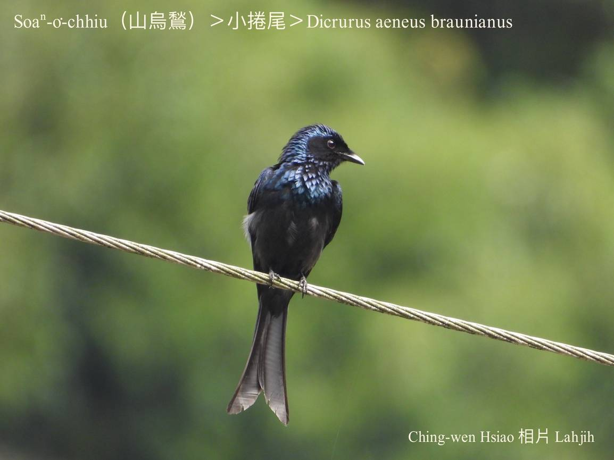
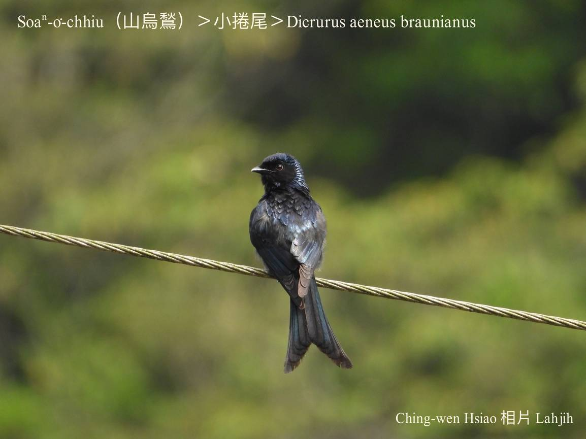
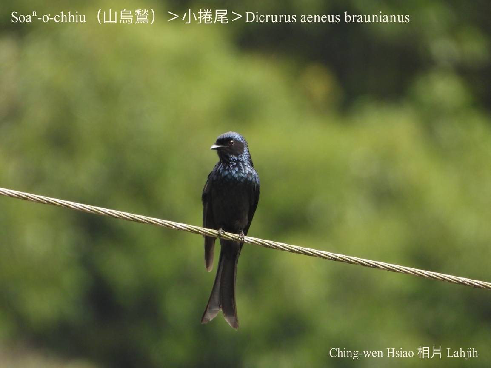
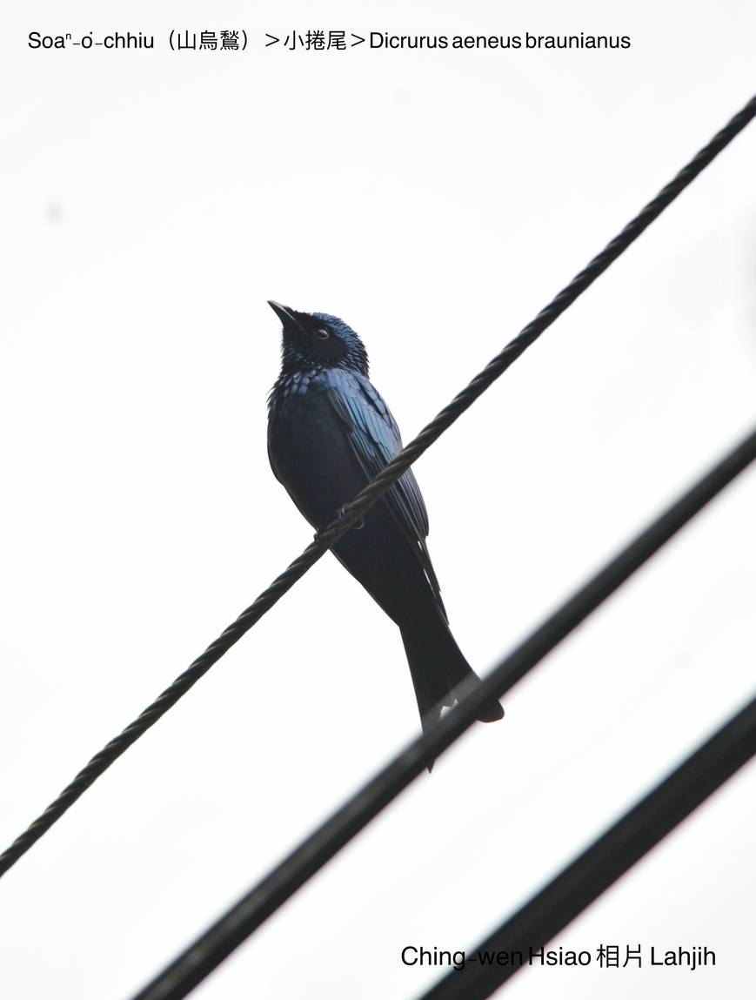
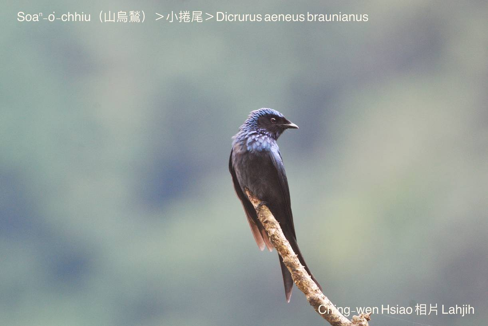
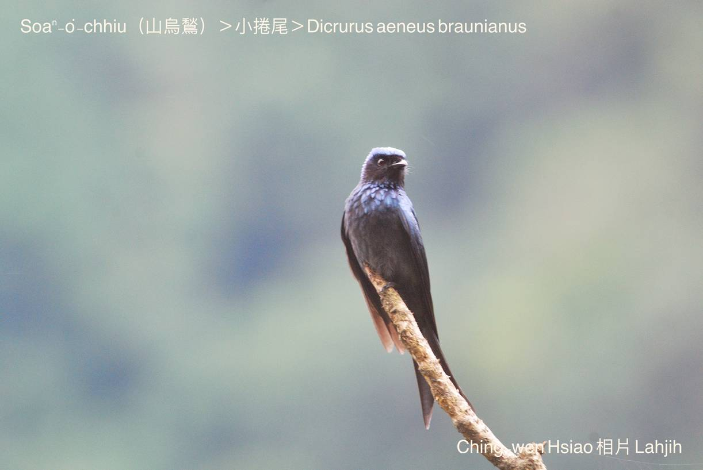

#### 37. Kńg-bóe Kho『捲尾科』

|台灣名|中譯名|學名|
|Soaⁿ-o͘-chhiu（山烏鶖）|小捲尾|Dicrurus aeneus braunianus|

# 37-2. Soaⁿ-o͘-chhiu（山烏鶖）

Soaⁿ-o͘-chhiu kap烏鶖是kāng族親，chiâⁿ chia̍p tī樹林邊a̍h是樹欉khah疏ê山區出現，kui身軀烏金烏金ê烏藍色，bē飛真遠，速度真緊sêng「~~~~」ê波浪形，時常kap戲班á kap做夥活動，kui大tīn ê戲班á後壁時常有2~7隻ê soaⁿ-o͘-chhiu tòe-leh保護，nā有猛禽出現，一定引起in ê攻擊。

Soaⁿ-o͘-chhiu ê領域性真強，tī大自然ê食物鏈定律之下，平常時soaⁿ-o͘-chhiu是鷹á虎ê犧牲品，俗語講：「鷹á虎，驚死烏鶖。」意思是soaⁿ-o͘-chhiu tn̄g-tio̍h鷹á虎to̍h驚kah phi̍h-phi̍h-chhoah。M̄-koh nā tī生湠期間，soaⁿ-o͘-chhiu to̍h特別惡，tī伊管區內ê鷹á虎都ē hō͘伊jiok kah走無路，實在真趣味。

Soaⁿ-o͘-chhiu ê聲音比o͘-chhiu khah柔軟好聽，koh-ē模仿別種鳥仔聲，hèng食蟲thōa蠓蟲。

# 【Tâi-oân Chiáu-á Liām Koa-si】

### **Soaⁿ-o͘-chhiu Gâu Kā-kiu**

Soaⁿ-o͘-chhiu Soaⁿ-o͘-chhiu

Tòa tiàm lāi-soaⁿ kā-kā-kiu

Bóe pit-chhe pháiⁿ-chhèng-chhèng

Jiok béng-khîm bô lún-chhiú

Pó-hō͘ chiáu-chiah bián iu-chhiû

### 【註解】

|詞|解說|
|bô lún-chhiú|Bô teh客氣。|
