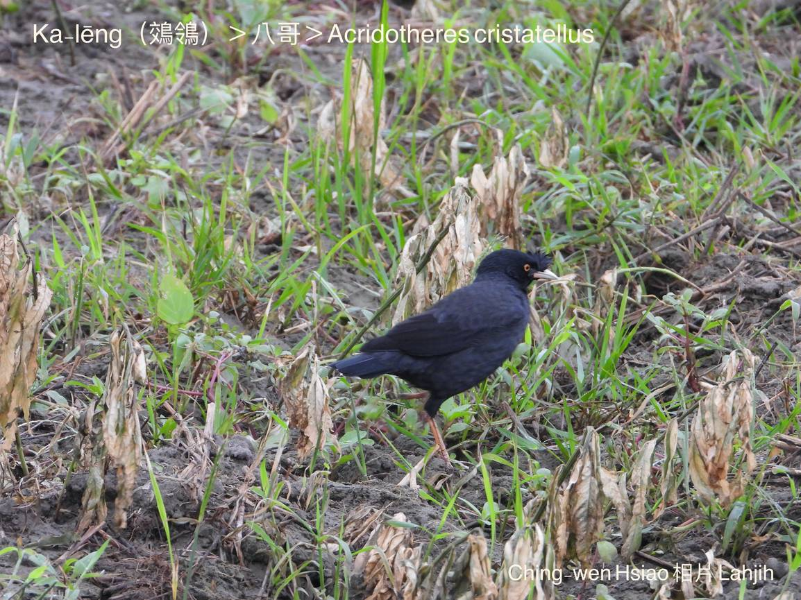

#### 38. Liâng-chiáu Kho『椋鳥科』

|台灣名|中譯名|學名|
|Ka-lēng（鵁鴒）|八哥|Acridotheres cristatellus|

# 38-1. Ka-lēng（鵁鴒）

Ka-lēng，老一輩ê人罕得m̄-bat chit款鳥仔，伊lio̍h-lio̍h-á ē-hiáu學人講話，所以一般人真kah意飼來sńg thit-thô。

Ka-lēng tī樹洞、古早厝ê壁空內底thiap羽毛、乾葉做siū，無像chheⁿ-tî-á a̍h是bāng-tang-tiuh-á ka-tī ē-hiáu做siū。

俗語講：「Ka-lēng、佔便khang。」To̍h是keng-thé一個人平時hō-lí-hō-sō，hèng thit-thô，pān-tōaⁿ做，kan-nā期待siàu想便--ê，ká-ná ka-lēng kan-nā ē-hiáu chhōe便khang做siū kāng-khoán。

Ka-lēng，是台灣特有ê亞種，時常三五隻ká群tī樹尾頂、竹phō頂a̍h是電線頂活動，飛行時翼股ê白色斑紋chiâⁿ明顯，叫聲響亮吵死人，是雜食性鳥類，蟲thōa、樹蛙、果子lóng-chóng食。

在地ka-lēng ê嘴pe是象牙白色，嘴角淡薄á粉紅色，頭殼額有一chhop chhàng-chhàng ê羽毛，是伊ê特徵。

現在野外時常khoàiⁿ--tio̍h是『家八哥』kap『白尾八哥』ê外來種類，在地鳥ê ka-lēng soah ná來ná少。

# 【Tâi-oân Chiáu-á Liām Koa-si】

### **Ka-lēng M̄ Kóng-ōe**

Ka-lēng ka-lēng phu̍h-phu̍h-poe
 
Chin-kú m̄-bat thiaⁿ lí kóng lán-lâng ê ōe

Chi̍t-sì-kè lóng-sī n̂g-chhùi-pe góa-lâi pat-ko

Góa-lâi pat-ko, hiông-kài-kài kā-kā-kún chiàm tē-pôaⁿ

Pe̍h-chhùi-pe chāi-tē ka-lēng, nā-koh m̄ kóng-ōe

Bián gōa-kú, khióng-kiaⁿ lí ē sit-siaⁿ pìⁿ é-káu

### 【註解】

|詞|解說|
|khoàiⁿ|Khòaⁿ-kìⁿ ê合音。|
|hō-lí-hō-sō|Bô tāi-chì chò，lōng-liú-lian，『遊手好閒，無所事事』。|
|kā-kā-kún|『鬧哄哄』。|