#### 38. Liâng-chiáu Kho『椋鳥科』

|台灣名|中譯名|學名|
|Ka-lēng（鵁鴒）|白尾八哥|Acridotheres javanicus|

# 38-2. Ka-lēng（鵁鴒）

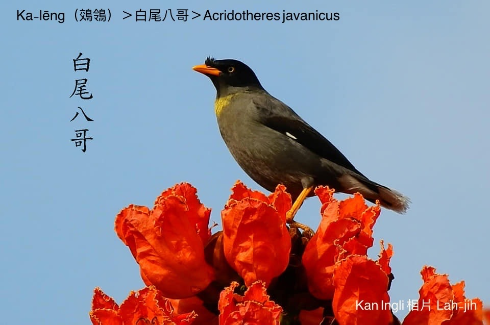

『白尾八哥』ka-lēng mā號做『爪哇八哥』，是入侵台灣ê外來鳥，可能是有人為養飼寵物。

『白尾八哥』ka-lēng hiông-kài-kài，時常kui群討食，無thang hō͘其他鳥類倚近，生湠chiâⁿ緊，soah hō͘在地ka-lēng受tio̍h威脅。

『白尾八哥』ka-lēng除了五穀、蟲thōa，對台灣在地鳥kiáⁿ、iáu未孵出ê鳥卵lóng食，造成台灣生態嚴重災厄。

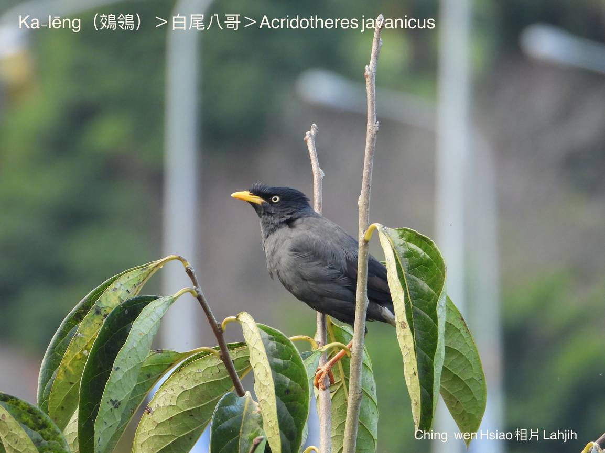
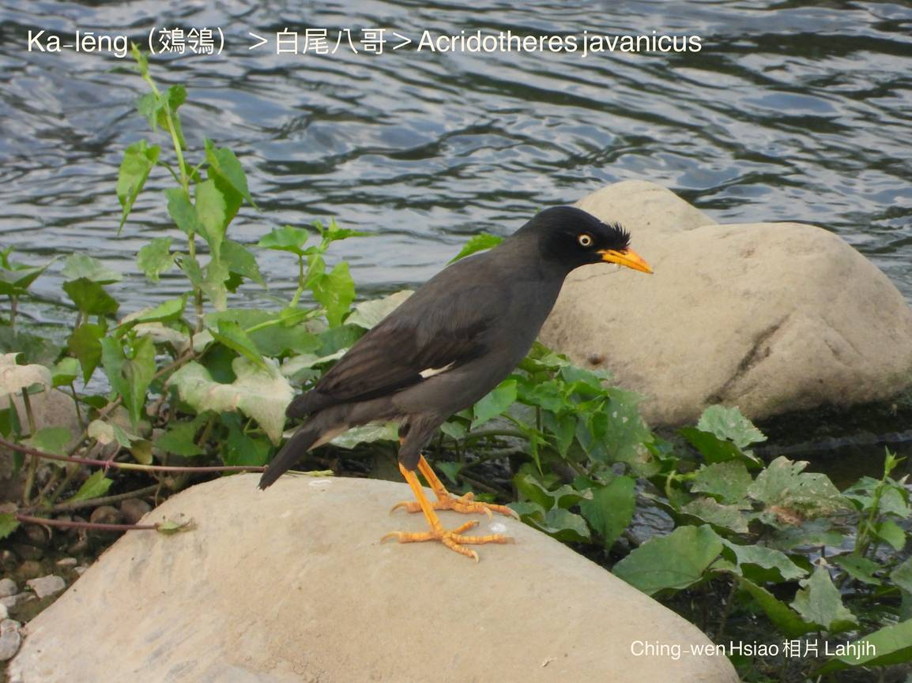
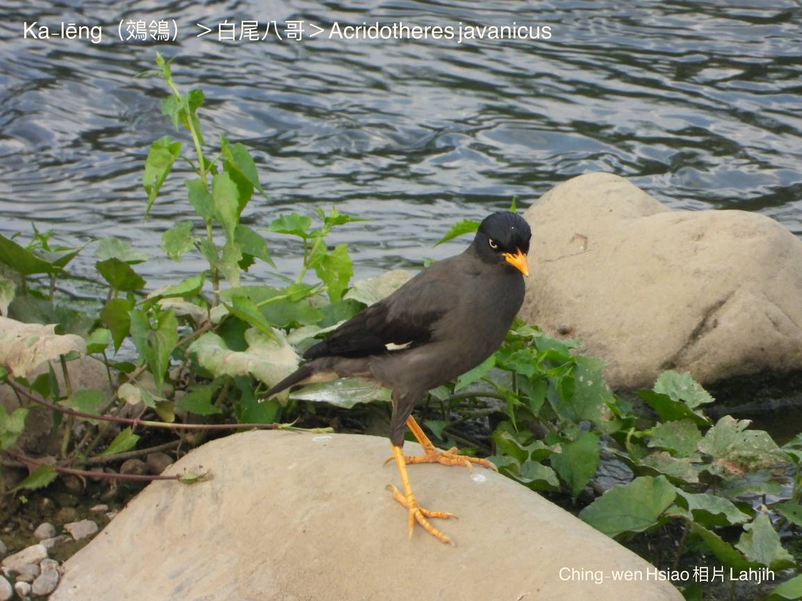
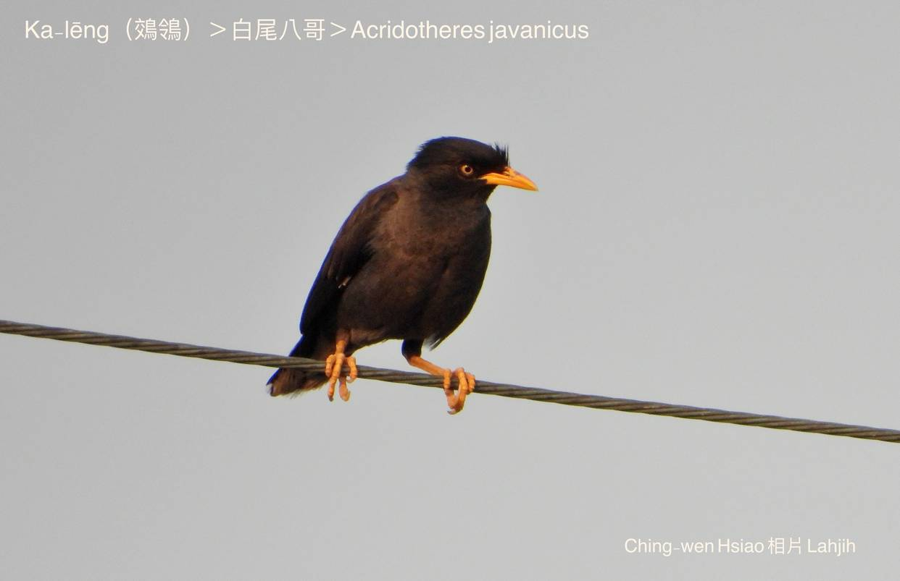
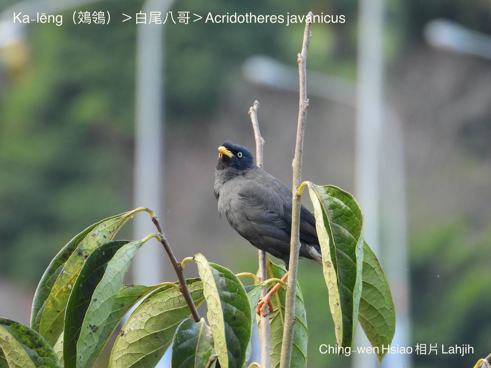
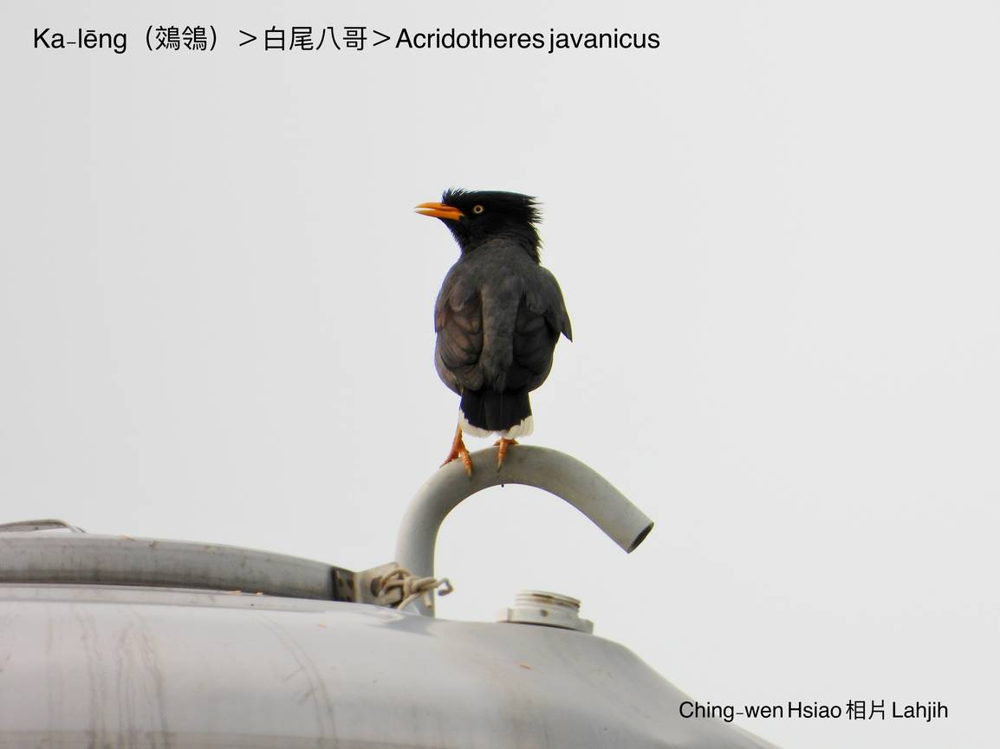
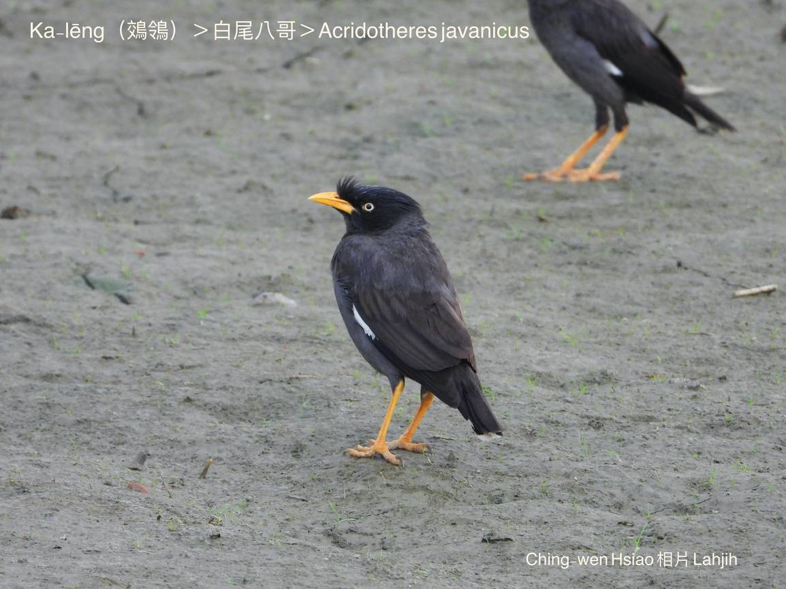
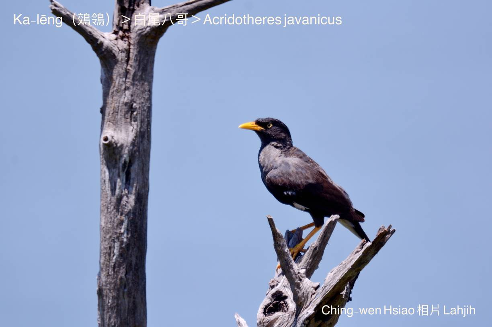
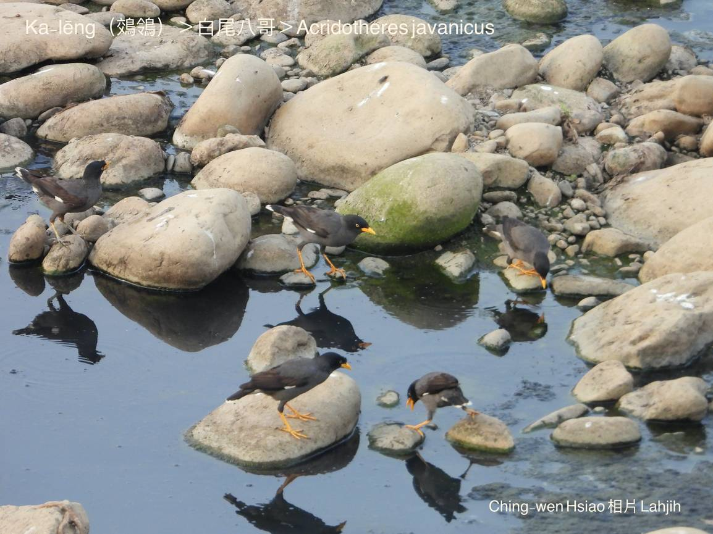
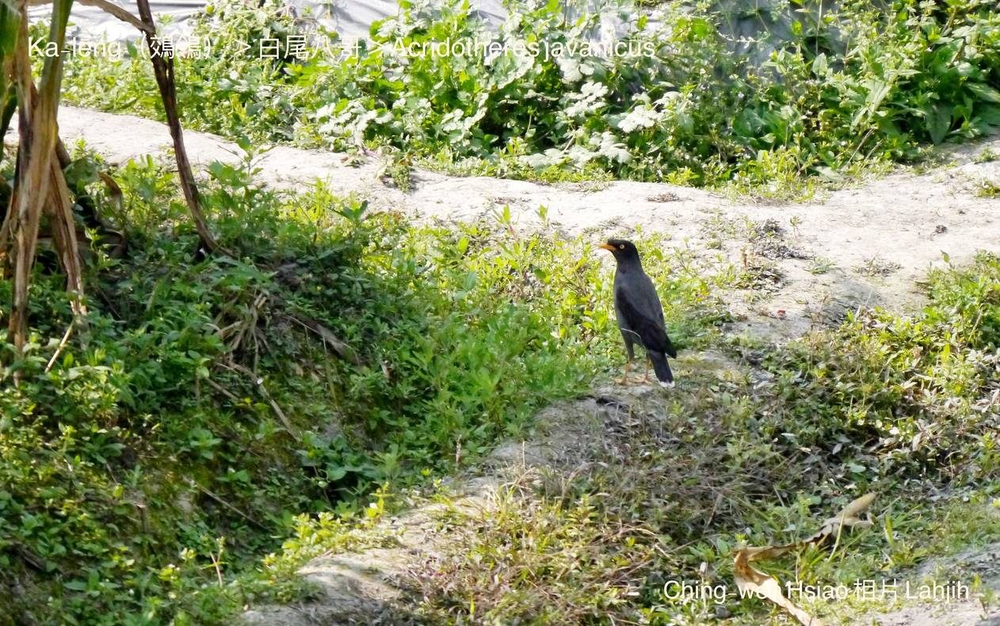

