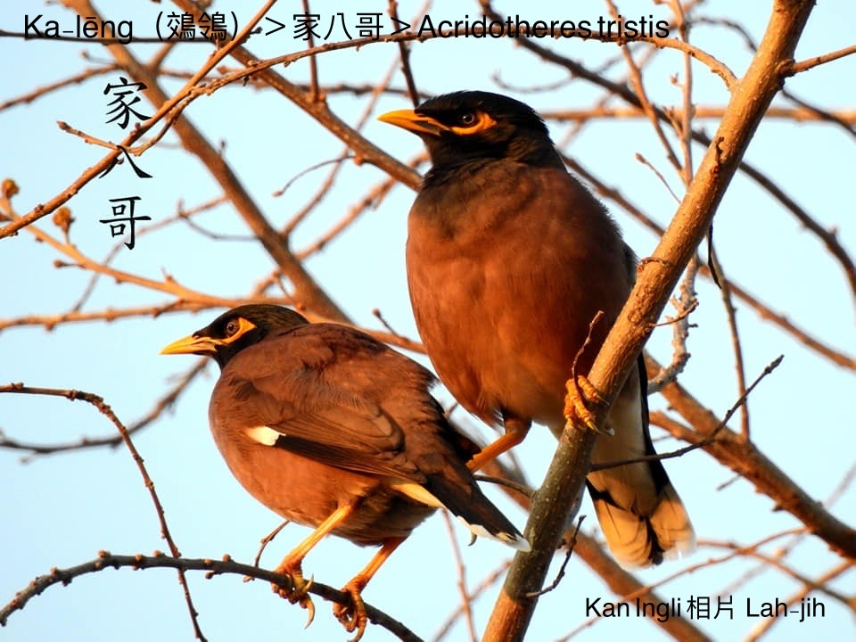
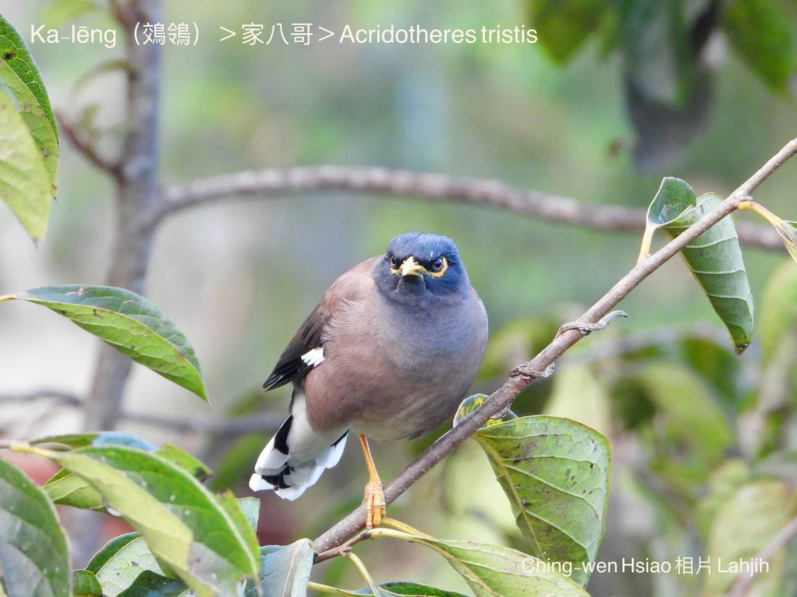
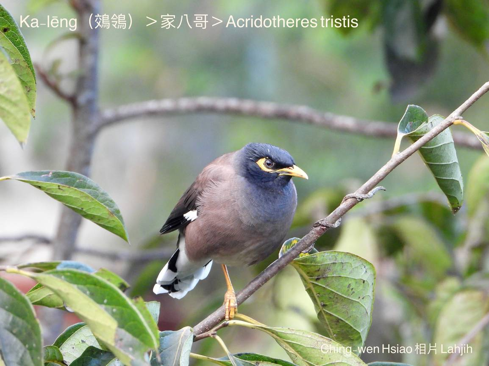
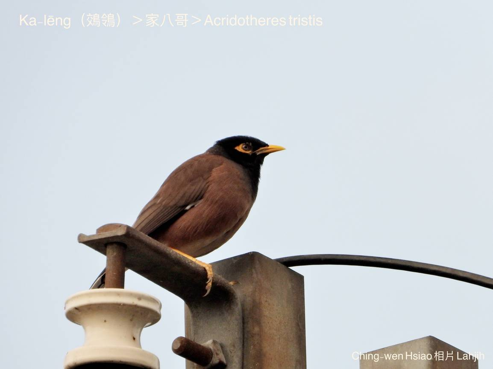
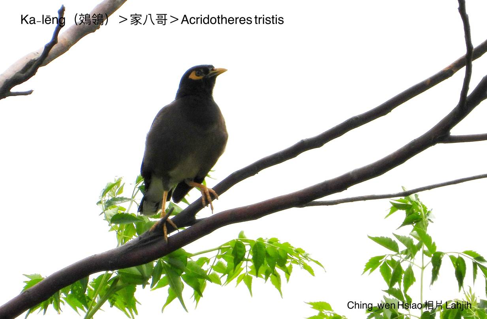
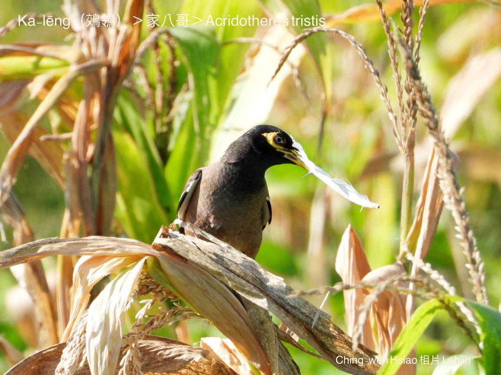

#### 38. Liâng-chiáu Kho『椋鳥科』

|台灣名|中譯名|學名|
|Ka-lēng（鵁鴒）|家八哥|Acridotheres tristis|

# 38-3. Ka-lēng（鵁鴒）

『家八哥』ka-lēng mā是外來鳥類，gâu學話模仿聲音，hông引進做寵物飼，因為偷走a̍h是放生，致使野外生湠快速增加，soah pìⁿ-chiâⁿ台灣chiâⁿ普遍ê在地鳥，時常三五tàu-tīn討食，hèng食細隻蟲thōa hām植物果子、農作物。

