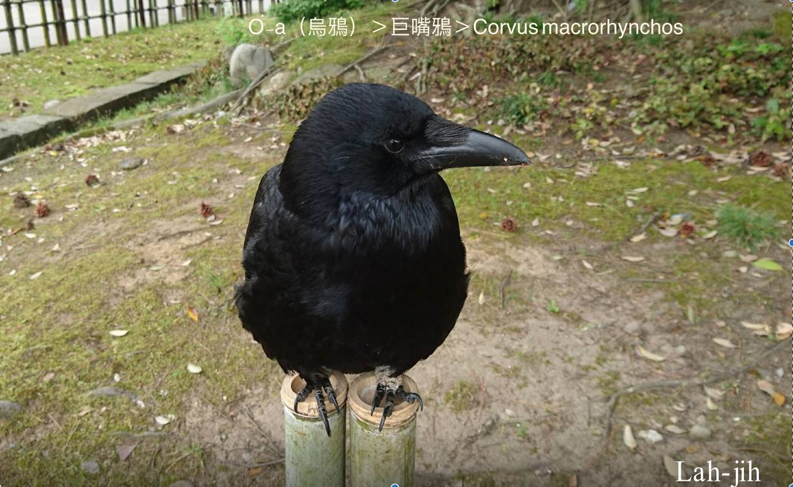
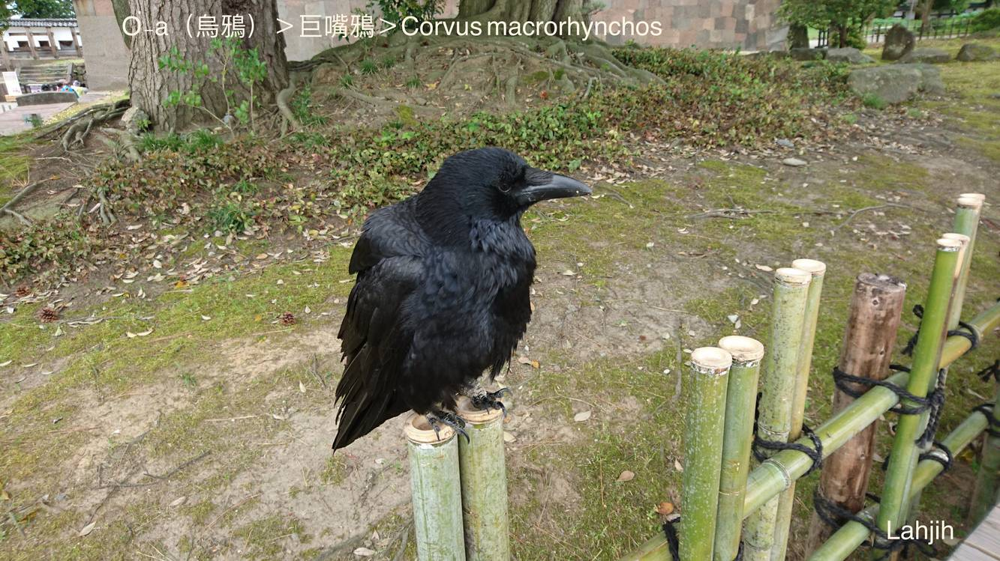
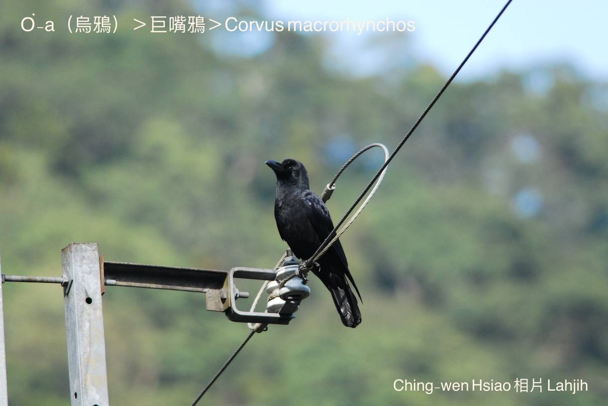
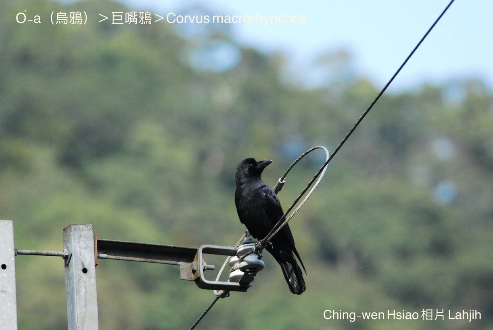

#### 39. A Kho『鴉科』

|台灣名|中譯名|學名|
|O͘-a（烏鴉）|巨嘴鴉|Corvus macrorhynchos|

# 39-1. O͘-a（烏鴉）

O͘-a咱慣勢講烏鴉á，kui身鳥毛、嘴pe kap兩支腳骨lóng是烏色，叫聲「ah、ah、ah ah …」，是án-ne ka號名--ê。

O͘-a chiâⁿ大食，鼠類、杜定、狗母梭á、母舅蛇、蛇類a̍h是蟲thōa伊lóng boeh食，mā hèng食鳥仔卵、鳥仔-kiáⁿ。

俗語有一句講：「O͘-a-á，無隔暝卵。」是leh講伊chiâⁿ貪食，鳥仔卵無khòaiⁿ便罷，nā ho͘ khòaiⁿ--tio̍h，一定sûi ka食掉，無thang phah-ka-la̍uh。

一個人nā無儉錢粒積ê習慣，現趁現開，趁了了食了了，to̍h ē-sái-tit用chit句「o͘-a-á無隔暝卵。」來ka恥笑keng-thé。

O͘-a tī台灣是普遍ê在地鳥，中高海拔山地，東部海岸壁lóng bat出現，有聚集性，kui-tīn tòa做夥，kui-tīn飛同齊，警戒性強，nā有giâu-gî koh樣，隨時「ah、ah、ah、ah」liu-soan飛走。時常tī糞埽堆chhōe食，hèng食家畜屍體，是山林ê清道夫。

# 【Tâi-oân Chiáu-á Liām Koa-si】

### **O͘-a Sī Hó Chiáu**

Lóng-sī Tiong-kok bûn-hòa gō͘-kái

In-ūi lí ê siaⁿ-sàu kan-nā ah ah ah

Khan-thoa lí "Kiat hiong bōe kàu seng iú tiāu"

Soah hông kioh-sī "Pháiⁿ chiáu"

Nā chai-iáⁿ lāi-soaⁿ "Chheng-tō-hu" to̍h sī lí

Lán to̍h liáu-kái o͘-a sī hó chiáu

### 【註解】

|詞|解說|
|khoàiⁿ|Khòaⁿ-kìⁿ ê合音。|
|大食|暴食，食量大。相對細食、小食。|
